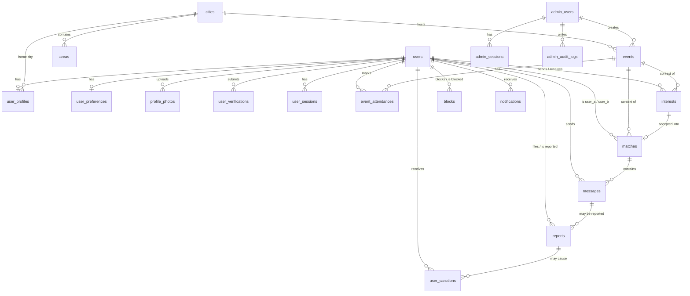

# Database Architecture — Garba Partner

> Related: [Application architecture](application-architecture.md), [Security architecture](security-architecture.md), [User flows](../product/user-flows.md)
>
> This is the **target design** for the whole MVP. Tables that are already implemented are documented exactly in [docs/database/schema.md](../database/schema.md), which wins wherever the two differ: `users`, `user_profiles`, `user_preferences`, `user_sessions`, `user_verifications`.

## 1. Principles

- **PostgreSQL 16+** is the only system of record. There is no second datastore in the MVP.
- **Sequelize v6 + sequelize-typescript** models. **Every schema change goes through a migration** (Umzug, TypeScript). `sequelize.sync()` is forbidden outside unit tests.
- **UUID primary keys** (`gen_random_uuid()`, built into PG 13+). Sequential IDs are never exposed.
- **snake_case** tables and columns (Sequelize `underscored: true`). Plural table names.
- **`timestamptz`** for every timestamp, stored in UTC. `date` only for date of birth.
- **Foreign keys everywhere**, with explicit `ON DELETE` behaviour.
- **Status columns** are `varchar` + `CHECK` constraint rather than native PG enums (easier to evolve in migrations). The allowed values mirror the `as const` arrays in `@garba-partner/shared`.
- **Constraints in the database, not only in code:** uniqueness, one-pending-interest, one-active-match, `sender <> receiver` and age-range checks are all DB constraints. That way a race or a bug can't break an invariant.
- **Minimum PII.** Phone numbers are stored only as an HMAC hash (lookup) plus AES-256-GCM ciphertext (break-glass). Exact location and Aadhaar data are never stored.
- **Two DB roles:** `gp_owner` owns the schema and runs migrations. `gp_app` is used by the running API and worker and gets DML privileges only. On `admin_audit_logs` it gets only `INSERT, SELECT` (append-only).

## 2. Entity-relationship overview



## 3. Tables

Columns are `NOT NULL` unless marked `null`. Every table has `created_at` and, where rows are mutable, `updated_at` (both `timestamptz`, default `now()`). They're omitted below to keep the tables short.

### 3.1 Identity and access

#### `users`

| Column | Type | Notes |
|---|---|---|
| `id` | uuid PK | |
| `phone_hash` | char(64) null | HMAC-SHA256(`PHONE_HASH_SECRET`, E.164) hex. **Unique where not null.** Null after anonymisation |
| `phone_encrypted` | text null | AES-256-GCM `base64(iv‖tag‖ciphertext)`. Read only by the audited super-admin reveal |
| `phone_key_version` | smallint null | Encryption key version, for rotation |
| `status` | varchar(20) | `active` \| `suspended` \| `banned` \| `pending_deletion`. Default `active`. Erased accounts are soft-deleted via `deleted_at` |
| `onboarding_completed_at` | timestamptz null | Set when a profile and ≥ 1 photo exist |
| `underage_rejected_at` | timestamptz null | Locks DOB submission ([user flows §3.2](../product/user-flows.md#32-underage-handling)) |
| `photo_verified_at` | timestamptz null | Non-null = badge shown |
| `hidden_from_discovery` | boolean | Default `false`. Set by auto-hide rules |
| `hidden_reason` | varchar(30) null | `p0_report` \| `report_threshold` \| `no_visible_photo` |
| `terms_version` | varchar(20) null | Version accepted |
| `terms_accepted_at` | timestamptz null | |
| `last_active_at` | timestamptz null | Updated at most once per hour per user (cheap write). Only exposed as day-bucketed ordering |
| `deletion_requested_at` | timestamptz null | Start of the 30-day grace period |
| `deleted_at` | timestamptz null | Soft delete (Sequelize `paranoid`). The phone columns must be nulled in the same update (CHECK `users_phone_lifecycle_check`) |

Indexes: `UNIQUE (phone_hash) WHERE phone_hash IS NOT NULL`, `(status)`, `(deletion_requested_at) WHERE status = 'pending_deletion'`.

Model `defaultScope` excludes `phone_hash`, `phone_encrypted` and `phone_key_version`. Code that needs them uses an explicit named scope (`withPhone`) that only the auth and admin-reveal services use.

#### `otp_requests`

| Column | Type | Notes |
|---|---|---|
| `id` | uuid PK | |
| `phone_hash` | char(64) | |
| `otp_hash` | char(64) | HMAC-SHA256(`OTP_HMAC_SECRET`, `phone_hash ‖ code`). Compared in constant time |
| `attempts` | smallint | Default 0 |
| `expires_at` | timestamptz | `created_at + 5 min` |
| `consumed_at` | timestamptz null | |
| `invalidated_at` | timestamptz null | Set when superseded by a new OTP or when attempts run out |
| `ip_hash` | char(64) | HMAC of the client IP (rate limiting without storing raw IPs) |

Indexes: `(phone_hash, created_at DESC)`, `(ip_hash, created_at DESC)`. Rows are purged after 24 h. The rate-limit counts query this table, so limits survive restarts.

#### `banned_phone_hashes`

| Column | Type | Notes |
|---|---|---|
| `phone_hash` | char(64) PK | Kept after the user row is anonymised |
| `user_id` | uuid null FK → users `ON DELETE SET NULL` | |
| `sanction_id` | uuid null FK → user_sanctions `ON DELETE SET NULL` | |

#### `user_sessions`

One row per login (device). The refresh token rotates **within** the row, so `id` (the JWT `sid`) stays stable for the session's lifetime.

| Column | Type | Notes |
|---|---|---|
| `id` | uuid PK | JWT `sid` |
| `user_id` | uuid FK → users `ON DELETE CASCADE` | |
| `refresh_token_hash` | char(64) | SHA-256 of the current refresh token. **Unique** |
| `previous_refresh_token_hash` | char(64) null | For reuse detection |
| `rotated_at` | timestamptz null | |
| `user_agent` | varchar(255) null | Truncated |
| `ip_hash` | char(64) null | |
| `last_used_at` | timestamptz | |
| `expires_at` | timestamptz | Absolute: created + 30 days |
| `revoked_at` | timestamptz null | |
| `revoked_reason` | varchar(30) null | `logout` \| `logout_all` \| `reuse_detected` \| `sanction` \| `deletion` |

Indexes: `UNIQUE (refresh_token_hash)`, `(previous_refresh_token_hash)`, `(user_id) WHERE revoked_at IS NULL`.

**Reuse rule:** if a presented token matches `previous_refresh_token_hash`:
- within 15 s of `rotated_at`: treat it as a benign multi-tab race. Return `REFRESH_INVALID` without revoking. The client retries with the updated cookie.
- otherwise: revoke the session (`reuse_detected`).

The web client also serialises refreshes across tabs with the Web Locks API.

#### `admin_users`

| Column | Type | Notes |
|---|---|---|
| `id` | uuid PK | |
| `email` | varchar(254) | Unique on `lower(email)` |
| `name` | varchar(100) | |
| `role` | varchar(20) | `super_admin` \| `moderator` \| `event_manager` |
| `password_hash` | text | Argon2id |
| `must_change_password` | boolean | `true` for newly created accounts |
| `totp_secret_encrypted` | text null | AES-256-GCM with `TOTP_ENCRYPTION_KEY` |
| `totp_enabled_at` | timestamptz null | |
| `status` | varchar(20) | `active` \| `disabled` |
| `failed_login_count` | smallint | Reset on success |
| `locked_until` | timestamptz null | |
| `last_login_at` | timestamptz null | |
| `created_by_admin_id` | uuid null FK → admin_users | |

#### `admin_login_challenges`

`id` uuid PK, `admin_id` FK, `purpose` (`totp` \| `setup`), `attempts` smallint, `expires_at` (5 min), `consumed_at` null. Purged daily.

#### `admin_sessions`

Same shape as `user_sessions`, with `admin_id` FK → admin_users `ON DELETE CASCADE`. `expires_at` = created + 12 h. The idle timeout (30 min) is checked against `last_used_at`.

#### `admin_audit_logs` (append-only)

| Column | Type | Notes |
|---|---|---|
| `id` | uuid PK | |
| `admin_id` | uuid FK → admin_users `ON DELETE RESTRICT` | Admins are disabled, never deleted |
| `action` | varchar(60) | e.g. `user.sanction.create`, `user.phone.reveal`, `report.resolve`, `event.publish`, `admin.create` |
| `target_type` | varchar(30) | `user` \| `report` \| `event` \| `verification` \| `photo` \| `city` \| `area` \| `admin` \| `sanction` |
| `target_id` | uuid null | |
| `metadata` | jsonb | Before/after of the changed fields, reason text. **Never** contains a revealed phone number, OTP, password or token |
| `ip_hash` | char(64) null | |
| `user_agent` | varchar(255) null | |

Indexes: `(created_at DESC)`, `(admin_id, created_at DESC)`, `(target_type, target_id)`. `gp_app` has `INSERT, SELECT` only.

### 3.2 Profile and reference data

#### `cities`

`id` uuid PK, `name` varchar(80), `state` varchar(80), `slug` varchar(100) **unique**, `is_active` boolean, `sort_order` smallint. `UNIQUE (name, state)`.

#### `areas`

`id` uuid PK, `city_id` FK → cities `ON DELETE RESTRICT`, `name` varchar(80), `slug` varchar(100), `is_active` boolean. `UNIQUE (city_id, slug)`. Areas are **neighbourhood-level** only (e.g. "Navrangpura", "Kothrud"). Never street level.

#### `user_profiles` and `user_preferences` (1:1 with users) — ✅ implemented

The profile is split into two tables. See [schema.md §4.2–4.3](../database/schema.md#42-user_profiles) for the exact columns.

- **`user_profiles`**: `display_name`, `date_of_birth` (immutable through the API, **never** sent to other users), `gender`, `bio`, `experience`, `styles`. The locations migration will add `city_id` (FK → cities `ON DELETE RESTRICT`) and `area_id` (FK → areas `ON DELETE SET NULL`), plus the index `(city_id, gender)`.
- **`user_preferences`**: `partner_gender_preference`, `age_min`/`age_max` (18–80, ordered), `discovery_enabled` (explicit opt-in, default `false`, the "pause profile" switch), `show_area` (default `false`).

#### `profile_photos`

| Column | Type | Notes |
|---|---|---|
| `id` | uuid PK | |
| `user_id` | uuid FK → users `ON DELETE CASCADE` | |
| `public_id` | varchar(255) | Cloudinary public ID. **Unique** |
| `width`, `height` | integer | |
| `position` | smallint | 0 = primary. `UNIQUE (user_id, position) DEFERRABLE INITIALLY DEFERRED` (allows reorder in one transaction) |
| `status` | varchar(20) | `pending_review` \| `approved` \| `rejected`. `pending_review` is **visible** (post-moderation) |
| `rejection_reason` | varchar(30) null | |
| `reviewed_by_admin_id` | uuid null FK → admin_users | |
| `reviewed_at` | timestamptz null | |

Indexes: `(user_id, position)`, `(status, created_at) WHERE status = 'pending_review'` (review queue).

#### `user_verifications` — ✅ implemented

Provider/reference/status metadata only. See [schema.md §4.5](../database/schema.md#45-user_verifications). Summary:

- `type` (`photo`; `government_id` reserved), `provider` (`internal_review`), `provider_reference`, `status` (`initiated` → `pending` → `approved` / `rejected` / `expired` / `revoked`), `challenge_code` (the gesture code), `evidence_reference` (opaque pointer to the **private** selfie asset, nulled on purge), `evidence_deleted_at`, `failure_reason`, `submitted_at`, `decided_at`, `expires_at`, `reviewed_by_admin_id` (FK → admin_users added in the admin phase).
- One open request per user and type (partial unique index). Review-queue and purge-job indexes.
- The database rejects Aadhaar-like numbers in reference columns (`contains_aadhaar_like_number()` CHECK).

### 3.3 Events

#### `events`

| Column | Type | Notes |
|---|---|---|
| `id` | uuid PK | |
| `slug` | varchar(140) | **Unique**. Generated from the title + short random suffix |
| `title` | varchar(120) | |
| `description` | text | ≤ 5000 chars (validated in the app) |
| `city_id` | uuid FK → cities `ON DELETE RESTRICT` | |
| `area_id` | uuid null FK → areas | |
| `venue_name` | varchar(150) | |
| `venue_address` | varchar(300) | Public venue address |
| `map_url` | varchar(500) null | Validated `https://` URL |
| `starts_at` / `ends_at` | timestamptz | CHECK `ends_at > starts_at` |
| `organizer_name` | varchar(150) null | |
| `price_info` | varchar(200) null | Free text, e.g. "₹499 onwards" |
| `external_pass_url` | varchar(500) null | Validated `https://` URL |
| `cover_public_id` | varchar(255) null | |
| `status` | varchar(20) | `draft` \| `published` \| `cancelled` |
| `cancellation_reason` | varchar(300) null | |
| `published_at` / `cancelled_at` | timestamptz null | |
| `created_by_admin_id` / `updated_by_admin_id` | uuid FK → admin_users | |

Indexes: `(city_id, status, starts_at)`, `(status, ends_at)`.

"Ended" is derived (`ends_at < now()`). There is no `completed` status and no job is needed.

#### `event_attendances`

| Column | Type | Notes |
|---|---|---|
| `id` | uuid PK | |
| `event_id` | uuid FK → events `ON DELETE RESTRICT` | |
| `user_id` | uuid FK → users `ON DELETE CASCADE` | |
| `status` | varchar(20) | `going` \| `interested` |
| `looking_for_partner` | boolean | Default `false` |

Constraints/indexes: `UNIQUE (event_id, user_id)`, `(event_id, user_id) WHERE looking_for_partner` (event discovery), `(user_id, created_at DESC)`, `(event_id, status)` (counts).

Event counts are computed with `COUNT(*) FILTER (WHERE status = 'going')` grouped by `event_id` for the event IDs on the current page. No denormalised counters in the MVP.

### 3.4 Interests, matches and messages

#### `interests`

| Column | Type | Notes |
|---|---|---|
| `id` | uuid PK | |
| `sender_id` | uuid FK → users `ON DELETE CASCADE` | |
| `receiver_id` | uuid FK → users `ON DELETE CASCADE` | CHECK `sender_id <> receiver_id` |
| `event_id` | uuid null FK → events `ON DELETE SET NULL` | |
| `status` | varchar(20) | `pending` \| `accepted` \| `declined` \| `withdrawn` \| `expired` \| `cancelled` |
| `expires_at` | timestamptz | created + 14 days |
| `responded_at` | timestamptz null | |

Constraints/indexes:
- `UNIQUE (sender_id, receiver_id) WHERE status = 'pending'`
- `(receiver_id, created_at DESC) WHERE status = 'pending'` (received list)
- `(sender_id, created_at DESC) WHERE status = 'pending'` (sent list)
- `(sender_id, created_at DESC)` (daily limit count)
- `(sender_id, receiver_id, responded_at) WHERE status = 'declined'` (cooldown)
- `(expires_at) WHERE status = 'pending'` (expiry job)

#### `matches`

| Column | Type | Notes |
|---|---|---|
| `id` | uuid PK | |
| `user_a_id` | uuid FK → users `ON DELETE CASCADE` | CHECK `user_a_id < user_b_id` (canonical order) |
| `user_b_id` | uuid FK → users `ON DELETE CASCADE` | |
| `interest_id` | uuid FK → interests `ON DELETE SET NULL` null | **Unique** |
| `event_id` | uuid null FK → events `ON DELETE SET NULL` | |
| `status` | varchar(20) | `active` \| `unmatched` \| `blocked` \| `closed` |
| `ended_at` | timestamptz null | |
| `ended_by_user_id` | uuid null FK → users `ON DELETE SET NULL` | Internal only. Never exposed |
| `last_message_at` | timestamptz null | Sorting the chat list |
| `user_a_last_read_at` / `user_b_last_read_at` | timestamptz null | Read receipts |

Constraints/indexes: `UNIQUE (user_a_id, user_b_id) WHERE status = 'active'`, `(user_a_id, last_message_at DESC) WHERE status = 'active'`, `(user_b_id, last_message_at DESC) WHERE status = 'active'`, `(ended_at) WHERE status <> 'active'` (message purge job).

#### `messages`

| Column | Type | Notes |
|---|---|---|
| `id` | uuid PK | |
| `match_id` | uuid FK → matches `ON DELETE CASCADE` | |
| `sender_id` | uuid FK → users `ON DELETE CASCADE` | |
| `client_message_id` | uuid | Idempotency key from the client |
| `body` | varchar(1000) | Plain text |
| `contains_contact_info` | boolean | Default `false`. Moderation context only |

Constraints/indexes: `UNIQUE (sender_id, client_message_id)`, `(match_id, created_at DESC, id DESC)`.

Messages are immutable (no `updated_at`, no edit in the MVP).

### 3.5 Safety

#### `blocks`

`id` uuid PK, `blocker_id` FK → users `ON DELETE CASCADE`, `blocked_id` FK → users `ON DELETE CASCADE`, CHECK `blocker_id <> blocked_id`, `UNIQUE (blocker_id, blocked_id)`, index `(blocked_id)`.

#### `reports`

| Column | Type | Notes |
|---|---|---|
| `id` | uuid PK | |
| `reporter_id` | uuid null FK → users `ON DELETE SET NULL` | |
| `reported_user_id` | uuid FK → users `ON DELETE RESTRICT` | Users are anonymised, never hard-deleted, so the FK stays valid |
| `message_id` | uuid null FK → messages `ON DELETE SET NULL` | |
| `match_id` | uuid null FK → matches `ON DELETE SET NULL` | |
| `reason` | varchar(30) | `underage` \| `safety_threat` \| `harassment` \| `sexual_content` \| `fake_profile` \| `scam_spam` \| `hate_speech` \| `other` |
| `priority` | smallint | 0 (P0), 1 or 2. Derived from the reason via `REPORT_PRIORITY_BY_REASON` |
| `details` | varchar(1000) null | |
| `evidence` | jsonb null | Snapshot: `{ messages: [{ id, from: 'reporter'\|'reported', body, createdAt }], profile: { displayName, bio, photoPublicIds } }` |
| `status` | varchar(20) | `open` \| `in_review` \| `resolved` \| `dismissed` |
| `assigned_admin_id` | uuid null FK → admin_users | |
| `resolution_action` | varchar(30) null | `dismiss` \| `warn` \| `remove_content` \| `suspend` \| `ban` |
| `resolution_note` | text null | Internal |
| `resolved_by_admin_id` | uuid null FK → admin_users | |
| `resolved_at` | timestamptz null | |

Indexes: `(status, priority, created_at)`, `(reported_user_id, created_at DESC)`, `(reporter_id, created_at DESC)`, and a partial unique index to merge duplicates:
`UNIQUE (reporter_id, reported_user_id, COALESCE(message_id, '00000000-0000-0000-0000-000000000000'::uuid)) WHERE status IN ('open','in_review')`.

#### `user_sanctions`

| Column | Type | Notes |
|---|---|---|
| `id` | uuid PK | |
| `user_id` | uuid FK → users `ON DELETE RESTRICT` | |
| `type` | varchar(20) | `warning` \| `suspension` \| `ban` |
| `reason_code` | varchar(30) | Guideline category (shared constant) |
| `note` | text | Internal note (required) |
| `report_id` | uuid null FK → reports | |
| `starts_at` | timestamptz | |
| `ends_at` | timestamptz null | Suspensions only |
| `created_by_admin_id` | uuid FK → admin_users | |
| `revoked_at` | timestamptz null | |
| `revoked_by_admin_id` | uuid null FK → admin_users | |
| `revoke_reason` | varchar(300) null | |

Indexes: `(user_id, created_at DESC)`, `(ends_at) WHERE type = 'suspension' AND revoked_at IS NULL` (lift job).

`users.status` is a cached projection of active sanctions, updated in the same transaction as the sanction.

### 3.6 Notifications

#### `notifications`

`id` uuid PK, `user_id` FK → users `ON DELETE CASCADE`, `type` varchar(40) (`interest_received`, `match_created`, `verification_approved`, `verification_rejected`, `event_updated`, `event_cancelled`, `photo_rejected`, `warning_issued`, `report_reviewed`), `data` jsonb (IDs and display strings only, no private data), `read_at` null.

Indexes: `(user_id, created_at DESC)`, `(user_id) WHERE read_at IS NULL`.

## 4. Key queries

### 4.1 Discovery (city mode, simplified)

The query lives in `apps/api/src/modules/discovery/discovery.queries.ts` as parameterised SQL (`sequelize.query` with `replacements`). It never uses string interpolation of user input.

```sql
SELECT p.user_id, p.display_name, p.gender, p.date_of_birth, p.city_id, p.area_id, pref.show_area,
       p.bio, p.experience, p.styles, u.photo_verified_at, u.last_active_at
FROM user_profiles p
JOIN user_preferences pref ON pref.user_id = p.user_id
JOIN users u ON u.id = p.user_id
WHERE p.city_id = :cityId
  AND p.user_id <> :viewerId
  AND u.status = 'active'
  AND u.deleted_at IS NULL
  AND u.onboarding_completed_at IS NOT NULL
  AND u.hidden_from_discovery = false
  AND pref.discovery_enabled = true
  -- mutual gender preference
  AND p.gender = ANY(:viewerAcceptedGenders)            -- derived from viewer.partner_gender_preference
  AND (pref.partner_gender_preference = 'everyone'
       OR pref.partner_gender_preference = :viewerGenderAsPreference)
  -- mutual age preference (ages computed in Asia/Kolkata)
  AND p.date_of_birth BETWEEN :dobFromViewerMaxAge AND :dobFromViewerMinAge
  AND :viewerAge BETWEEN pref.age_min AND pref.age_max
  -- has a visible photo
  AND EXISTS (SELECT 1 FROM profile_photos ph WHERE ph.user_id = p.user_id AND ph.status <> 'rejected')
  -- blocks in either direction
  AND NOT EXISTS (SELECT 1 FROM blocks b
                  WHERE (b.blocker_id = :viewerId AND b.blocked_id = p.user_id)
                     OR (b.blocker_id = p.user_id AND b.blocked_id = :viewerId))
  -- no active match
  AND NOT EXISTS (SELECT 1 FROM matches m WHERE m.status = 'active'
                  AND m.user_a_id = LEAST(:viewerId, p.user_id)::uuid
                  AND m.user_b_id = GREATEST(:viewerId, p.user_id)::uuid)
  -- no pending interest from viewer, no recent decline of viewer's interest
  AND NOT EXISTS (SELECT 1 FROM interests i WHERE i.sender_id = :viewerId AND i.receiver_id = p.user_id
                  AND (i.status = 'pending'
                       OR (i.status = 'declined' AND i.responded_at > now() - interval '30 days')))
  -- optional filters (:experience, :styles via &&, :verifiedOnly) appended as parameterised clauses
  -- cursor
  AND (/* keyset condition on (verified_rank, active_day, user_id) */ true)
ORDER BY (u.photo_verified_at IS NOT NULL) DESC,
         date_trunc('day', u.last_active_at) DESC NULLS LAST,
         p.user_id
LIMIT :limit;
```

**Event mode** adds `JOIN event_attendances ea ON ea.user_id = p.user_id AND ea.event_id = :eventId AND ea.looking_for_partner`. It drops the city filter and first checks that the viewer has `looking_for_partner = true` on the event and that the event is published and not ended.

The date-of-birth window is computed in the service, which keeps the predicate index-friendly (no function calls on the column). Profiles are mapped to `PublicProfileDto` (age computed, DOB dropped, area included only if `show_area`).

### 4.2 Interaction gate

`safetyService.assertCanInteract(viewerId, targetId)` is a single query that checks the target is active and onboarded and that no block exists either way. It's used by profile view, interest send/accept, message send and report (reporting skips the block check, since a user can report someone they've blocked). See [security architecture §5](security-architecture.md#5-authorization-and-the-interaction-gate).

## 5. Migrations

The full, current procedure is in the [migration guide](../database/migration-guide.md). In short:

- Location: `apps/api/src/migrations/` (seeders in `apps/api/src/seeders/`). File name `YYYYMMDDHHmmss-<kebab-description>.ts`. Each exports `up` and `down` (Umzug `MigrationFn<MigrationContext>`).
- Runner: `apps/api/src/config/umzug.ts` + CLI `apps/api/src/scripts/db.ts` (tables `schema_migrations`, `schema_seeders`). Scripts: `db:migrate`, `db:migrate:undo`, `db:migrate:status`, `db:seed`, `db:seed:undo`, `db:reset`.
- Migrations are written as **raw SQL executed in one transaction** (`runInTransaction`). That covers partial indexes, CHECK constraints, deferrable constraints, functions and grants uniformly. Values are hard-coded (no imports from shared constants).
- **Never edit a migration that has run in any shared environment.** Add a new one.
- **Expand → migrate → contract** for breaking changes. The previous release must keep working against the new schema for one deploy (rollback safety).
- Large-table index creation in production uses `CREATE INDEX CONCURRENTLY` in its own migration, with the transaction disabled.
- `gen_random_uuid()` is built into PostgreSQL 13+, so no extension is needed. `citext` is **not** used (we index `lower(email)` instead).
- A migration PR must include: the migration, the model change, a `down` that works, and an update to this document.

## 6. Seeding

| Seeder | Environments | Content |
|---|---|---|
| `reference` | all (idempotent upsert by slug) | Launch cities and areas, gesture set if stored in the DB (MVP: gestures are shared constants, not DB rows) |
| `bootstrap-admin` | all, one-time | Creates the first `super_admin` from CLI prompts/env (`must_change_password = true`). Refuses to run if a super admin exists |
| `dev-users` ✅ (`20260925110000-dev-users`) | development only (**throws if `APP_ENV=production`**) | 8 fictional members covering the main account states ([database setup §2](../database/database-setup.md#2-development-seed-data)) |
| `dev-fixtures` | development only | Placeholder images, events, interests and matches, added with their phases |

**Production data is never copied into development or staging.**

## 7. Future schema (post-MVP, NOT created in MVP)

Recorded here so MVP decisions don't block these. **Do not create these tables in the MVP.**

### 7.1 Payments (Razorpay)

| Table | Purpose / key columns |
|---|---|
| `event_pass_types` | `event_id`, `name`, `price_paise` (integer, **paise**), `currency` (`INR`), `quantity_total`, `quantity_sold`, `sales_start_at`, `sales_end_at`, `status` |
| `orders` | `user_id`, `event_id`, `status` (`created` \| `paid` \| `failed` \| `refunded` \| `expired`), `amount_paise`, `razorpay_order_id` (unique), `idempotency_key` (unique), `expires_at` |
| `order_items` | `order_id`, `pass_type_id`, `quantity`, `unit_price_paise` |
| `payments` | `order_id`, `razorpay_payment_id` (unique), `status`, `method`, `amount_paise`, `captured_at` (no card data, ever) |
| `payment_webhook_events` | `razorpay_event_id` (**unique**, idempotency), `event_type`, `payload` jsonb, `signature_valid`, `processed_at` |
| `passes` | `order_item_id`, `user_id`, `code_hash` (QR token stored hashed), `status` (`valid` \| `used` \| `refunded`), `checked_in_at` |
| `refunds` | `payment_id`, `razorpay_refund_id` (unique), `amount_paise`, `status` |

Rules: amounts are integers in paise. An order is marked paid **only** after server-side signature verification and/or a verified webhook. Inventory is decremented in a transaction with row locks.

### 7.2 ID/age verification (licensed provider)

`user_verifications.type = 'government_id'` with a newly approved `provider` (added to the CHECK constraint by migration after legal review). Outcome booleans go in a new `id_verification_results` table: `user_verification_id`, `is_over_18` boolean, `name_matches_profile` boolean. **No Aadhaar number (full or masked), no document images, no XML/QR payloads.**

### 7.3 Web push

`push_subscriptions`: `user_id`, `endpoint` (unique), `p256dh`, `auth`, `user_agent`, `last_success_at`.

## 8. Performance and maintenance

- Enable `pg_stat_statements`. Review the slowest queries weekly during the season.
- Connection pool: `DATABASE_POOL_MAX = 10` for the API and 3 for the worker. PostgreSQL `max_connections` is sized accordingly.
- `autovacuum` defaults are fine for the MVP. Watch `messages` and `otp_requests` (high churn).
- Every new query that filters or sorts a table expected to exceed 10k rows must be backed by an index listed in this document, **or** the PR must explain why it's not needed.
- Scaling options (read replica, partitioning `messages` by month) are in [system architecture §8.3](system-architecture.md#83-scaling-path-build-only-when-metrics-show-the-need).
