# Security & Safety Architecture — Garba Partner

> Related: [System architecture](system-architecture.md), [Application architecture](application-architecture.md), [Database architecture](database-architecture.md), [User flows](../product/user-flows.md)

User safety and privacy are **core requirements**, not add-ons. Everything marked **MVP** in this document is a launch blocker.

## Contents

1. [Security goals and principles](#1-security-goals-and-principles)
2. [Threat model](#2-threat-model)
3. [Authentication](#3-authentication)
4. [Trust and safety architecture](#4-trust-and-safety-architecture)
5. [Authorization and the interaction gate](#5-authorization-and-the-interaction-gate)
6. [Input validation and output encoding](#6-input-validation-and-output-encoding)
7. [File and media security](#7-file-and-media-security)
8. [Transport, headers, CORS, CSRF and rate limiting](#8-transport-headers-cors-csrf-and-rate-limiting)
9. [Data privacy, retention and deletion](#9-data-privacy-retention-and-deletion)
10. [Secrets and cryptography](#10-secrets-and-cryptography)
11. [Logging, audit and monitoring](#11-logging-audit-and-monitoring)
12. [Incident response](#12-incident-response)
13. [Security checklist (MVP launch gate)](#13-security-checklist-mvp-launch-gate)
14. [Future security considerations](#14-future-security-considerations)

---

## 1. Security goals and principles

| Goal | Meaning |
|---|---|
| **Protect people** | No feature lets one member find, contact or track another without that person's consent |
| **Protect private data** | Phone numbers, DOB, exact location, verification selfies and event plans never leak to other members, logs or third parties |
| **Enforce restrictions everywhere** | Blocks, suspensions and bans apply to every endpoint and socket event. No bypass through another API |
| **Least privilege** | Members, each admin role and each DB role have only what they need |
| **Honesty** | Trust signals never overstate what was checked |
| **Accountability** | Every admin action is attributable and audited |

Principles: deny by default, validate at the boundary, authorise in the service, minimise data, fail closed, and put defence in depth at the network, app and DB layers.

---

## 2. Threat model

### 2.1 Assets

| Asset | Sensitivity |
|---|---|
| Phone numbers | **High**: direct contact, identity |
| Date of birth | High |
| Verification selfies | **High**: biometric-like image |
| Chat messages | High |
| Event attendance (who will be where, when) | **High**: physical-safety risk |
| Report details and evidence | High |
| Profile photos, name, bio | Medium (shared with members by design) |
| Admin credentials / sessions | **Critical** |
| JWT, encryption and hash secrets | **Critical** |

### 2.2 Threats → controls

| # | Threat | Controls (section) |
|---|---|---|
| T1 | Account takeover by OTP brute force or SIM-swap-style reuse | OTP attempt limits, TTL, send limits, HMAC-stored OTP, session list + logout-all (§3) |
| T2 | Account enumeration via OTP responses | Identical responses for new, existing and banned numbers (§3.1) |
| T3 | Stalking via location, event attendance, EXIF or activity timestamps | No GPS, area opt-in, reciprocal event visibility, EXIF stripping, no last-seen (§4.3, §7) |
| T4 | Harassment after block or through a new account | Symmetric block enforced in SQL, phone-hash ban list, OTP limits (§4, §5) |
| T5 | Suspended/banned user bypassing restrictions through another endpoint or socket | Per-request status check, `requireMember`, the interaction gate in every service, socket disconnect on sanction (§5) |
| T6 | IDOR: reading others' chats, profiles, interests or reports | Ownership/participant checks in services, query scoping, UUIDs, 404 on hidden resources (§5.3) |
| T7 | Minors on the platform | DOB gate + lock, P0 underage reports + auto-hide, future ID age check (§4) |
| T8 | Scams, spam and mass messaging | Consent-first chat, interest/message limits, contact nudge, reports (§4) |
| T9 | Malicious file upload (polyglot, huge image, metadata leak) | sharp decode + re-encode, size/dimension limits, private storage for selfies (§7) |
| T10 | XSS / injection | React escaping, no `dangerouslySetInnerHTML`, CSP, parameterised SQL, strict Zod schemas (§6, §8) |
| T11 | CSRF on cookie-authenticated refresh | SameSite=Strict, path-scoped cookie, custom header + Origin check (§8.3) |
| T12 | Admin compromise or insider misuse | Separate admin identity, Argon2id + TOTP, lockout, idle timeout, least-privilege roles, audited phone reveal, append-only audit log (§3.2, §11) |
| T13 | Secret/PII leakage in logs or errors | Log redaction, no stack traces in prod, OTPs never logged (§11) |
| T14 | Scraping of profiles | Auth-only profiles, rate-limited discovery, cursor pagination, no public profile URLs (§8.4) |
| T15 | Payment fraud (post-MVP) | Server-side signature + webhook verification, idempotency (§14) |

---

## 3. Authentication

### 3.1 Members: mobile OTP (MVP)

| Control | Specification |
|---|---|
| Phone normalisation | Parse to E.164 (`libphonenumber-js`). Only `+91` mobile numbers at MVP |
| Phone storage | `phone_hash = HMAC-SHA256(PHONE_HASH_SECRET, e164)` for lookup. `phone_encrypted = AES-256-GCM` for audited break-glass reveal only |
| OTP generation | `crypto.randomInt(0, 1_000_000)`, zero-padded to 6 digits |
| OTP storage | `HMAC-SHA256(OTP_HMAC_SECRET, phone_hash ‖ code)`. Plaintext is never stored or logged |
| OTP comparison | `crypto.timingSafeEqual` |
| Expiry / attempts | 5 min / 5 attempts. A new request invalidates older OTPs |
| Send limits | DB-backed: 5/h and 10/day per phone hash, 20/h per IP hash, 30 s resend cooldown |
| Enumeration | `otp/request` always returns the same shape and timing class. Banned numbers silently get no SMS |
| SMS content | DLT-approved template. Contains only the code, the app name and "Do not share this code" |
| Dev/test | `TEST_OTP_PHONES` + `TEST_OTP_CODE` only when `APP_ENV ≠ production` (boot fails otherwise). There is **no** OTP console logging in any environment |

### 3.2 Tokens and sessions

| Item | Members | Admins |
|---|---|---|
| Access token | JWT HS256, 15 min, `aud=app`, secret `JWT_ACCESS_SECRET` | JWT HS256, 15 min, `aud=admin`, secret `JWT_ADMIN_ACCESS_SECRET` |
| Claims | `sub`, `sid`, `aud`, `iss`, `iat`, `exp`. **No PII, no role for members** | `sub`, `sid`, `aud`, `iss`, `iat`, `exp` (role is loaded from the DB per request, not trusted from the token) |
| Refresh token | 256-bit random, SHA-256 hashed in `user_sessions`. Rotated each use. 30-day absolute expiry | Same in `admin_sessions`. 12 h absolute, 30 min idle |
| Cookie | `gp_rt`: `HttpOnly; Secure; SameSite=Strict; Path=/api/v1/auth` | `gp_admin_rt`: `HttpOnly; Secure; SameSite=Strict; Path=/api/v1/admin/auth` on the admin host |
| Client storage | Access token in memory only | Same |
| Per-request check | Session not revoked + user status (DB) | Session not revoked, not idle, admin `active` (DB) |
| Revocation | Logout, logout-all, sanction, deletion, reuse detection | Logout, disable admin, role change, TOTP reset |

JWT verification pins the algorithm (`algorithms: ['HS256']`) and validates `aud`/`iss`. Tokens from one audience are rejected by the other.

### 3.3 Admins

- Accounts are created only by a super admin (no self sign-up). The first super admin comes from the one-time `bootstrap-admin` seeder.
- **Password:** ≥ 12 characters and checked against a common-password list. Hashed with **Argon2id** (memory ≥ 19 MiB, iterations ≥ 2, parallelism 1, per OWASP guidance).
- **TOTP mandatory** (RFC 6238, ±1 step window). The secret is encrypted at rest. Enrolment happens on first login. Codes can't be replayed (the last used time-step is stored per admin).
- **Lockout:** 5 failed password/TOTP attempts → locked 15 min. The event is audit-logged.
- Login challenges expire in 5 min and allow 5 attempts.
- Role changes and disabling an admin revoke all of that admin's sessions immediately.
- Optional extra layer: Nginx IP allow-list for the admin host.

---

## 4. Trust and safety architecture

Safety works in layers: **prevent → detect → respond → learn**.

```mermaid
flowchart LR
    subgraph Prevent
      A1[18+ gate + DOB lock]
      A2[Consent-first chat]
      A3[No phone/location exposure]
      A4[Reciprocal event visibility]
      A5[Rate limits]
      A6[Photo verification]
    end
    subgraph Detect
      B1[Member reports]
      B2[Contact-info flag]
      B3[Report thresholds]
      B4[Photo review queue]
    end
    subgraph Respond
      C1[Instant block]
      C2[Auto-hide]
      C3[Moderator sanctions]
      C4[Ban list by phone hash]
    end
    subgraph Learn
      D1[Audit + report outcomes]
      D2[Guideline updates]
    end
    Prevent --> Detect --> Respond --> Learn --> Prevent
```



### 4.1 Prevention controls (MVP)

| Control | Implementation |
|---|---|
| **18+ only** | DOB required. Age computed server-side (IST). Under 18 → reject and lock DOB (`underage_rejected_at`). DOB immutable via the API |
| **Consent before contact** | Chat exists only for `active` matches, which require the receiver's acceptance |
| **No contact details exposed** | Phone never appears in any member-facing DTO. Name/bio validation rejects phone/email/URL patterns |
| **Contact-sharing nudge** | Client warns before sending contact info. The server flags `contains_contact_info` |
| **Location privacy** | City + optional neighbourhood area only, `show_area` default off. No GPS permission requested anywhere (`Permissions-Policy: geolocation=()`) |
| **Event-attendance privacy** | Public pages show counts only. An individual's attendance is visible only to members who are *also* looking for a partner at that event, and only if both opted in |
| **No activity tracking exposure** | No online/typing/last-seen indicators. Discovery ordering buckets activity by day |
| **Rate limits** | Interests 25/day, messages 30/min, reports 10/day, uploads 20/h, verification 3/day (§8.4) |
| **Safety copy** | Safety card in every new chat, safety centre linked from profile, match and chat |

### 4.2 Verification honesty (MVP)

- The only MVP badge is **"Photo verified"**: a live gesture selfie matched to the profile photos by a human moderator.
- The badge tooltip/page must state what was checked, **and** that "Verification does not guarantee a person's identity, intentions or safety."
- The badge is revoked automatically when the primary photo changes.
- **Aadhaar:** we never collect, store, log or display Aadhaar numbers (full or masked), Aadhaar images, e-KYC XML or QR payloads. The future ID-verification flow uses a licensed provider and stores outcome booleans only ([database architecture §7.2](database-architecture.md#72-idage-verification-licensed-provider)).

### 4.3 Detection and response

| Mechanism | Behaviour |
|---|---|
| **Block** | Immediate and symmetric. Ends interests and match. Enforced in every query (§5) |
| **Report** | Evidence snapshot (message + up to 10 prior messages, and profile state) is copied into the report, so it survives unmatch/deletion |
| **P0 auto-hide** | `underage` or `safety_threat` → reported user `hidden_from_discovery` at once |
| **Threshold auto-hide** | 3 distinct reporters in 7 days → hidden pending review |
| **Moderator actions** | Warn, remove content, suspend (1/3/7/30 days), ban. Each needs a note and is audit-logged |
| **Sanction enforcement** | In one transaction: sanction row + `users.status` + revoke all sessions + cancel pending interests. After commit: disconnect sockets, emit `match:ended` to counterparts |
| **Ban evasion** | Banned `phone_hash` goes on `banned_phone_hashes`, and OTP login is refused silently |
| **Reporter protection** | Reporter identity never disclosed. Generic outcome message |
| **Emergency guidance** | The safety centre and report confirmation show 112 and the cyber-crime helpline (1930 / cybercrime.gov.in). Numbers verified before launch |

### 4.4 Moderation operations

- A written **moderation playbook** (Phase 6) maps each guideline to an action ladder (e.g. harassment: warn → 7-day suspension → ban; underage or credible threats: ban immediately).
- Moderators see the minimum needed: no phone numbers and no chat browsing, only report evidence.
- **Law-enforcement requests:** handled by a super admin under a documented procedure. Phone reveal requires a reason and is audited. Legal counsel is consulted before any disclosure.

---

## 5. Authorization and the interaction gate

### 5.1 Layered checks

| Layer | Check |
|---|---|
| Route | `requireUser` / `requireMember` / `requireAdmin(permission)` |
| Validation | Strict Zod schema, UUID params |
| Service | Ownership/participant checks + **interaction gate** + state checks (e.g. interest still `pending`) |
| Query | Every query scoped by the caller (`WHERE receiver_id = :userId`, `WHERE (user_a_id = :u OR user_b_id = :u)`) |
| Database | Constraints (unique pending interest, single active match, CHECKs) |

**Client-side checks (hidden buttons, route guards) are UX only and never count as authorization.**

### 5.2 The interaction gate

`safetyService.assertCanInteract(actorId, targetId, { action })`. **Every** service method where one member affects or sees another must call it:

1. The actor is `active` and onboarded (already guaranteed by `requireMember` for REST. Sockets check it again).
2. The target exists, is `active`, onboarded and not `pending_deletion`/`deleted`.
3. There's no block in either direction.
4. Action-specific rules (e.g. `send_interest` also checks discovery eligibility, daily limit and cooldown. `send_message` checks the active match).

Failures return `USER_UNAVAILABLE` (actions) or `NOT_FOUND` (reads). The response never says *why*.

**Endpoints and events that must call it:** profile view, interest send, interest accept, message send (REST + socket), read receipt, match detail/messages list (via match participant + status check), discovery (implemented in SQL, see [database architecture §4.1](database-architecture.md#41-discovery-city-mode-simplified)).

**Exception:** block and report don't require the target to be active, and a suspended actor may still block and report.

### 5.3 IDOR prevention rules

- Look up a resource **and** its ownership in one query (`findOne({ where: { id, userId } })`). Never fetch by ID and then compare in JS after returning data.
- Match-scoped resources (messages, read receipts) require the caller to be `user_a_id` or `user_b_id` **and** the match to be `active` (except for report evidence created server-side).
- Report creation with `messageId` verifies the reporter is a participant of that message's match.
- Photo delete/reorder is scoped to the caller's `user_id`. The reorder list must equal exactly the caller's photo set.
- Admin endpoints check the permission, not just "is admin".
- UUIDs make guessing harder but **are not** an authorization control.

### 5.4 Suspended / banned / deleted behaviour matrix

| Capability | Active | Suspended | Banned | Pending deletion |
|---|:-:|:-:|:-:|:-:|
| Log in | ✅ | ✅ (restricted screen) | ❌ | ✅ (restore prompt) |
| View own profile/settings | ✅ | ✅ | ❌ | ✅ |
| Discovery / be discovered | ✅ | ❌ | ❌ | ❌ |
| Send/receive interests | ✅ | ❌ | ❌ | ❌ |
| Chat / sockets | ✅ | ❌ | ❌ | ❌ |
| Mark event attendance | ✅ | ❌ | ❌ | ❌ |
| Browse events | ✅ | ✅ | ❌ | ✅ |
| Block / report | ✅ | ✅ | ❌ | ❌ |
| Delete account | ✅ | ✅ | via grievance | — |

---

## 6. Input validation and output encoding

- **Validation:** every body, query and param goes through a strict Zod schema. Unknown keys are rejected, strings are trimmed with lengths capped, enums come from shared constants, and dates/UUIDs/URLs are validated (`https://` only for URLs admins enter).
- **Mass assignment:** services build model attributes explicitly from validated input. Never `Model.update(req.body)`.
- **SQL:** Sequelize query builders or `sequelize.query` with `replacements`/`bind`. **No string concatenation of input into SQL.** ESLint rule + review.
- **Output:** responses go through explicit DTO mappers (allow-lists). Model instances are never serialised directly. Sequelize `defaultScope` hides phone fields as a second line of defence.
- **XSS:** React escapes by default. `dangerouslySetInnerHTML` is banned by ESLint. Chat and bios render as plain text with `white-space: pre-wrap`. No auto-linking in the MVP.
- **Unicode abuse:** display names are normalised (NFKC), zero-width and control characters are rejected, and there are limits on combining marks.
- **Body size:** JSON ≤ 100 KB. Socket messages ≤ 16 KB.

---

## 7. File and media security

| Control | Specification |
|---|---|
| Accepted types | JPEG, PNG, WebP, detected by **decoding with sharp**, not by extension or MIME header |
| Size | ≤ 5 MB upload (Nginx 6 MB, multer 5 MB) |
| Dimensions | ≥ 400×400 and ≤ 8000×8000. Guards against decompression bombs via sharp `limitInputPixels` |
| Metadata | Auto-rotate, then **re-encode without metadata**. EXIF/GPS/XMP never reach storage. Covered by an automated test with a GPS-tagged fixture |
| Storage | Cloudinary. Profile photos and event covers as `upload` type with random public IDs. **Verification selfies as `authenticated` (private)** type, viewable only through short-lived (5 min) signed URLs generated for admins with `verifications:review` |
| Upload path | Only server-side uploads with API credentials. The client never gets an unsigned upload preset |
| Deletion | Cloudinary assets are destroyed when a photo is deleted (immediately) or rejected (the API stops serving it immediately, and the asset is destroyed after 30 days so it's still available as moderation evidence), on account purge, and for selfies 30 days after the decision |
| Rate limit | 20 uploads/h per user |
| Credentials | `CLOUDINARY_API_SECRET` server-only. The web gets only the cloud name to build delivery URLs |

---

## 8. Transport, headers, CORS, CSRF and rate limiting

### 8.1 Transport

- HTTPS only (TLS 1.2+), HSTS `max-age=31536000; includeSubDomains` (add `preload` once stable). HTTP → 301 to HTTPS.
- The API and PostgreSQL listen on `127.0.0.1` only. Managed DB connections (if used) require TLS.

### 8.2 Security headers

API: `helmet()` defaults, plus `Cache-Control: no-store` on all authenticated responses.

Web/admin (Nginx):

```text
Content-Security-Policy: default-src 'self'; img-src 'self' https://res.cloudinary.com data: blob:; connect-src 'self' wss://garbapartner.example; script-src 'self'; style-src 'self' 'unsafe-inline'; font-src 'self'; frame-ancestors 'none'; base-uri 'self'; form-action 'self'; object-src 'none'
X-Content-Type-Options: nosniff
Referrer-Policy: strict-origin-when-cross-origin
Permissions-Policy: geolocation=(), microphone=(), camera=(self), payment=()
Cross-Origin-Opener-Policy: same-origin
```

(`style-src 'unsafe-inline'` only if needed by tooling. Try to remove it. Admin CSP `connect-src` has no `wss:`. Add Razorpay domains only when payments ship.)

### 8.3 CORS and CSRF

- Production is same-origin, so CORS is effectively closed: the allow-list is `WEB_ORIGIN` and `ADMIN_ORIGIN` only, with `credentials: true`. Dev adds `localhost` origins through env.
- Access tokens travel in the `Authorization` header, which is not automatically attached by browsers, so it's not CSRF-able.
- Refresh cookies: `SameSite=Strict` + path-scoped + the refresh endpoint requires the header `X-Requested-With: gp-web` / `gp-admin` **and** an `Origin` header matching the expected origin. Otherwise `403`.

### 8.4 Rate limiting

Two tiers: Nginx `limit_req` (coarse, per IP) and application limiters (fine, per user/phone/IP). App limiters return `429 RATE_LIMITED` with `Retry-After`.

| Target | Key | Limit | Store |
|---|---|---|---|
| All `/api/` (Nginx) | IP | 20 r/s burst 40 | Nginx |
| `POST /auth/otp/request` | phone hash | 5/h, 10/day, 30 s cooldown | DB (`otp_requests`) |
| `POST /auth/otp/request` | IP hash | 20/h | DB |
| `POST /auth/otp/verify` | IP | 30/15 min | memory |
| `POST /auth/refresh` | IP | 60/15 min | memory |
| `POST /admin/auth/*` | IP + email | 10/15 min, plus account lockout | memory + DB |
| `GET /discovery` | user | 60/min | memory |
| `GET /users/:id/profile` | user | 120/min | memory |
| `POST /interests` | user | 25/24 h (business rule, DB count) | DB |
| `message:send` + REST send | user | 30/min | memory |
| `POST /reports` | user | 10/24 h | DB count |
| Uploads | user | 20/h | memory |
| `POST /me/verification*` | user | 3/24 h | DB count |

Memory-store limits reset on restart, which is acceptable because every **security-critical** limit is DB-backed. Move to Redis when scaling out.

---

## 9. Data privacy, retention and deletion

### 9.1 Data inventory

| Data | Purpose | Visible to other members | Visible to admins | Retention |
|---|---|:-:|---|---|
| Phone number | Login, ban enforcement, legal requests | ❌ | Super admin via audited reveal only | Until account purge (hash kept on ban list if banned) |
| Date of birth | 18+ check, age display | ❌ (age only) | Moderators (age + DOB) | Until account purge |
| Name, gender, bio, experience, styles | Profile | ✅ | ✅ | Until account purge |
| City / area | Discovery | City ✅, area only if opted in | ✅ | Until account purge |
| Profile photos | Profile | ✅ (non-rejected) | ✅ | Until deleted or purged. Rejected: 30 days |
| Verification selfie | Photo verification | ❌ | Reviewers (signed URL) | **30 days after decision** |
| Event attendance | Discovery, notifications | Only reciprocal event-mode visibility | ✅ | Until account purge |
| Messages | Chat | Match participants | **Only via report evidence** | Active match: until unmatch/purge. Ended match: 90 days |
| Report evidence | Moderation, legal | ❌ | Moderators | 180 days after resolution (**placeholder, counsel to confirm**) |
| Sanctions | Enforcement | ❌ | Moderators | 3 years, or as counsel advises (repeat-offender history) |
| OTP requests | Auth, rate limiting | ❌ | ❌ | 24 h |
| Sessions (UA, IP hash) | Security | ❌ | ❌ | Expiry + 7 days |
| Admin audit logs | Accountability | ❌ | Super admin | 2 years (placeholder) |
| Application logs | Operations, security | ❌ | Ops | 14 days on server (no PII by design). CERT-In direction may require 180-day retention of certain logs. **Confirm with counsel** |

### 9.2 User rights (DPDP)

- **Notice & consent:** privacy notice at onboarding. Accepted version stored.
- **Access / correction:** the profile is editable in-app. A data summary is available on request via the grievance process (self-service export post-MVP).
- **Erasure:** in-app account deletion with a 30-day grace, then purge/anonymise, except data we must keep for safety/legal reasons (report evidence, sanctions, ban hash), kept for the defined periods above.
- **Grievance officer:** contact published in-app and on the website, with response timelines per the IT Rules/DPDP (to be confirmed by counsel).
- **Breach notification:** handled in the incident response runbook (§12).

### 9.3 Third parties (data processors)

| Processor | Data shared | Notes |
|---|---|---|
| SMS provider | Phone number, OTP message | Required for login. DLT compliance |
| Cloudinary | Photos, selfies (private), event covers | Server-side uploads. Deletion honoured |
| Error tracker (optional) | Scrubbed errors, no PII | Disclose if used |
| Razorpay (post-MVP) | Order amount, payer details entered on the Razorpay checkout | We store only IDs and status |

No advertising or third-party analytics SDKs in the MVP.

---

## 10. Secrets and cryptography

| Secret | Use | Rotation |
|---|---|---|
| `JWT_ACCESS_SECRET`, `JWT_ADMIN_ACCESS_SECRET` | Sign access tokens | Rotate any time (users re-authenticate via refresh). Supports a `kid` + previous secret during overlap |
| `OTP_HMAC_SECRET` | OTP hashing | Rotate any time (only affects in-flight OTPs) |
| `PHONE_HASH_SECRET` | Phone lookup hash | **Rotation requires a re-hash migration** (decrypt `phone_encrypted` → re-hash). Treat as long-lived |
| `PHONE_ENCRYPTION_KEY` (+ version) | AES-256-GCM phone ciphertext | Versioned. New writes use the new key, and a background re-encrypt job migrates old rows |
| `TOTP_ENCRYPTION_KEY` | Admin TOTP secrets | Versioned as above |
| DB passwords, SMS/Cloudinary keys | Integrations | Rotate on staff change or suspected exposure |

Rules:

- Secrets live only in the server's `.env` (mode 600, owned by the app user) or a secrets manager later. **Never committed, never in `VITE_*`, never in logs, never in error messages.**
- `.env.example` lists names with placeholder values only.
- Crypto uses Node `crypto` only (no custom algorithms): `randomBytes`, `randomInt`, `createHmac('sha256')`, `aes-256-gcm` with a 12-byte random IV per encryption, `timingSafeEqual`.
- Hashing an IP for rate limiting uses a keyed HMAC. Raw IPs are not stored in the DB (Nginx access logs keep IPs for 14 days for security operations. Disclose this in the privacy policy).

---

## 11. Logging, audit and monitoring

- **pino** structured logs with `redact` paths: `req.headers.authorization`, `req.headers.cookie`, `res.headers["set-cookie"]`, `*.phone`, `*.code`, `*.otp`, `*.password`, `*.token`, `*.accessToken`, `*.refreshToken`, `*.body` (chat), `*.dob`, `*.dateOfBirth`. **Default: don't log request/response bodies at all.**
- Log security events (without PII): login success/failure (user ID or phone hash prefix only), OTP limit hits, refresh reuse detection, admin lockouts, permission denials, sanctions and rate-limit spikes.
- Errors in production: log the full error server-side with the request ID. Clients get a generic message and the request ID.
- **Admin audit log:** every admin write + phone reveal + selfie view + login/lockout. Append-only at the DB-grant level.
- Alerts: API down, 5xx rate, spikes in OTP sends (SMS cost/abuse), refresh-reuse spikes, disk usage, backup failure.

---

## 12. Incident response

A runbook (`docs/runbooks/incident-response.md`, Phase 6) covers:

1. **Triage** severity (SEV1 data breach / active safety threat; SEV2 service down; SEV3 degraded).
2. **Contain:** revoke sessions, rotate secrets, disable features via env flag, block IPs at Nginx.
3. **Safety incidents** (credible threat to a person): ban the offender, preserve evidence (reports, audit log), advise the victim to contact 112/police, handle law-enforcement requests via the super admin with counsel.
4. **Data breach:** assess scope, preserve logs, notify the Data Protection Board and affected users as required by DPDP, and CERT-In within its mandated window (**confirm current timelines with counsel**).
5. **Post-incident review** within 7 days, with the resulting action items tracked.

---

## 13. Security checklist (MVP launch gate)

Authentication & sessions
- [ ] OTP never logged, stored hashed, constant-time compare, TTL/attempt/send limits enforced (DB-backed).
- [ ] `otp/request` responses are identical for new/existing/banned numbers.
- [ ] Test OTP mode impossible in production (boot fails).
- [ ] Access token in memory only. Refresh cookie `HttpOnly; Secure; SameSite=Strict`, path-scoped. Rotation + reuse detection tested.
- [ ] Member and admin tokens use different secrets and audiences. Cross-use rejected (test).
- [ ] Admin: Argon2id, mandatory TOTP, lockout, idle timeout, forced first-login setup.

Authorization & safety
- [ ] Every social endpoint uses `requireMember`. Every admin endpoint uses `requireAdmin(permission)`.
- [ ] The interaction gate is called in every service listed in §5.2 (checked by review + tests).
- [ ] Automated tests: a blocked user can't see, interest, message or view the profile of the blocker, via REST **and** socket.
- [ ] Automated tests: a suspended user is cut off from every social REST endpoint and socket event immediately after the sanction.
- [ ] IDOR tests for messages, matches, interests, photos, reports, verification requests.
- [ ] Underage rejection + DOB lock tested.
- [ ] Event attendance never exposed outside reciprocal event mode (test).
- [ ] No member DTO contains phone, DOB, exact area (unless opted in) or last-seen (test on serializers).

Data & media
- [ ] EXIF/GPS stripping verified with real phone photos and an automated fixture test.
- [ ] Verification selfies private, signed URLs ≤ 5 min, purge job tested.
- [ ] Account deletion + purge job tested end to end (including Cloudinary deletion).
- [ ] Log redaction verified (grep a test run's logs for phone, OTP and token patterns).

Platform
- [ ] TLS, HSTS, CSP and security headers in place (checked with an external header scanner).
- [ ] PostgreSQL and API not reachable from the internet (external port scan).
- [ ] `gp_app` DB role has no DDL privileges and only INSERT/SELECT on audit logs.
- [ ] `npm audit` has no high/critical vulnerabilities (or documented exceptions). Dependabot enabled.
- [ ] Backups encrypted, off-site, restore tested.
- [ ] Secrets only in the server `.env` (mode 600). `.env` absent from git history.

Product honesty & legal
- [ ] Verification copy reviewed: no "safe/trusted/genuine" claims.
- [ ] Safety centre live with verified helpline numbers.
- [ ] Privacy policy lists all processors and retention periods. Grievance officer published.

---

## 14. Future security considerations

| Area | Requirements when built |
|---|---|
| **Razorpay payments** | Create orders server-side only. Verify the checkout `razorpay_signature` (HMAC-SHA256 of `order_id\|payment_id` with the key secret) server-side. Verify webhooks with `X-Razorpay-Signature` over the **raw body** using the webhook secret. Idempotency on `razorpay_event_id`. Amounts from the DB, never the client. No card data touches our servers. Refunds only via the admin permission `payments:refund`, audited |
| **ID/age verification** | Licensed provider, outcome-only storage, DPIA-style review, explicit consent screen, no Aadhaar data persisted or logged, provider responses filtered before logging |
| **Web push** | VAPID keys in env, payloads contain no message content (just "You have a new message") |
| **Image messages** | Same upload pipeline, per-match private assets, moderation, report snapshot includes the image reference |
| **Scale-out** | Redis-backed rate limits and Socket.IO adapter. Secrets manager instead of `.env` |
| **Passkeys** | WebAuthn as an optional second factor or OTP alternative for members |
| **Automated moderation** | Text classifiers / image moderation as *flags for humans*, not automatic bans |
