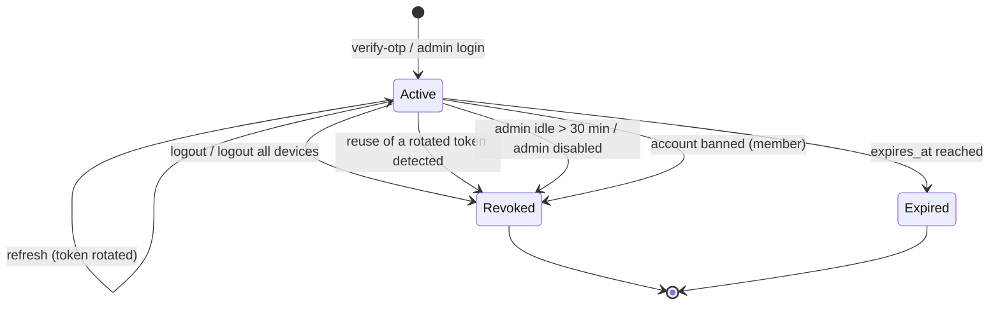

# Session Management

> Related: [Authentication](authentication.md), [Authorization](authorization.md), [Schema: user_sessions](../database/schema.md#44-user_sessions)

## 1. Strategy

| Piece | Member | Admin |
|---|---|---|
| **Access token** | JWT HS256 (`jose`), 15 min, claims `sub` (user ID), `sid` (session ID), `aud=garba-partner:app`, `iss=garba-partner`, `iat`, `exp`. **No personal data, no role** | Same, `aud=garba-partner:admin`, separate secret |
| Where the client keeps it | **Memory only** (never `localStorage`/`sessionStorage`) | Same |
| **Refresh token** | 32 random bytes (base64url). Only its SHA-256 is stored (`user_sessions.refresh_token_hash`) | Same (`admin_sessions`) |
| Cookie | `gp_rt`; `HttpOnly; Secure; SameSite=Strict; Path=/api/v1/auth` | `gp_admin_rt`; same flags, `Path=/api/v1/admin/auth` |
| Session lifetime | 30 days absolute (`REFRESH_TOKEN_TTL_DAYS`) | 12 h absolute + 30 min idle |
| Persistence | PostgreSQL, one row per login/device | PostgreSQL |

`Secure` is omitted only when `APP_ENV=development`, so cookies work on `http://localhost`.

**Why JWT and a DB session together?** The JWT keeps requests cheap and stateless to verify. The session row makes logout, revocation and bans **immediate**: the authentication middleware checks the session and account on every request with one indexed join.

## 2. Lifecycle

Revocation sets `revoked_at` + `revoked_reason` (`logout`, `logout_all`, `reuse_detected`, `sanction`, `deletion` for members; `logout`, `reuse_detected`, `idle_timeout`, `disabled` for admins). Expired or revoked rows are purged by a scheduled job (worker phase).

## 3. Refresh rotation and reuse detection

Every successful refresh:

1. locks the session row (`SELECT … FOR UPDATE`),
2. checks it isn't revoked or expired (and, for admins, not idle, and the admin is active),
3. moves the current hash to `previous_refresh_token_hash`, stores the new hash, sets `rotated_at` and `last_used_at`,
4. returns a new access token and a new cookie.

If a request presents a token equal to some session's `previous_refresh_token_hash`:

| Time since rotation | Interpretation | Action |
|---|---|---|
| ≤ 15 s (`LIMITS.REFRESH_REUSE_GRACE_SECONDS`) | Benign race (two tabs refreshed at once) | `401 REFRESH_INVALID`, session kept. The other tab already has the new cookie |
| > 15 s | Likely token theft | Session **revoked** (`reuse_detected`), `401`, warning logged (session ID only) |

The web and admin clients avoid the race in the first place: refreshes are **single-flight** within a tab and serialised **across tabs** with the Web Locks API (`navigator.locks`).

## 4. CSRF

The refresh endpoints are the only ones authenticated by a cookie. They are protected by:

1. `SameSite=Strict` plus the narrow cookie `Path`,
2. a required custom header (`X-Requested-With: gp-web` or `gp-admin`), which cross-site pages can't send without a CORS preflight that our CORS allow-list rejects,
3. an `Origin` check: if present, it must be `WEB_ORIGIN` (member) or `ADMIN_ORIGIN` (admin).

All other endpoints use the `Authorization: Bearer` header, which browsers never attach automatically.

## 5. Client behaviour (web and admin)

| Situation | Behaviour |
|---|---|
| App load | Calls refresh. Success → authenticated. 401 → anonymous (login screen) |
| Authenticated API call returns 401 | One silent refresh, then retries the call once. If the refresh fails → anonymous |
| Logout | Calls logout (best effort), clears the in-memory token, goes to the login screen |
| Page reload | The in-memory token is gone. Refresh restores the session from the cookie |
| Phone number during login | Kept in router state (memory), never in the URL or storage |

Implementation: `apps/web/src/lib/api-client.ts`, `apps/web/src/features/auth/AuthProvider.tsx`, and the admin equivalents.

## 6. Configuration

| Variable | Default | Notes |
|---|---|---|
| `JWT_ACCESS_SECRET` | — (required) | ≥ 32 characters |
| `JWT_ADMIN_ACCESS_SECRET` | — (required) | ≥ 32 characters. **Must differ** from the member secret (enforced) |
| `ACCESS_TOKEN_TTL_SECONDS` | 900 | 60–3600 |
| `REFRESH_TOKEN_TTL_DAYS` | 30 | 1–90 |
| `ADMIN_ACCESS_TOKEN_TTL_SECONDS` | 900 | 60–3600 |
| `ADMIN_SESSION_TTL_HOURS` | 12 | 1–24 |
| `ADMIN_SESSION_IDLE_MINUTES` | 30 | 5–240 |

**Secret rotation:** rotating a JWT secret invalidates all access tokens of that audience. Clients recover silently through refresh, because refresh tokens aren't JWTs. Supporting a key ID (`kid`) and an overlap window is a later improvement.
