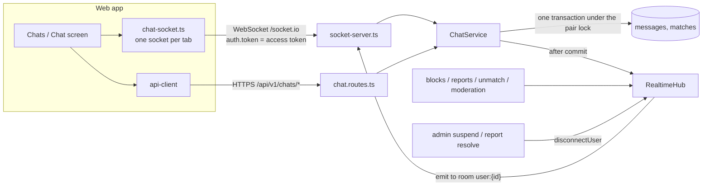

# Chat Architecture

> Related: [Socket events](socket-events.md), [Moderation](moderation.md), [Chat safety](safety.md), [Matches](../matching/matches.md), [User flows §8](../product/user-flows.md#8-chat-flow)

## 1. Purpose

One-to-one text chat between two members who **both said yes** (an active match). Messages are delivered in real time over Socket.IO, stored in PostgreSQL, and available as history over REST. Chat never exists outside a match: no match, no chat.

| Rule | How it's enforced |
|---|---|
| Only matched members can chat | Every read and write loads the match by ID **and** the caller as `user_a_id`/`user_b_id`; the match must be `active` |
| Blocked members can't chat | A block ends the match (`blocked`) under the pair lock; the service also re-checks the `blocks` table on every call |
| Suspended/banned members can't chat | HTTP: `requireActiveMember`. Sockets: only active members can connect, the session and account are re-checked on **every** event, and a suspension disconnects open sockets immediately. The partner's account must be active too |
| Unmatched members can't chat | Unmatch/report/moderation end the match; sends fail with `MATCH_NOT_ACTIVE` |

## 2. Components



| Concern | File |
|---|---|
| Chat rules, history, send, read, unread counts | `apps/api/src/modules/chat/chat.service.ts` |
| REST endpoints | `apps/api/src/modules/chat/chat.routes.ts` |
| Socket.IO server (auth, events, per-event checks) | `apps/api/src/realtime/socket-server.ts` |
| RealtimeHub (emit/disconnect seam, shared message limiter) | `apps/api/src/realtime/hub.ts` |
| Session check shared by HTTP and sockets | `resolveMemberSession()` in `apps/api/src/middlewares/authenticate.ts` |
| Pair lock, `match:ended` emits | `apps/api/src/modules/interests/connections.ts` |
| Model / migrations | `apps/api/src/models/message.model.ts`, `migrations/20260929130000-create-messages.ts`, `20260929130100-add-report-message-context.ts` |
| Shared contract | `packages/shared/src/types/socket.ts`, `schemas/chat.schema.ts`, `types/dto/chat.dto.ts` |
| Web | `apps/web/src/features/chat/`, `apps/web/src/pages/{Chats,Chat}Page.tsx` |

### Realtime hub

Business services never touch Socket.IO directly. They call `hub.toUser(userId, event, payload)` and `hub.disconnectUser(userId, reason)` **after their transaction commits**. Every socket joins the room `user:{userId}`, so emits reach all of a member's tabs and never depend on socket IDs. Until a Socket.IO server is attached (tests, scripts) the hub is a no-op, which keeps services testable without sockets. `server.ts` creates one hub and passes it to both the Express app and the Socket.IO server.

## 3. Data model

`messages` ([schema §4.16](../database/schema.md#416-messages)):

| Column | Notes |
|---|---|
| `match_id` | FK → `matches` `ON DELETE CASCADE` |
| `sender_id` | FK → `users` `ON DELETE CASCADE` |
| `client_message_id` | Client idempotency key. **`UNIQUE (sender_id, client_message_id)`** |
| `body` | `varchar(1000)`, not blank. Plain text |
| `contains_contact_info` | Moderation context only; never returned to members |
| `created_at` | Message timestamp (shown to members, IST) |

- **Immutable:** a trigger rejects `UPDATE` (no editing). Rows are removed only with their match/user or by a retention purge.
- Index `(match_id, created_at DESC, id DESC)` serves history pages and unread counts.
- `matches` gains `last_message_at` (chat list order, indexed per member as `COALESCE(last_message_at, created_at)` for active matches) and `user_a_last_read_at` / `user_b_last_read_at` (read positions).
- `reports` gains `message_id` and `match_id` (`SET NULL`); the evidence itself is copied into `reports.evidence` ([moderation](moderation.md)).

## 4. REST API

All under `/api/v1/chats`, member token, **active and onboarded** members only (`403` for suspended), `Cache-Control: private, no-store`.

| Method | Path | Description |
|---|---|---|
| GET | `/chats` | Active chats (the partner active, no block), latest activity first. Each: `partner` (public profile), `event`, `lastMessage` (preview ≤120 chars), `unreadCount`, `partnerLastReadAt`, `lastActivityAt`. Cursor pagination |
| GET | `/chats/unread` | `{ total }` unread messages across chats (navigation badge) |
| GET | `/chats/:matchId` | One chat summary |
| GET | `/chats/:matchId/messages` | History, **newest first**; `cursor` loads older; `limit` 1–100 (default 30) |
| POST | `/chats/:matchId/messages` | `{ clientMessageId, body }` → `201` `MessageDto`; `200` when the same `clientMessageId` was already stored |
| POST | `/chats/:matchId/read` | `{ lastReadMessageId }` → `{ lastReadAt }`. Read positions only move forward |

Errors: `404 NOT_FOUND` (not a member of this chat: indistinguishable from a missing one), `409 MATCH_NOT_ACTIVE` (ended, or the partner is unavailable/blocked), `400 VALIDATION_ERROR`, `429 RATE_LIMITED`.

```http
POST /api/v1/chats/5f0a…/messages
Authorization: Bearer <member access token>

{ "clientMessageId": "8c1d8e0e-2f7a-4b0e-9f3e-7a0c7f1b2d11", "body": "See you at the gate at 8?" }
```

```json
{
  "success": true,
  "message": "Message sent",
  "data": {
    "id": "c2b7…",
    "matchId": "5f0a…",
    "senderId": "4b1e…",
    "clientMessageId": "8c1d8e0e-2f7a-4b0e-9f3e-7a0c7f1b2d11",
    "body": "See you at the gate at 8?",
    "createdAt": "2026-10-11T13:05:42.118Z"
  }
}
```

The REST send is the fallback when the socket is disconnected; it calls the same service method and emits the same `message:new` events.

## 5. Sending a message

```mermaid
sequenceDiagram
    participant S as Sender (socket or REST)
    participant C as ChatService
    participant DB as PostgreSQL
    participant H as RealtimeHub
    S->>C: send(matchId, clientMessageId, body)
    C->>DB: same clientMessageId already stored? → return it (no duplicate)
    C->>C: rate limit (30/min per member, shared by REST + socket)
    C->>DB: check membership + match active + partner active + no block
    C->>DB: BEGIN; pair lock; re-check; INSERT … (idempotent); matches.last_message_at; COMMIT
    C->>H: toUser(partner, message:new) and toUser(sender, message:new)
    C-->>S: MessageDto
```

The pair lock is the same advisory lock used by block, unmatch, report and moderation: if a block commits first, the send's re-check fails, so **no message can be stored after a block**.

## 6. Read status and unread counts

- Opening a chat marks the newest message from the partner as read (socket `message:read`, or `POST …/read`). The member's `*_last_read_at` becomes `GREATEST(current, message.created_at)`.
- The other member gets `message:read` live and shows **"Seen"** under their last message when `partnerLastReadAt ≥ its createdAt`.
- `unreadCount` = messages from the partner newer than your read position. `/chats/unread` sums it across active chats with active, unblocked partners.
- No typing indicators and no online status (privacy).

## 7. Web client

- `chat-socket.ts` keeps one Socket.IO connection per tab while an **active** member is signed in. The handshake sends the in-memory access token (function form, so reconnects use the latest token). When the server refuses (`UNAUTHENTICATED`) or drops the socket (token expiry), the client refreshes the session over HTTP and reconnects.
- `ChatRealtime` turns events into TanStack Query cache updates: new messages are inserted into open conversations (deduplicated), and chat lists and unread counts are refreshed. `match:ended` closes the chat; `session:ended` re-reads the account.
- Sending uses the socket with an 8 s acknowledgement timeout, then falls back to REST with the **same** `clientMessageId`.
- Screens: **Chats** (`/chats`, unread badges, last message), **Chat** (`/chats/:matchId`: safety card, history with "Load earlier", composer, per-message **Report**, **Block**/**Report member**, "Seen"), and **Open chat** on each match. The navigation shows **Chats** with the total unread count.
- The Vite dev servers proxy `/socket.io` (with WebSocket upgrade) like `/api`. In production Nginx must forward the WebSocket upgrade for `/socket.io`.

## 8. Scaling

Single API process for the MVP: rooms and the message rate limiter live in memory. For several processes, add `@socket.io/redis-adapter`, sticky sessions, and a shared (e.g. Redis) rate limiter. No business code changes are needed because all emits go through the hub and `user:{id}` rooms.

## 9. Testing

| Test file | Covers |
|---|---|
| `apps/api/src/modules/chat/chat.int.test.ts` | REST: send, history pagination, idempotency, validation and plain text, contact-detail flag not exposed, rate limit, membership (404), unmatch/block/suspension (both sides), unread counts, read positions, chat list order, report-message evidence and chat closure |
| `apps/api/src/realtime/socket.int.test.ts` | Real Socket.IO client ↔ server: handshake auth (no/invalid/admin token, not onboarded, suspended, banned), live delivery to partner and other tabs, REST → live delivery, idempotent retries, non-members, invalid payloads, missing ack, read receipts, rate limit, block/unmatch → `match:ended` + sends refused, admin suspension → `session:ended` + disconnect, revoked session refused per event |
| `apps/api/src/modules/admin/reports/admin-reports.int.test.ts` | See [moderation §6](moderation.md#6-testing) |
| `packages/shared/test/chat.test.ts` | Body validation, strict payloads, contact-detail detection |

## 10. Known limitations

- Text only (no images, voice, reactions or edits); no push notifications (a member sees new messages when the app is open).
- Retention purge of ended chats is designed (index in place) but not scheduled yet ([safety §5](safety.md#5-retention)).
- In-memory rooms and rate limits (single process).
