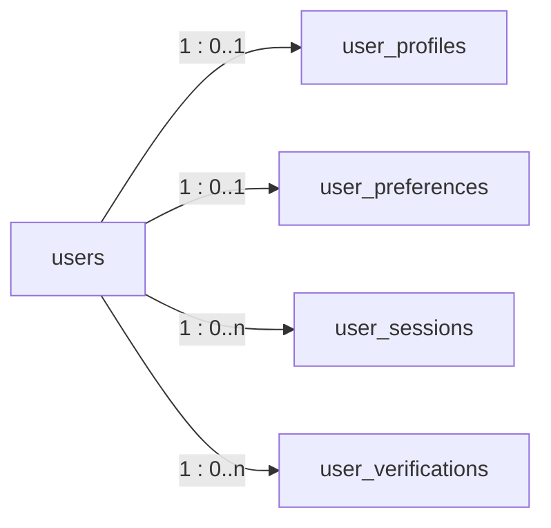

# Relationships

> Related: [Schema](schema.md), [Migration guide](migration-guide.md)

## 1. Overview

Every table introduced so far belongs to a user. `users` is the aggregate root.



| Parent | Child | Cardinality | FK column | DB constraint | `ON DELETE` | Sequelize association |
|---|---|---|---|---|---|---|
| `users` | `user_profiles` | 1 : 0..1 | `user_profiles.user_id` | FK + `UNIQUE (user_id)` | `CASCADE` | `User.hasOne(UserProfile)` as `profile` / `UserProfile.belongsTo(User)` as `user` |
| `users` | `user_preferences` | 1 : 0..1 | `user_preferences.user_id` | FK + `UNIQUE (user_id)` | `CASCADE` | `User.hasOne(UserPreference)` as `preferences` / `belongsTo` as `user` |
| `users` | `user_sessions` | 1 : 0..n | `user_sessions.user_id` | FK | `CASCADE` | `User.hasMany(UserSession)` as `sessions` / `belongsTo` as `user` |
| `users` | `user_verifications` | 1 : 0..n (at most one **open** per type) | `user_verifications.user_id` | FK + partial unique index | `CASCADE` | `User.hasMany(UserVerification)` as `verifications` / `belongsTo` as `user` |

"0..1" rather than "1": a user exists as soon as their phone is verified, and the profile and preferences are created during onboarding. The service layer creates **both in one transaction** when onboarding completes.

## 2. Associations in code

Associations are declared with sequelize-typescript decorators in `apps/api/src/models/`:

```ts
// user.model.ts
@HasOne(() => UserProfile, { foreignKey: 'userId', onDelete: 'CASCADE' })
profile?: NonAttribute<UserProfile | null>;

@HasMany(() => UserSession, { foreignKey: 'userId', onDelete: 'CASCADE' })
sessions?: NonAttribute<UserSession[]>;

// user-profile.model.ts
@ForeignKey(() => User)
@Column({ type: DataType.UUID, allowNull: false, unique: 'user_profiles_user_id_unique' })
userId!: string;

@BelongsTo(() => User, { foreignKey: 'userId', onDelete: 'CASCADE' })
user?: NonAttribute<User>;
```

Association properties are typed `NonAttribute<…>`, so they're excluded from `InferAttributes` and never treated as columns. The `onDelete` options document intent. The **database** constraints created by migrations are authoritative (`sync()` is never used).

### Eager loading

```ts
const user = await User.findByPk(userId, {
  include: [UserProfile, UserPreference],
});
user?.profile?.displayName;
user?.preferences?.discoveryEnabled;
```

Rules:

- Select only what you need on hot paths: `include: [{ model: UserProfile, attributes: ['displayName', 'dateOfBirth'] }]`.
- Never `include` `sessions` or `verifications` for member-facing responses. They're internal.
- `User`'s default scope hides the phone columns, even when included from another model.

## 3. Deletion behaviour

| Operation | Effect on children |
|---|---|
| **Soft delete** of a user (`deleted_at` set, phone data nulled in the same `UPDATE`) | None automatically. The erasure service deletes the profile and preferences, revokes sessions and purges verification evidence **in the same transaction** |
| **Hard delete** of a user (`DELETE FROM users`, e.g. dev seed undo, tests) | Profile, preferences, sessions and verifications are removed by `ON DELETE CASCADE` |
| Delete a profile/preference row | No effect on the user row |

Sequelize `paranoid` on `User` means ordinary queries exclude soft-deleted users. Use `{ paranoid: false }` only in admin/audit code.

## 4. Transactions

Use a managed transaction (`sequelize.transaction(async (t) => …)`) and pass `transaction` to **every** query inside it whenever several rows must change together:

| Operation (future phases) | Rows changed together |
|---|---|
| Complete onboarding | `user_profiles` insert + `user_preferences` insert + `users.onboarding_completed_at`, `terms_*` |
| Approve photo verification | `user_verifications` (status, decided_at) + `users.photo_verified_at` |
| Revoke verification on primary-photo change | `user_verifications.status = 'revoked'` + `users.photo_verified_at = null` |
| Sanction / logout-all | `users.status` + all `user_sessions.revoked_*` |
| Account erasure | Delete profile + preferences, revoke sessions, purge evidence, then null phone + set `deleted_at` (single `UPDATE`) |

The development seeder already follows this pattern (`src/seeders/20260925110000-dev-users.ts`).

## 5. Relationships planned in later phases

| Relationship | Added by |
|---|---|
| `user_profiles.city_id → cities.id`, `user_profiles.area_id → areas.id` | Locations migration |
| `user_verifications.reviewed_by_admin_id → admin_users.id` | Admin foundation phase |
| Users → events, attendances, interests, matches, messages, blocks, reports, sanctions | Their respective phases (see [database architecture](../architecture/database-architecture.md)) |
