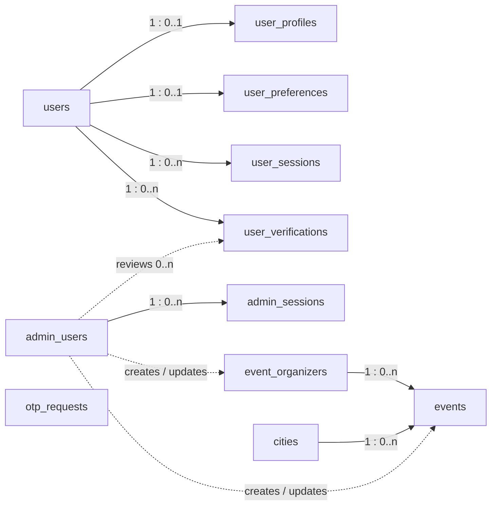

# Relationships

> Related: [Schema](schema.md), [Migration guide](migration-guide.md)

## 1. Overview

Member tables belong to a user (`users` is the aggregate root). Admin tables belong to an admin (`admin_users`). `otp_requests` is keyed by phone hash only, with no FK, because a code can be requested before an account exists.


```mermaid
flowchart LR
    U[users] -->|1 : 0..1| P[user_profiles]
    U -->|1 : 0..1| PR[user_preferences]
    U -->|1 : 0..n| S[user_sessions]
    U -->|1 : 0..n| V[user_verifications]
    A[admin_users] -->|1 : 0..n| AS[admin_sessions]
    A -.->|reviews 0..n| V
    O[otp_requests]
    EO[event_organizers] -->|1 : 0..n| E[events]
    C[cities] -->|1 : 0..n| E
    A -.->|creates / updates| E
    A -.->|creates / updates| EO
```

| Parent | Child | Cardinality | FK column | DB constraint | `ON DELETE` | Sequelize association |
|---|---|---|---|---|---|---|
| `users` | `user_profiles` | 1 : 0..1 | `user_profiles.user_id` | FK + `UNIQUE (user_id)` | `CASCADE` | `User.hasOne(UserProfile)` as `profile` / `UserProfile.belongsTo(User)` as `user` |
| `users` | `user_preferences` | 1 : 0..1 | `user_preferences.user_id` | FK + `UNIQUE (user_id)` | `CASCADE` | `User.hasOne(UserPreference)` as `preferences` / `belongsTo` as `user` |
| `users` | `user_sessions` | 1 : 0..n | `user_sessions.user_id` | FK | `CASCADE` | `User.hasMany(UserSession)` as `sessions` / `belongsTo` as `user` |
| `users` | `user_verifications` | 1 : 0..n (at most one **open** per type) | `user_verifications.user_id` | FK + partial unique index | `CASCADE` | `User.hasMany(UserVerification)` as `verifications` / `belongsTo` as `user` |
| `admin_users` | `admin_sessions` | 1 : 0..n | `admin_sessions.admin_id` | FK | `CASCADE` | `AdminUser.hasMany(AdminSession)` as `sessions` / `AdminSession.belongsTo(AdminUser)` as `admin` |
| `cities` | `areas` | 1 : 0..n | `areas.city_id` | FK | `RESTRICT` | `City.hasMany(Area)` / `Area.belongsTo(City)` |
| `cities` | `user_profiles` | 1 : 0..n | `user_profiles.city_id` | FK | `RESTRICT` | `UserProfile.belongsTo(City)` as `city` |
| `areas` | `user_profiles` | 0..1 : 0..n | `(user_profiles.area_id, city_id)` | **Composite FK** → `areas (id, city_id)` | `RESTRICT` | `UserProfile.belongsTo(Area)` as `area` |
| `admin_users` | `admin_audit_logs` | 1 : 0..n | `admin_audit_logs.admin_id` | FK | `RESTRICT` | none (written through `recordAdminAction()`) |
| `event_organizers` | `events` | 1 : 0..n | `events.organizer_id` | FK | `RESTRICT` (organizers are archived, never deleted) | `Event.belongsTo(EventOrganizer)` as `organizer` |
| `cities` | `events` | 1 : 0..n | `events.city_id` | FK | `RESTRICT` | `Event.belongsTo(City)` as `city` |
| `areas` | `events` | 0..1 : 0..n | `(events.area_id, city_id)` | **Composite FK** → `areas (id, city_id)` | `RESTRICT` | `Event.belongsTo(Area)` as `area` |
| `admin_users` | `events` | 1 : 0..n (creator / last editor) | `events.created_by_admin_id`, `updated_by_admin_id` | FK | `RESTRICT` | `Event.belongsTo(AdminUser)` as `createdBy` / `updatedBy` |
| `admin_users` | `event_organizers` | 1 : 0..n (creator / last editor) | `event_organizers.created_by_admin_id`, `updated_by_admin_id` | FK | `RESTRICT` | `EventOrganizer.belongsTo(AdminUser)` as `createdBy` |
| `events` | `event_attendances` | 1 : 0..n | `event_attendances.event_id` | FK + `UNIQUE (event_id, user_id)` | `RESTRICT` | `EventAttendance.belongsTo(Event)` as `event` |
| `users` | `event_attendances` | 1 : 0..n | `event_attendances.user_id` | FK | `CASCADE` | none (queried by user ID) |
| `users` | `blocks` | 1 : 0..n (as blocker and as blocked) | `blocks.blocker_id`, `blocked_id` | FK + `UNIQUE (blocker_id, blocked_id)` | `CASCADE` | `Block.belongsTo(User)` as `blocked` |
| `users` | `reports` | 1 : 0..n (as reporter / reported) | `reports.reporter_id`, `reported_user_id` | FK | `SET NULL` / `RESTRICT` | `Report.belongsTo(User)` as `reporter` / `reportedUser` |
| `admin_users` | `user_verifications` | 0..1 : 0..n (reviewer) | `user_verifications.reviewed_by_admin_id` | FK (nullable) | `RESTRICT` | none yet (added with the verification review feature) |

"0..1" rather than "1": a user exists as soon as their phone is verified, and the profile and preferences are created during onboarding. The service layer creates **both in one transaction** when onboarding completes.

## 2. Associations in code

Associations are declared with sequelize-typescript decorators in `apps/api/src/models/`:

```ts
// user.model.ts
@HasOne(() => UserProfile, { foreignKey: 'userId', onDelete: 'CASCADE' })
profile?: NonAttribute<UserProfile | null>;

@HasMany(() => UserSession, { foreignKey: 'userId', onDelete: 'CASCADE' })
sessions?: NonAttribute<UserSession[]>;

// user-profile.model.ts
@ForeignKey(() => User)
@Column({ type: DataType.UUID, allowNull: false, unique: 'user_profiles_user_id_unique' })
userId!: string;

@BelongsTo(() => User, { foreignKey: 'userId', onDelete: 'CASCADE' })
user?: NonAttribute<User>;
```

Association properties are typed `NonAttribute<…>`, so they're excluded from `InferAttributes` and never treated as columns. The `onDelete` options document intent. The **database** constraints created by migrations are authoritative (`sync()` is never used).

### Eager loading

```ts
const user = await User.findByPk(userId, {
  include: [UserProfile, UserPreference],
});
user?.profile?.displayName;
user?.preferences?.discoveryEnabled;
```

Rules:

- Select only what you need on hot paths: `include: [{ model: UserProfile, attributes: ['displayName', 'dateOfBirth'] }]`.
- Never `include` `sessions` or `verifications` for member-facing responses. They're internal.
- `User`'s default scope hides the phone columns, even when included from another model.

## 3. Deletion behaviour

| Operation | Effect on children |
|---|---|
| **Soft delete** of a user (`deleted_at` set, phone data nulled in the same `UPDATE`) | None automatically. The erasure service deletes the profile and preferences, revokes sessions and purges verification evidence **in the same transaction** |
| **Hard delete** of a user (`DELETE FROM users`, e.g. dev seed undo, tests) | Profile, preferences, sessions and verifications are removed by `ON DELETE CASCADE` |
| Delete a profile/preference row | No effect on the user row |
| Hard delete of an event (only never-published events) | Row removed; its image is deleted from storage after commit. Published events are archived instead |
| Delete an organizer | Refused by `RESTRICT` while events reference it. Organizers are archived instead |
| Delete an admin who created events/organizers | Refused by `RESTRICT` (admins are disabled, never deleted) |

Sequelize `paranoid` on `User` means ordinary queries exclude soft-deleted users. Use `{ paranoid: false }` only in admin/audit code.

## 4. Transactions

Use a managed transaction (`sequelize.transaction(async (t) => …)`) and pass `transaction` to **every** query inside it whenever several rows must change together:

| Operation (future phases) | Rows changed together |
|---|---|
| Complete onboarding | `user_profiles` insert + `user_preferences` insert + `users.onboarding_completed_at`, `terms_*` |
| Approve photo verification | `user_verifications` (status, decided_at) + `users.photo_verified_at` |
| Revoke verification on primary-photo change | `user_verifications.status = 'revoked'` + `users.photo_verified_at = null` |
| Sanction / logout-all | `users.status` + all `user_sessions.revoked_*` |
| Event / organizer admin actions (implemented) | Row lock (`FOR UPDATE`) + change + `admin_audit_logs` entry |
| Account erasure | Delete profile + preferences, revoke sessions, purge evidence, then null phone + set `deleted_at` (single `UPDATE`) |

The development seeder already follows this pattern (`src/seeders/20260925110000-dev-users.ts`).

## 5. Relationships planned in later phases

| Relationship | Added by |
|---|---|
| Users → interests, matches, messages, blocks, reports, sanctions | Their respective phases (see [database architecture](../architecture/database-architecture.md)) |
