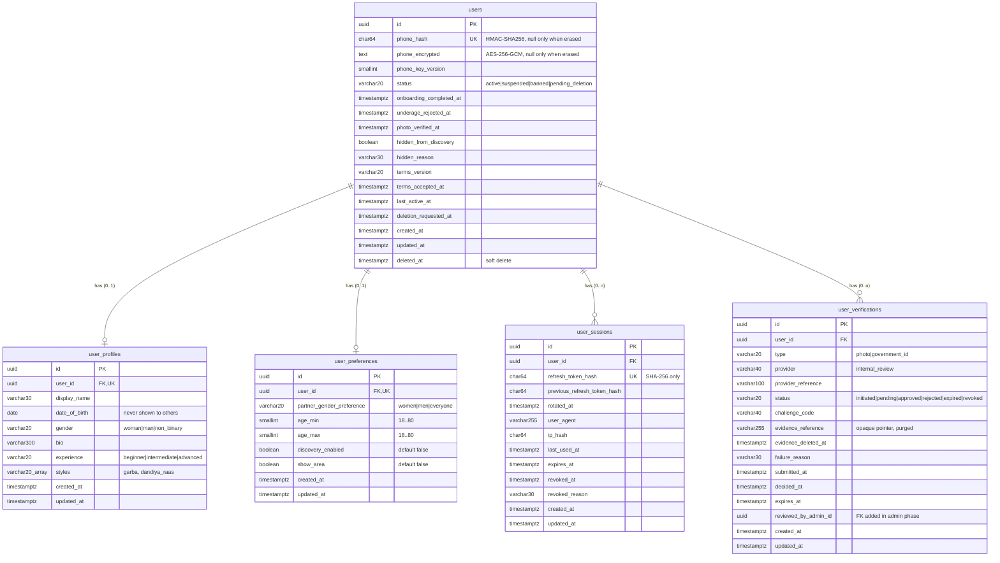

# Database Schema

> **Source of truth for implemented tables.** Related: [Relationships](relationships.md), [Migration guide](migration-guide.md), [Database setup](database-setup.md), [Database architecture (target design)](../architecture/database-architecture.md)

Implemented so far: `users`, `user_profiles`, `user_preferences`, `user_sessions`, `user_verifications`, plus the migration bookkeeping tables `schema_migrations` and `schema_seeders`. Other tables in the [target design](../architecture/database-architecture.md) are added by later phases.

## 1. ERD

## 2. Conventions

| Convention | Rule |
|---|---|
| Primary keys | `uuid` with `DEFAULT gen_random_uuid()`. Models also generate UUIDv4 |
| Naming | `snake_case` tables and columns, plural tables. Models use camelCase attributes (`underscored: true`) |
| Timestamps | `created_at`/`updated_at` `timestamptz NOT NULL DEFAULT now()` on every table. `updated_at` is also maintained by the `set_updated_at()` trigger, so raw SQL updates stay correct |
| Enumerations | `varchar` + `CHECK` constraint (not PG enums). Values mirror `packages/shared/src/constants/enums.ts` |
| Constraint names | `<table>_<column(s)>_<check\|unique\|idx>`, so errors are easy to trace |
| Foreign keys | Always declared. `ON DELETE CASCADE` from user-owned rows to `users` |
| Time zone | All timestamps are UTC (`timestamptz`, Sequelize `timezone: '+00:00'`). Only `date_of_birth` is a `date` |

## 3. Soft-delete strategy

| Table | Strategy | Why |
|---|---|---|
| `users` | **Soft delete** (`deleted_at`, Sequelize `paranoid`) | The row must survive erasure so that reports and sanctions (later phases) keep a valid FK. The CHECK `users_phone_lifecycle_check` requires phone data to be **nulled in the same update** that sets `deleted_at`, so a soft-deleted account holds no personal data |
| `user_profiles` | Hard delete during erasure | Pure personal data. Nothing else needs it after erasure |
| `user_preferences` | Hard delete during erasure | Personal settings |
| `user_sessions` | Logical revocation (`revoked_at` + reason). Expired/revoked rows are purged by a job | Security records with a short life |
| `user_verifications` | Kept as an audit trail (status history). Evidence is purged (`evidence_reference` → null, `evidence_deleted_at` set). Rows are removed with the account | Moderation accountability without keeping evidence |

Account deletion (later phase) runs in **one transaction**: set `status = 'pending_deletion'` and revoke sessions. After the grace period: delete the profile and preferences, purge the evidence, then null the phone columns and set `deleted_at` in a single `UPDATE`. A plain `user.destroy()` is rejected by the database on purpose.

## 4. Tables

### 4.1 `users`

Account record. Personal details live in `user_profiles`, and settings in `user_preferences`.

| Column | Type | Null | Default | Notes |
|---|---|---|---|---|
| `id` | uuid | no | `gen_random_uuid()` | PK |
| `phone_hash` | char(64) | yes* | | HMAC-SHA256(`PHONE_HASH_SECRET`, E.164), lowercase hex |
| `phone_encrypted` | text | yes* | | AES-256-GCM `base64(iv‖tag‖ciphertext)` with `PHONE_ENCRYPTION_KEY` |
| `phone_key_version` | smallint | yes* | | Key version used for `phone_encrypted` (≥ 1) |
| `status` | varchar(20) | no | `'active'` | `active`, `suspended`, `banned`, `pending_deletion` |
| `onboarding_completed_at` | timestamptz | yes | | |
| `underage_rejected_at` | timestamptz | yes | | Locks DOB submission |
| `photo_verified_at` | timestamptz | yes | | Cached projection of an approved photo verification |
| `hidden_from_discovery` | boolean | no | `false` | Auto-hide after reports |
| `hidden_reason` | varchar(30) | yes | | `p0_report`, `report_threshold`, `no_visible_photo` |
| `terms_version` / `terms_accepted_at` | varchar(20) / timestamptz | yes | | Both set or both null |
| `last_active_at` | timestamptz | yes | | Never exposed precisely to other members |
| `deletion_requested_at` | timestamptz | yes | | Start of the 30-day grace period |
| `created_at` / `updated_at` | timestamptz | no | `now()` | |
| `deleted_at` | timestamptz | yes | | Soft delete |

\* Null **only** when the account is erased (see constraint below).

Constraints:

| Name | Rule |
|---|---|
| `users_status_check` | status in the allowed set |
| `users_phone_hash_format_check` | `phone_hash ~ '^[0-9a-f]{64}$'` |
| `users_phone_key_version_check` | `phone_key_version >= 1` |
| `users_phone_lifecycle_check` | live row ⇒ all three phone columns set. Soft-deleted row ⇒ all three null |
| `users_hidden_reason_check` | reason in the allowed set |
| `users_hidden_consistency_check` | `hidden_from_discovery = (hidden_reason IS NOT NULL)` |
| `users_terms_consistency_check` | `terms_version` and `terms_accepted_at` set together |
| `users_pending_deletion_check` | `pending_deletion` ⇒ `deletion_requested_at` set |

Indexes: `users_phone_hash_unique` (UNIQUE, `WHERE phone_hash IS NOT NULL`), `users_status_idx` (`status`, `WHERE deleted_at IS NULL`), `users_deletion_requested_at_idx` (`WHERE status = 'pending_deletion'`).

Model: `User`. The **default scope excludes** `phoneHash`, `phoneEncrypted` and `phoneKeyVersion`. Load them only with `User.scope('withPhone')` (auth and audited phone-reveal code only).

### 4.2 `user_profiles`

| Column | Type | Null | Default | Notes |
|---|---|---|---|---|
| `id` | uuid | no | `gen_random_uuid()` | PK |
| `user_id` | uuid | no | | FK → `users.id` `ON DELETE CASCADE`. **Unique** |
| `display_name` | varchar(30) | no | | 2–30 characters after trimming |
| `date_of_birth` | date | no | | ≥ 1900-01-01. Immutable through the API. The 18+ rule is enforced in the service (it depends on "today") |
| `gender` | varchar(20) | no | | `woman`, `man`, `non_binary` |
| `bio` | varchar(300) | yes | | |
| `experience` | varchar(20) | no | | `beginner`, `intermediate`, `advanced` |
| `styles` | varchar(20)[] | no | | Non-empty subset of `garba`, `dandiya_raas` |
| `created_at` / `updated_at` | timestamptz | no | `now()` | |

Constraints: `user_profiles_user_id_unique`, `user_profiles_display_name_check`, `user_profiles_date_of_birth_check`, `user_profiles_gender_check`, `user_profiles_experience_check`, `user_profiles_styles_check`.

City and area columns (`city_id`, `area_id`) are added by the locations migration together with the `cities`/`areas` tables.

### 4.3 `user_preferences`

| Column | Type | Null | Default | Notes |
|---|---|---|---|---|
| `id` | uuid | no | `gen_random_uuid()` | PK |
| `user_id` | uuid | no | | FK → `users.id` `ON DELETE CASCADE`. **Unique** |
| `partner_gender_preference` | varchar(20) | no | `'everyone'` | `women`, `men`, `everyone` |
| `age_min` / `age_max` | smallint | no | 18 / 80 | `18 ≤ age_min ≤ age_max ≤ 80` |
| `discovery_enabled` | boolean | no | **`false`** | Explicit opt-in to discovery |
| `show_area` | boolean | no | **`false`** | Explicit opt-in to showing the area |
| `created_at` / `updated_at` | timestamptz | no | `now()` | |

Constraints: `user_preferences_user_id_unique`, `user_preferences_partner_gender_preference_check`, `user_preferences_age_range_check`.
Indexes: `user_preferences_discovery_enabled_idx` (`user_id WHERE discovery_enabled`).

### 4.4 `user_sessions`

One row per login (device). **Only SHA-256 hashes of refresh tokens are stored.** Token issuance and rotation arrive in the auth phase.

| Column | Type | Null | Default | Notes |
|---|---|---|---|---|
| `id` | uuid | no | `gen_random_uuid()` | PK (becomes the JWT `sid`) |
| `user_id` | uuid | no | | FK → `users.id` `ON DELETE CASCADE` |
| `refresh_token_hash` | char(64) | no | | **Unique**, hex |
| `previous_refresh_token_hash` | char(64) | yes | | Reuse detection |
| `rotated_at` | timestamptz | yes | | Set together with the previous hash |
| `user_agent` | varchar(255) | yes | | Truncated |
| `ip_hash` | char(64) | yes | | HMAC of the IP. Raw IPs are not stored |
| `last_used_at` | timestamptz | no | `now()` | |
| `expires_at` | timestamptz | no | | Absolute expiry (> `created_at`) |
| `revoked_at` | timestamptz | yes | | |
| `revoked_reason` | varchar(30) | yes | | `logout`, `logout_all`, `reuse_detected`, `sanction`, `deletion`. Set exactly when revoked |
| `created_at` / `updated_at` | timestamptz | no | `now()` | |

Constraints: `user_sessions_refresh_token_hash_unique`, `user_sessions_hash_format_check`, `user_sessions_rotation_consistency_check`, `user_sessions_expiry_check`, `user_sessions_revoked_reason_check`, `user_sessions_revocation_consistency_check`.
Indexes: `user_sessions_active_user_id_idx` (`user_id WHERE revoked_at IS NULL`), `user_sessions_previous_refresh_token_hash_idx` (partial), `user_sessions_expires_at_idx`.

### 4.5 `user_verifications`

**Stores only provider / reference / status metadata.** No document numbers (Aadhaar or other), no document images, no KYC payloads, no free-text notes.

| Column | Type | Null | Default | Notes |
|---|---|---|---|---|
| `id` | uuid | no | `gen_random_uuid()` | PK |
| `user_id` | uuid | no | | FK → `users.id` `ON DELETE CASCADE` |
| `type` | varchar(20) | no | | `photo` (MVP), `government_id` (reserved) |
| `provider` | varchar(40) | no | | `internal_review` (moderator review). New providers need legal review + a migration |
| `provider_reference` | varchar(100) | yes | | External provider's reference ID. Unique per provider |
| `status` | varchar(20) | no | `'initiated'` | `initiated`, `pending`, `approved`, `rejected`, `expired`, `revoked` |
| `challenge_code` | varchar(40) | yes | | e.g. gesture code. `^[a-z0-9_]{1,40}$` |
| `evidence_reference` | varchar(255) | yes | | Opaque pointer to **privately** stored evidence (e.g. a private selfie asset). Nulled when purged |
| `evidence_deleted_at` | timestamptz | yes | | When evidence was purged |
| `failure_reason` | varchar(30) | yes | | Set exactly when `rejected`: `gesture_mismatch`, `face_not_visible`, `does_not_match_photos`, `inappropriate`, `provider_failed`, `other` |
| `submitted_at` / `decided_at` / `expires_at` | timestamptz | yes | | `decided_at` is required for approved/rejected |
| `reviewed_by_admin_id` | uuid | yes | | FK to `admin_users` added in the admin phase |
| `created_at` / `updated_at` | timestamptz | no | `now()` | |

Constraints:

| Name | Rule |
|---|---|
| `user_verifications_type_check` / `_provider_check` / `_status_check` / `_failure_reason_check` | Allowed values |
| `user_verifications_type_provider_check` | `photo` ⇔ `internal_review`. `government_id` needs an external provider (none approved, so it can't be inserted yet) |
| `user_verifications_challenge_code_check` | Code format |
| `user_verifications_rejection_consistency_check` | `failure_reason` set ⇔ `status = 'rejected'` |
| `user_verifications_decision_check` | approved/rejected ⇒ `decided_at` set |
| `user_verifications_evidence_purge_check` | purged ⇒ `evidence_reference` is null |
| `user_verifications_no_identity_numbers_check` | `provider_reference` and `evidence_reference` must not contain an Aadhaar-like number (see below) |

Indexes: `user_verifications_one_open_per_type_unique` (UNIQUE `(user_id, type) WHERE status IN ('initiated','pending')`), `user_verifications_provider_reference_unique` (UNIQUE `(provider, provider_reference)` where not null), `user_verifications_review_queue_idx` (`submitted_at WHERE status = 'pending'`), `user_verifications_user_id_created_at_idx`, `user_verifications_evidence_purge_idx` (`decided_at WHERE evidence_reference IS NOT NULL`).

**Aadhaar guard (defence in depth).** SQL functions `is_verhoeff_valid(text)` and `contains_aadhaar_like_number(text)` (IMMUTABLE) detect a *standalone* 12-digit number, optionally grouped 4-4-4, whose first digit is 2–9 and that passes the Verhoeff checksum. The same rule is implemented in `apps/api/src/lib/pii-guards.ts` and applied by model validation. Requiring the checksum and standalone boundaries keeps false positives on ordinary IDs (e.g. UUIDs) negligible. The primary protection is still the schema itself: there is no column that could hold a document number, image or KYC payload.

### 4.6 Bookkeeping tables

| Table | Created by | Content |
|---|---|---|
| `schema_migrations` | Umzug `SequelizeStorage` | Names of applied migrations |
| `schema_seeders` | Umzug `SequelizeStorage` | Names of applied seeders (development) |

## 5. Database functions and triggers

| Object | Created in | Purpose |
|---|---|---|
| `set_updated_at()` | `20260925100000-create-users` | Trigger function setting `updated_at = now()` |
| `<table>_set_updated_at` triggers | each table's migration | `BEFORE UPDATE` on every table |
| `is_verhoeff_valid(text)` | `20260925100400-create-user-verifications` | Verhoeff checksum |
| `contains_aadhaar_like_number(text)` | same | Used by `user_verifications_no_identity_numbers_check` |

## 6. Privacy summary

| Data | Where | Protection |
|---|---|---|
| Phone number | `users` | Only an HMAC hash (lookup) and AES-GCM ciphertext. Excluded from the default model scope. Erased on soft delete |
| Date of birth | `user_profiles` | Never returned to other members (only age) |
| Refresh tokens | `user_sessions` | SHA-256 hashes only |
| IP addresses | `user_sessions` | HMAC only |
| Identity documents | — | **Not stored anywhere.** Verification rows hold metadata only, and the DB rejects Aadhaar-like values |
| Verification evidence | Private storage (later phase) | Referenced by an opaque pointer and purged after the retention period |
