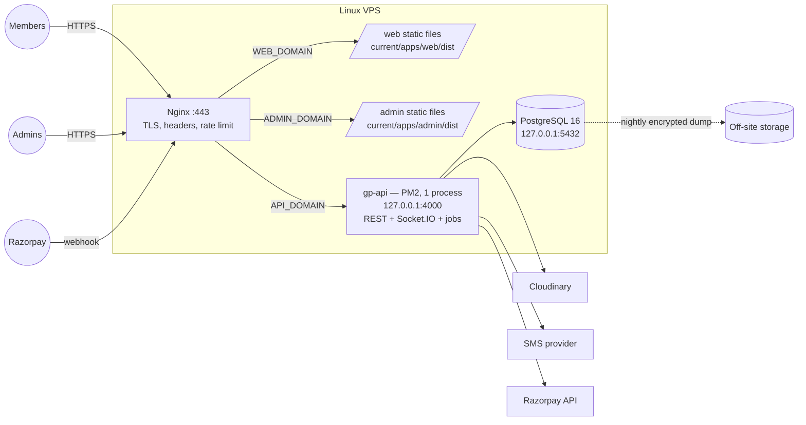

# Production Setup

> Related: [Nginx](nginx.md), [PM2](pm2.md), [SSL](ssl.md), [Database backup](database-backup.md), [Rollback](rollback.md), [Environment variables](../setup/environment-variables.md), [Security checklist](../security/security-checklist.md), [Release checklist](../testing/release-checklist.md)

## 1. Status

**Garba Partner has not been deployed to production.** This folder prepares the deployment: configuration, scripts and procedures are in the repository, and the parts that can run on a development machine have been tested (§12). Nothing here has run on a real VPS yet.

Two things block a production start today:

| Blocker | Why | What is needed |
|---|---|---|
| **MSG91 is not configured or verified** | Members sign in with a code sent on WhatsApp. The API **will not start** with `APP_ENV=production` unless `SMS_PROVIDER=msg91_whatsapp` and its three variables are set. The adapter has only been tested against a stand-in | Follow [MSG91 setup](../notifications/msg91.md): connect a WhatsApp Business number, get the login-code template approved, set the auth key, then do the first-send check |
| **The deployment checklist (§11) has never been run on a server** | Nginx, PM2, certbot and the deploy script could not be run on the Windows development machine | Run §3–§9 on the VPS; the deployment is complete only when `healthcheck.sh` passes there |

Also open before launch: admins sign in with a password only (no second factor), see [security checklist §5](../security/security-checklist.md#5-before-launch-open-items).

## 2. Architecture

One Linux VPS. Nginx is the only public entry point; the API and PostgreSQL listen on loopback.



| Domain (example) | Variable | Serves |
|---|---|---|
| `garbamates.in` | `WEB_DOMAIN` | Member web app (static files) |
| `admin.garbamates.in` | `ADMIN_DOMAIN` | Admin panel (static files) |
| `api.garbamates.in` | `API_DOMAIN` | REST API and Socket.IO, proxied to the Node process |

The domains are **not** in the code. They come from `/etc/garba-partner/production.env` and are used in three places: the Nginx templates, the API's CORS/CSRF allow-list (`WEB_ORIGIN`, `ADMIN_ORIGIN`) and the browser bundles (`VITE_API_BASE_URL`, baked in at build time). To move to another domain, see §9.

**Why the API has its own domain.** The browser apps call `https://<API_DOMAIN>` directly. This is a cross-origin but same-site setup, so:

- the refresh cookie is still host-only on the API domain, `HttpOnly`, `Secure`, `SameSite=Strict`;
- the browser only talks to the API from the two allowed origins (strict CORS, tested), and cookie endpoints also require the CSRF header and a matching `Origin`;
- all three hostnames must share one registrable domain (`garbamates.in`). If the API were on an unrelated domain, `SameSite=Strict` cookies would not be sent and sign-in sessions would break.

### What is in the repository

| Path | Purpose |
|---|---|
| [`ecosystem.config.cjs`](../../ecosystem.config.cjs) | PM2 process file ([pm2.md](pm2.md)) |
| [`deploy/env/production.env.example`](../../deploy/env/production.env.example) | Template of the server's env file (placeholders only) |
| [`deploy/nginx/`](../../deploy/nginx/) | Nginx templates and snippets ([nginx.md](nginx.md)) |
| [`deploy/postgres/`](../../deploy/postgres/) | Role setup, server settings, `pg_hba` rules (§5) |
| [`deploy/scripts/`](../../deploy/scripts/) | `deploy.sh`, `rollback.sh`, `preflight.sh`, `healthcheck.sh`, `render-nginx.sh`, `backup-db.sh`, `restore-db.sh` |
| [`deploy/logrotate/`](../../deploy/logrotate/), [`deploy/cron/`](../../deploy/cron/) | Log rotation and the nightly backup schedule |

No secret is stored in the repository. Run the scripts with `bash <script>` (they don't need the executable bit).

### Layout on the server

| Path | Owner | Contents |
|---|---|---|
| `/etc/garba-partner/production.env` | `root:garba`, mode `640` | All settings and secrets |
| `/srv/garba-partner/repo` | `garba` | Git clone (source of releases and of the deploy script) |
| `/srv/garba-partner/releases/<time>-<commit>` | `garba` | One directory per release (5 are kept) |
| `/srv/garba-partner/current` | `garba` | Symlink to the live release |
| `/var/log/garba-partner/` | `garba` | API logs (PM2), backup log |
| `/var/backups/garba-partner/` | `garba`, mode `700` | Encrypted database dumps |
| `/etc/nginx/conf.d/garba-partner.conf` | `root` | Rendered Nginx site |

## 3. Prepare the server

Tested target: Ubuntu 24.04 LTS, 2 vCPU, 4 GB RAM, 40 GB disk. Commands run as a sudo-capable admin user unless stated.

**DNS first:** create `A` (and `AAAA` if you use IPv6) records for the three domains pointing at the VPS. Certificates cannot be issued until they resolve.

```bash
# System packages
sudo apt update && sudo apt upgrade -y
sudo apt install -y nginx postgresql-16 certbot git curl gnupg rclone gettext-base ufw unattended-upgrades

# Node.js 22 system-wide (NodeSource). Do not use nvm: cron and PM2 need node on the default PATH.
curl -fsSL https://deb.nodesource.com/setup_22.x | sudo -E bash -
sudo apt install -y nodejs
node --version            # must be v22.12 or newer
sudo npm install -g pm2

# Deploy user (no sudo rights, no password login)
sudo adduser --disabled-password --gecos "" garba

# Directories
sudo mkdir -p /srv/garba-partner /var/log/garba-partner /var/backups/garba-partner /etc/garba-partner /var/www/letsencrypt
sudo chown garba:garba /srv/garba-partner /var/log/garba-partner /var/backups/garba-partner
sudo chmod 700 /var/backups/garba-partner
sudo chown root:garba /etc/garba-partner && sudo chmod 750 /etc/garba-partner

# Firewall: SSH and web only. PostgreSQL (5432) and the API (4000) are never opened.
sudo ufw allow OpenSSH && sudo ufw allow 'Nginx Full' && sudo ufw enable
```

Server hardening that is not specific to this app, but required: SSH keys only (`PasswordAuthentication no`, `PermitRootLogin no`), `unattended-upgrades` enabled, server time in UTC (`sudo timedatectl set-timezone UTC`), and the provider's snapshot/monitoring features switched on.

Nginx must be able to read the static files: `/srv/garba-partner` and everything below it stay world-readable (the default). The env file is not inside that tree.

## 4. Environment file

```bash
sudo -u garba git clone https://github.com/<owner>/garba-partner.git /srv/garba-partner/repo
sudo cp /srv/garba-partner/repo/deploy/env/production.env.example /etc/garba-partner/production.env
sudo chown root:garba /etc/garba-partner/production.env
sudo chmod 640 /etc/garba-partner/production.env
sudoedit /etc/garba-partner/production.env
```

Fill in every value. The template explains each one; the full reference is [environment variables §6](../setup/environment-variables.md#6-production). Rules:

- Generate each secret separately **on the server**: `node -e "console.log(require('node:crypto').randomBytes(32).toString('base64'))"`. Never reuse development values.
- One `KEY=value` per line, no quotes, no spaces around `=`. URL-encode special characters in database passwords.
- Do **not** set `NODE_ENV` in the file (PM2 sets it; the frontend build reads this file too).
- `WEB_ORIGIN`, `ADMIN_ORIGIN` and `VITE_API_BASE_URL` must match the three domains exactly. `preflight.sh` checks this.
- Keep a copy of the secrets in a password manager. **Without `PHONE_HASH_SECRET` and `PHONE_ENCRYPTION_KEY` a database backup is useless**: members could not sign in and phone numbers could not be decrypted.

## 5. PostgreSQL

Two roles, so that a compromised API cannot change the schema:

| Role | Used by | Rights |
|---|---|---|
| `gp_owner` | Migrations, backups, `admin:create` (`DATABASE_MIGRATION_URL`) | Owns the schema |
| `gp_app` | The running API (`DATABASE_URL`) | `SELECT`, `INSERT`, `UPDATE`, `DELETE` only. No create, alter, drop or truncate |

```bash
cd /srv/garba-partner/repo

# Server settings (loopback only, SCRAM, no statement logging) — adjust the memory lines first
sudo cp deploy/postgres/garba-partner.conf /etc/postgresql/16/main/conf.d/garba-partner.conf
# Add the rules from deploy/postgres/pg_hba.conf.example above any broader "host all all" rule
sudoedit /etc/postgresql/16/main/pg_hba.conf
sudo systemctl restart postgresql

# Roles and database (safe to run again)
sudo -u postgres psql -v db=garba_partner -v owner=gp_owner -v app=gp_app -f deploy/postgres/setup-roles.sql

# Passwords: typed interactively, never in a file or on a command line
sudo -u postgres psql -c '\password gp_owner'
sudo -u postgres psql -c '\password gp_app'
```

Put the two passwords into `DATABASE_MIGRATION_URL` and `DATABASE_URL` in the env file.

Why statement logging is off: the API sends values inside the SQL text, so `log_statement`, slow-query logging and error-statement logging would write members' data to the PostgreSQL log. Use `pg_stat_statements` (normalised queries) for performance work instead; the settings file explains how.

Tables are created by the first deploy (§7), not by hand.

## 6. TLS certificate and Nginx

Follow [ssl.md](ssl.md) (bootstrap site → certificate → full site), then [nginx.md](nginx.md) for what the configuration does. In short:

```bash
sudo bash /srv/garba-partner/repo/deploy/scripts/render-nginx.sh --http-only
# issue the certificate (ssl.md §2), then:
sudo bash /srv/garba-partner/repo/deploy/scripts/render-nginx.sh
```

The second command fails with a clear message until the certificate exists.

## 7. First deploy

As the deploy user:

```bash
sudo -iu garba
bash /srv/garba-partner/repo/deploy/scripts/preflight.sh          # server and env file
bash /srv/garba-partner/repo/deploy/scripts/deploy.sh v1.0.0      # a tag; default is origin/main
```

`deploy.sh` does, in order: fetch → new release directory → `npm ci` → build → preflight (including the API's own environment validation and a scan that no secret is in a browser bundle) → encrypted database backup → migrations (as `gp_owner`) → switch `current` → restart the API → local health check → prune old releases. If anything fails **before** the switch, the running release is untouched. If the API is unhealthy **after** the switch, the previous release is restored automatically ([rollback.md](rollback.md)).

Then, once:

```bash
# Start the API again after a reboot (run the sudo command that pm2 prints)
pm2 startup systemd -u garba --hp /home/garba
pm2 save
exit

# Log rotation and the nightly backup (as the admin user)
sudo cp /srv/garba-partner/repo/deploy/logrotate/garba-partner /etc/logrotate.d/garba-partner
sudo cp /srv/garba-partner/repo/deploy/cron/garba-partner /etc/cron.d/garba-partner
sudo chmod 644 /etc/logrotate.d/garba-partner /etc/cron.d/garba-partner

# First admin account (prints a one-time password; give it to the person over a secure channel)
sudo -iu garba bash -c 'cd /srv/garba-partner/current && NODE_ENV=production npm run admin:create:prod -w @garba-partner/api -- --email you@example.com --name "Your Name" --role super_admin'
```

External services:

- **Cloudinary:** production credentials in the env file; no unsigned upload presets. Images are stored under `<CLOUDINARY_FOLDER_PREFIX>/production/`.
- **Razorpay** (when payments go live): live keys in the env file, webhook URL `https://<API_DOMAIN>/api/v1/webhooks/razorpay` with the events in [webhook §3](../payments/webhook.md#3-events-handled).
- **Uptime monitor:** `https://<API_DOMAIN>/api/v1/health` every minute (§8).

Finally run the full check (§8). **The deployment is complete only when it passes.**

## 8. Health checks

| Check | What it proves | How |
|---|---|---|
| `GET /api/v1/health` | The API process answers **and** can query PostgreSQL. `200 {"status":"ok","database":"ok"}`, otherwise `503`. No internal details | External uptime monitor on `https://<API_DOMAIN>/api/v1/health`, 1-minute interval, alert after 2 failures. Nginx neither rate-limits nor logs this path |
| PM2 `wait_ready` | A restart counts as successful only after the API reports it is listening | Automatic ([pm2.md](pm2.md)) |
| `healthcheck.sh --local` | PM2 process online, health endpoint, 404 and 401 behaviour, `current` link | Run by `deploy.sh` and `rollback.sh` |
| `healthcheck.sh` | All of the above **plus** from the public side: HTTP→HTTPS redirect, HSTS, certificate validity (≥ 15 days), web and admin pages, CSP, the API domain, Socket.IO, CORS for both origins and refusal of a foreign origin | Run after every deploy and after any Nginx, DNS or certificate change |

```bash
sudo -iu garba bash /srv/garba-partner/current/deploy/scripts/healthcheck.sh
```

Exit code `0` means every check passed. If the admin IP allow-list is enabled, the admin checks accept `403` from the server's own address.

The script cannot test a real sign-in (it would need to receive an SMS). After the first deploy do the manual smoke test in the checklist (§11).

## 9. Routine operations

**Deploy a new version**

```bash
sudo -iu garba
git -C /srv/garba-partner/repo pull --ff-only        # updates the deploy script itself
bash /srv/garba-partner/repo/deploy/scripts/deploy.sh v1.1.0
bash /srv/garba-partner/current/deploy/scripts/healthcheck.sh
```

A restart takes a few seconds: there is one API process, so requests fail briefly and open chats reconnect on their own. Deploy outside peak hours (evenings during Navratri).

**Change a setting or secret:** edit `/etc/garba-partner/production.env` (keep a dated copy of the old file), then `pm2 restart gp-api --update-env` as `garba`. A changed `VITE_*` value needs a full deploy, because it is built into the bundles.

**Change the domains:** point DNS at the server → change the three `*_DOMAIN` lines and the three derived URL lines in the env file → issue a certificate for the new names ([ssl.md §4](ssl.md#4-changing-or-adding-domains)) → `render-nginx.sh` → `deploy.sh` (rebuilds the bundles with the new API URL) → `healthcheck.sh`. Update the Razorpay webhook URL.

**Nginx template changed in a release:** `sudo bash /srv/garba-partner/current/deploy/scripts/render-nginx.sh` (tests the configuration and keeps the previous file if the test fails).

## 10. Logging

| Log | Where | Format | Rotation | Personal data |
|---|---|---|---|---|
| API (application + requests) | `/var/log/garba-partner/api.out.log`, `api.err.log` | JSON lines (pino), each with a request ID | `logrotate`: daily, 14 days, compressed ([`deploy/logrotate/garba-partner`](../../deploy/logrotate/garba-partner)) | Redacted in the app: auth headers, cookies, OTPs, codes, tokens, passwords, secrets, phone numbers, sensitive query parameters, SQL text and values in errors |
| Nginx access | `/var/log/nginx/gp-{web,admin,api,http}.access.log` | `gp_main`: IP, time, method, **path without query string**, status, size, timings, request ID, user agent | Ubuntu's `/etc/logrotate.d/nginx`: daily, 14 days | No query strings (admin searches carry phone numbers), no referrers. IP addresses are personal data: keep 14 days unless an investigation needs longer |
| Nginx error | `/var/log/nginx/gp-*.error.log` | Nginx | Same | May contain request lines; same retention |
| PostgreSQL | `/var/log/postgresql/` | Text | Ubuntu default (weekly) | Connections, checkpoints, lock waits only. **No statements** (§5) |
| Backups | `/var/log/garba-partner/backup.log` | Script output | Same `logrotate` rule | None |
| Admin actions | Table `admin_audit_logs` | Rows | Kept (append-only) | IP addresses only as HMAC |

Rules:

- `LOG_LEVEL=info` in production. `debug` only temporarily, and never to chase a problem that involves personal data.
- To follow a request across Nginx and the API, search both logs for its request ID (`rid=` in Nginx, `req.id` in the API log; the API also returns it in the `X-Request-Id` header).
- Reading logs: `pm2 logs gp-api --lines 200`, or `jq` on the files, e.g. `jq 'select(.level >= 50)' /var/log/garba-partner/api.out.log` for errors.
- Alert on: health check failing, `level >= 50` (error) lines, a spike of `429` or `5xx` in the Nginx API log, disk above 80%, a failed backup (`ERROR` in `backup.log`).
- Logs stay on the server. If they are shipped to an external service later, review it for personal data and name it in the privacy policy.

## 11. Deployment checklist

A deployment is **complete only when every box is ticked on the server**. Items marked *(script)* are verified by `preflight.sh` or `healthcheck.sh`.

**Before the first deploy**

- [ ] MSG91 is configured (`SMS_PROVIDER=msg91_whatsapp`, auth key, WhatsApp number, login-code template) and a real login code arrived on WhatsApp ([MSG91 setup §6](../notifications/msg91.md#6-first-send-check)). Without the configuration the API cannot start.
- [ ] `npm run check` is green on the commit to deploy, with the integration tests running (not skipped).
- [ ] The [release checklist](../testing/release-checklist.md) and the open items in the [security checklist §5](../security/security-checklist.md#5-before-launch-open-items) are closed or explicitly accepted.
- [ ] DNS records for the three domains point at the server.

**Server**

- [ ] Ubuntu LTS, fully updated, unattended security upgrades on, time zone UTC.
- [ ] SSH: keys only, no root login. Firewall allows only SSH, 80 and 443.
- [ ] Node.js ≥ 22.12 installed system-wide; PM2 installed. *(script)*
- [ ] Deploy user `garba` without sudo rights; directories from §3 exist with the listed owners.

**Secrets and configuration**

- [ ] `/etc/garba-partner/production.env` is `root:garba`, mode `640`, with no `REPLACE_ME`. *(script)*
- [ ] Every secret was generated on the server and differs from development; a copy is in the password manager.
- [ ] `APP_ENV=production`, `API_HOST=127.0.0.1`, origins and `VITE_API_BASE_URL` match the domains. *(script)*
- [ ] `MEDIA_STORAGE=cloudinary` with production credentials. *(script)*
- [ ] No secret is in the repository or in a browser bundle. *(script)*
- [ ] Razorpay: live keys and webhook configured, or `PAYMENT_PROVIDER=disabled` on purpose.

**Database**

- [ ] PostgreSQL listens on `localhost` only; settings and `pg_hba` rules from §5 installed.
- [ ] Roles created with `setup-roles.sql`; the API uses `gp_app`, migrations use `gp_owner`. *(script)*
- [ ] Migrations applied by `deploy.sh`; `db:migrate:status:prod` shows nothing pending.
- [ ] No seed data was loaded (the seeders refuse to run outside development).

**TLS and Nginx**

- [ ] Certificate covers the three domains; `certbot renew --dry-run` succeeds; the reload hook exists ([ssl.md](ssl.md)).
- [ ] `nginx -t` passes; the default site is removed or does not conflict.
- [ ] HTTP redirects to HTTPS and HSTS is sent on all three domains. *(script)*
- [ ] Admin IP allow-list in place, or its absence is a recorded decision ([nginx.md §6](nginx.md#6-restricting-the-admin-panel)).

**Process and logs**

- [ ] `pm2 status` shows `gp-api` online with **1** instance; `pm2 startup` and `pm2 save` done; the API comes back after `sudo reboot`. *(script, except the reboot)*
- [ ] `logrotate --debug /etc/logrotate.d/garba-partner` shows no errors.
- [ ] A spot check of the API and Nginx logs shows no phone numbers, OTPs or tokens.

**Backups**

- [ ] `BACKUP_GPG_RECIPIENT` set; the private key is **not** on the server. *(script)*
- [ ] Off-site copy configured (`BACKUP_RCLONE_REMOTE`) with retention rules on the storage.
- [ ] A manual `backup-db.sh` run succeeded and the nightly cron entry is installed.
- [ ] A **restore drill** succeeded ([database-backup.md §5](database-backup.md#5-restore-drill)).

**Verification**

- [ ] `healthcheck.sh` (full run) exits `0` on the server.
- [ ] Manual smoke test on a phone and a desktop: sign in with a real number, complete a profile with a photo, open the events list, send and accept an interest between two accounts, chat live in both directions, block and report, receive a notification.
- [ ] Admin: sign in, open the dashboard, the users list and a report.
- [ ] If payments are live: one real ₹1 purchase and refund; the Razorpay dashboard shows the webhook delivered `2xx`.
- [ ] External uptime monitor is green and its alert reaches a person.
- [ ] A rollback was rehearsed once ([rollback.md §6](rollback.md#6-rehearsal)).

## 12. What was tested, and what was not

Tested on a development machine (Windows, plus Linux bash in WSL, against a local PostgreSQL 16):

- All scripts pass `bash -n` on Linux bash 5.2; the helper functions (env parsing, domain validation, atomic `current` switch, release listing) run correctly there.
- `render-nginx.sh --out` renders the templates with no placeholder left, leaves Nginx's own variables intact and rejects a domain value containing shell or Nginx syntax.
- `setup-roles.sql` runs twice without error. With migrations applied by the owner role, the app role can read and write but is refused `CREATE`, `ALTER`, `DROP`, `TRUNCATE`, dropping the audit trigger and `CREATE DATABASE`.
- The **built** API (`dist`) started like PM2 starts it (fork with an IPC channel) sends the `ready` signal, runs on the restricted role, and passes a 20-step cross-origin smoke test: admin and member sign-in, refresh with cookie and CSRF header, refusal of a foreign origin, audit log written, preflight, Socket.IO handshake.
- `backup-db.sh` refuses to write an unencrypted backup, produces an encrypted dump with a checksum, and removes its partial file when encryption fails. `restore-db.sh` verifies the checksum, refuses a damaged file, refuses the production database without the flag and the typed confirmation, restores into a drill database and over the production database; afterwards the app role still has exactly its DML rights.
- `preflight.sh` reports missing tools, a world-readable env file and mismatched URLs; the API's own validation reports the SMS blocker.
- `npm run check` (format, lint, typecheck, all tests, builds).

**Not tested** (needs the VPS):

- `nginx -t` on the rendered configuration, the TLS setup and certbot.
- PM2 itself (`startOrRestart`, `wait_ready`, startup on boot) and `logrotate`.
- `deploy.sh` and `rollback.sh` end to end, and `healthcheck.sh` against real domains.
- Sign-in and chat in a real browser with the apps and the API on different domains.
- The off-site copy (`rclone`) and the cron schedule.

Treat the first run on the server as the test of these parts, on a server without real data.

## 13. Known limitations

- **Brief downtime on every deploy or restart** (single API process). Zero-downtime reloads need shared rate limits and a Socket.IO adapter (Redis) first.
- **One server:** no redundancy. Recovery from a lost server is a new VPS plus the latest off-site backup ([database-backup.md §6](database-backup.md#6-disaster-recovery)).
- **Rate limits are per IP and in memory.** Many members behind one mobile-carrier address share the API's 300 requests/minute limit; watch `429`s after launch and raise `LIMITS.API_REQUESTS_PER_MINUTE` if real users are affected. Limits reset on restart.
- **Builds happen on the server** (`npm ci` + build need about 2 GB of free disk and a few minutes). Building in CI and shipping artifacts is a later improvement.
- **No CI/CD:** deploys are started by a person over SSH.
- **Open tabs after a deploy** may fail to load a page chunk that no longer exists; a reload fixes it.
