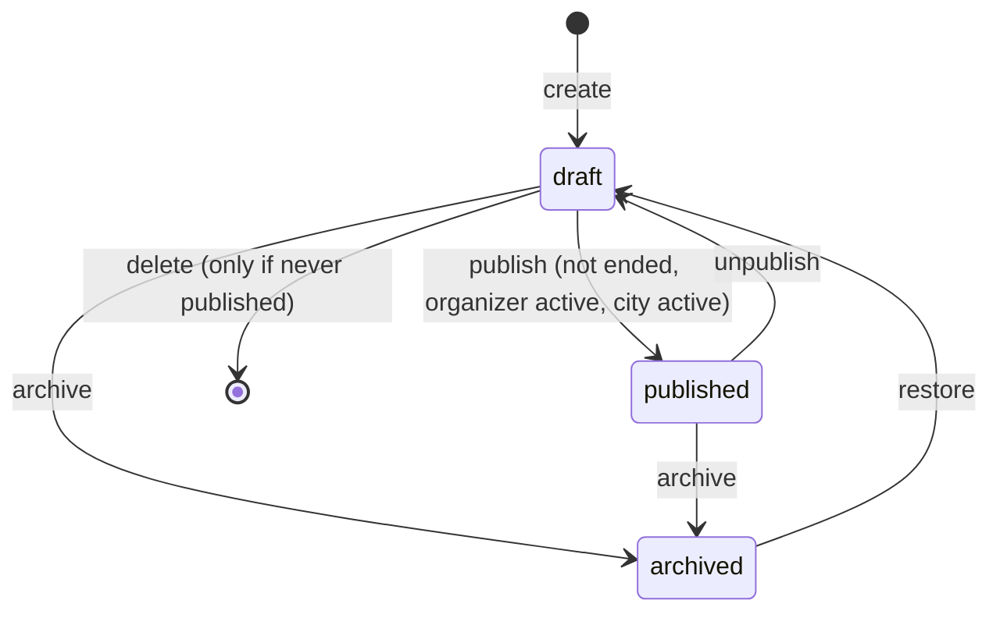

# Event Management

> Related: [Organizer management](organizer-management.md), [Event API](event-api.md), [Schema](../database/schema.md#411-event_organizers), [Authorization](../auth/authorization.md), [Cloudinary](../users/cloudinary.md)

## 1. Purpose

Garba Partner is event-first: members browse Garba/Dandiya events in their city, open an event, and (in a later phase) find a partner for that event. This feature lets **event managers** create and run event listings from the admin panel, and lets **anyone** (logged in or not) browse published events on the web app.

What is in this phase:

| Area | Features |
|---|---|
| Admin | Create, edit, publish/unpublish, verify/unverify, archive/restore, delete never-published drafts, event image upload, organizer management |
| Web | Public events page with city/date filters and sorting, event cards, event detail, verified organizer/event badges, **Find a partner** and **Get pass** calls to action |
| API | Public list/detail, admin CRUD + lifecycle, cursor pagination, filtering, sorting, permission checks, audit log |

**Not yet:** attendee notifications, cancellation with notice, pass purchase. Since the discovery phase, **Find a partner** lets signed-in members set their attendance and turn on "looking for a partner", then opens event-mode discovery ([discovery](../matching/discovery.md)).

## 2. Architecture

```mermaid
flowchart LR
  subgraph Admin panel
    A1[Events list / form / detail] --> A2[Organizers list / form / detail]
  end
  subgraph Web app
    W1[/events] --> W2[/events/:slug] --> W3[/events/:slug/find-partner]
  end
  A1 -- "Bearer admin token\nevents:view / events:manage" --> R1["/api/v1/admin/events"]
  A2 --> R2["/api/v1/admin/organizers"]
  W1 -- "no auth, rate-limited" --> R3["/api/v1/events"]
  W2 --> R3
  R1 --> S1[AdminEventsService] --> DB[(events)]
  R2 --> S2[AdminOrganizersService] --> DB2[(event_organizers)]
  R3 --> S3[EventsService] --> DB
  S1 -- image --> M[MediaStorage: Cloudinary / local dev]
  S1 & S2 -- same transaction --> AUD[(admin_audit_logs)]
```

| Concern | File |
|---|---|
| Public routes / service | `apps/api/src/modules/events/events.{routes,service}.ts` |
| DTO mappers (public allow-list + admin) | `apps/api/src/modules/events/event.mapper.ts` |
| Slug generation | `apps/api/src/modules/events/event-slug.ts` |
| Admin events | `apps/api/src/modules/admin/events/admin-events.{routes,service}.ts` |
| Admin organizers | `apps/api/src/modules/admin/organizers/admin-organizers.{routes,service}.ts` |
| Models | `apps/api/src/models/{event,event-organizer}.model.ts` |
| Migrations | `apps/api/src/migrations/20260929100000-create-event-organizers.ts`, `20260929100100-create-events.ts` |
| Keyset pagination helpers | `apps/api/src/lib/pagination.ts` (`KeysetOrder`, `keysetCondition`, …) |
| Shared schemas / DTOs / enums | `packages/shared/src/schemas/event.schema.ts`, `types/dto/event.dto.ts`, `constants/{enums,limits}.ts` |
| Web | `apps/web/src/pages/{Events,EventDetail,FindPartner}Page.tsx`, `apps/web/src/features/events/` |
| Admin | `apps/admin/src/pages/{Events,EventDetail,EventForm,Organizers,OrganizerPages}*.tsx`, `apps/admin/src/features/{events,organizers}/` |
| Dev data | `apps/api/src/seeders/20260929100000-dev-events.ts` |

## 3. Event fields

| Requested field | API name | Column | Notes |
|---|---|---|---|
| name | `name` | `name` varchar(120) | 3–120 chars, normalised |
| description | `description` | `description` text | 10–5000 chars, paragraphs kept. **Phone numbers and emails are rejected** (organizer contact details belong in private fields) |
| city | `cityId` → `city` | `city_id` → `cities` | Must be an active city |
| — | `areaId` → `area` | `area_id` → `areas` | Optional; must belong to the city (composite FK) |
| venue | `venueName`, `venueAddress` | `venue_name`, `venue_address` | Public venue only (never a member's location) |
| event_date | `eventDate` | `event_date` date | IST calendar day, today … +2 years |
| start_time / end_time | `startTime`, `endTime` | `start_time`, `end_time` time | `HH:MM` IST. End earlier than start = ends after midnight. Equal is rejected |
| — | `startsAt`, `endsAt` | `starts_at`, `ends_at` timestamptz | **Generated by PostgreSQL** from date + times (IST). Used for sorting, date filters and "ended" |
| image_url | `imageUrl` | `image_public_id` | Uploaded through the API (validated, EXIF/GPS stripped), delivered by Cloudinary. The URL is derived, never stored |
| ticket_url | `ticketUrl` | `ticket_url` | Optional, `https://` only, no credentials, ≤500 chars |
| organizer | `organizerId` → `organizer` | `organizer_id` → `event_organizers` | Must be an **active** organizer |
| status | `status` | `status` | `draft` \| `published` \| `archived` |
| is_verified | `isVerified` | `is_verified` + `verified_at` | Set only by the verify endpoint |
| — | `slug` | `slug` | Public URL id, e.g. `navratri-night-k3v9qa`, fixed at creation |

## 4. Lifecycle



- **Create** always makes a `draft`. Members never see drafts.
- **Publish** requires: the event has not ended, the organizer is active and the city is active. It sets `published_at`, and `first_published_at` the first time.
- **Unpublish** returns a published event to `draft` (hidden from members).
- **Archive** is the soft delete. The event is hidden everywhere and can't be edited. **Restore** brings it back as a draft; publishing again is a deliberate step.
- **Delete** is a hard delete, allowed **only if the event was never published** (`first_published_at IS NULL`). Once members may have seen or shared an event, it is archived instead. Future attendance, interests and matches will reference events.
- "Ended" is derived (`ends_at <= now`), never stored. Ended events leave the public list but stay reachable by link, marked "This event has ended".
- Every transition locks the row (`SELECT … FOR UPDATE`) and writes an audit entry in the same transaction. Invalid transitions return `409 CONFLICT`.

## 5. Verification

Two separate badges:

| Badge | Meaning | Set by |
|---|---|---|
| **Verified organizer** | The team checked that the organizer is genuine (see [organizer management](organizer-management.md#4-verification)) | `POST /admin/organizers/:id/verify` |
| **Verified event** | The team confirmed this listing (date, venue, pass link) with the organizer | `POST /admin/events/:id/verify` |

- An event's verification is **cleared automatically** when a material field changes: organizer, city, area, venue name/address, date, start/end time or ticket link. Editing the description or name keeps it. The audit entry records `verificationReset: true`.
- Verification is **never presented as a guarantee of safety**. The web shows a "What verified means" note on the event page: "*Our team confirmed this listing … It is not a guarantee of safety or quality.*"

## 6. Web experience

| Route | Access | Contents |
|---|---|---|
| `/events` | Public | Filters (city, date: all upcoming / today / this weekend / next 7 days / pick a date, sort), event cards, "Show more" (cursor pagination). Filters are kept in the URL (`?city=…&when=weekend`) |
| `/events/:slug` | Public | Image, name, badges, date/time (IST), venue with an "Open in Maps" link (a search for the public venue), organizer (name, Instagram, website), description, "What verified means", safety tips, CTAs |
| `/events/:slug/find-partner` | Member with profile | "Partner matching is coming soon" + profile readiness. Anonymous visitors are sent to log in and brought back |

- **Get pass** opens the organizer's `https://` ticket page in a new tab (`rel="noopener noreferrer nofollow"`) and shows its domain ("on tickets.example.com") so members know where they are going. A note says passes are sold by the organizer, and Garba Partner never asks you to pay another member.
- Ended events show "This event has ended" and hide both CTAs.
- The home page links to the events page; the navigation shows **Events** to everyone and **Log in** to visitors.

## 7. Admin experience

| Route | Permission | Contents |
|---|---|---|
| `/events` | `events:view` | Search (name, slug or ID), filters (status, city, verified), sort (newest, date asc/desc, name), load more |
| `/events/new` | `events:manage` | Form (organizer picker, city/area, date/time in IST, venue, ticket link). Validated with the shared schema, re-validated by the API |
| `/events/:id` | `events:view` | Details, history (created/updated by, published, verified, archived), image manager, actions |
| `/events/:id/edit` | `events:manage` | Same form; warns that material changes remove verification |
| `/organizers…` | see [organizer management](organizer-management.md#5-admin-screens) | |

Moderators (`events:view` only) see lists and details but no action buttons. The API enforces this regardless of the UI.

## 8. Database changes

- New tables `event_organizers` and `events` ([schema §4.11–4.12](../database/schema.md#411-event_organizers)).
- `admin_audit_logs.target_type` now also allows `organizer`.
- Key constraints: `UNIQUE(slug)`, composite FK `(area_id, city_id) → areas(id, city_id)`, `end_time <> start_time`, `ticket_url ~ '^https://'`, status/published/archived/verified consistency checks, `first_published_at` required once published.
- Indexes: partial `(city_id, starts_at, id)` and `(starts_at, id)` `WHERE status = 'published'` for the public list, `(status, starts_at, id)` and `(created_at DESC, id DESC)` for admin lists, plus FK indexes.

## 9. Security considerations

- **Authorization:** public endpoints need no login but return only published events. Every admin endpoint requires an admin token plus `events:view` (reads) or `events:manage` (writes). Member tokens are rejected (`401`) by the admin middleware.
- **Private organizer information** never reaches public responses. Public queries load only public organizer columns (`ORGANIZER_PUBLIC_ATTRIBUTES`), and the mappers are allow-lists; tests assert the exact public key sets.
- **Mass assignment:** create/update schemas are strict. `status`, `isVerified`, `slug`, `imagePublicId` and admin IDs cannot be sent.
- **Links:** ticket and website links must be `https://` with a public hostname and no credentials; `javascript:`, `http:` and quote/angle characters are rejected (API and DB check).
- **Images:** decoded and re-encoded with sharp; EXIF/GPS removed; size, type and pixel limits as for profile photos.
- **IDOR / enumeration:** drafts, archived and unknown events all return the same `404`. Slugs have a random suffix.
- **Rate limit:** public event endpoints are limited to 120 requests/minute per IP.
- **Caching:** public responses send `Cache-Control: public, max-age=60` (identical for everyone, no personal data). Admin responses send `no-store`.
- **Audit:** every admin write is recorded in `admin_audit_logs` in the same transaction, with field **names** only (never contact values).

## 10. Edge cases

| Case | Behaviour |
|---|---|
| Event 20:00 → 01:00 | `ends_at` is the next day at 01:00 IST; the UI shows "(next day)" |
| Start = end | `400` on `endTime` |
| Date in the past | `400` on create, and on update when the date/time changes. Unchanged past dates can still be edited (e.g. fix a typo) |
| City changed without area | Area is cleared; a new area must belong to the new city |
| Organizer archived after event creation | Existing events keep it; the event can't be published until an active organizer is chosen |
| Publish an event that has started but not ended | Allowed (it stays listed until it ends) |
| City deactivated | Its events disappear from public list/detail |
| Unchanged PATCH | No-op, no audit entry |
| Cursor from another sort | `400` (the sort is embedded in the cursor) |
| Non-Latin event name | Slug falls back to `event-xxxxxx` |

## 11. Testing

```bash
npm run test -w @garba-partner/api      # needs TEST_DATABASE_URL (docs/database/database-setup.md)
npm run test -w @garba-partner/shared
```

| Test file | Covers |
|---|---|
| `apps/api/src/modules/events/events.int.test.ts` | Public visibility (draft/archived/ended/inactive city), detail by id/slug, **privacy allow-list**, city/date filters, sort, cursor pagination, invalid queries |
| `apps/api/src/modules/admin/events/admin-events.int.test.ts` | Permissions (anonymous, member, moderator, event manager, super admin), create validation and mass assignment, IST/midnight times, updates and verification reset, lifecycle + audit, delete rules, image upload/EXIF stripping, admin list filters/sort/pagination |
| `apps/api/src/modules/admin/organizers/admin-organizers.int.test.ts` | See [organizer management](organizer-management.md#8-testing) |
| `packages/shared/test/event.test.ts` | Link validation, contact detection, schema normalisation and strictness, query/param schemas |

Manual check: `npm run db:seed` loads four fictional events (three published, one draft) and two organizers; browse http://localhost:5173/events and sign in to http://localhost:5174 as `events@garbapartner.test`.

## 12. Known limitations

- No attendance counts on event pages or attendee notifications yet. Attendance and event-mode discovery are covered in [discovery](../matching/discovery.md).
- No cancellation state with a reason/notice; unpublish or archive instead.
- Public responses are cached for up to 60 seconds, so an unpublished event may stay visible briefly.
- Admins cannot manage cities/areas from the panel yet (seeded by migration).
