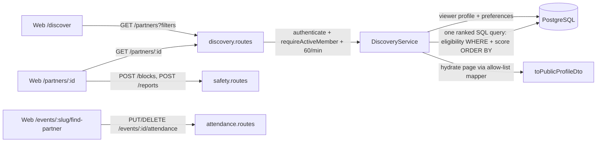

# Partner Discovery

> Related: [Matching logic](matching-logic.md), [Discovery privacy](privacy.md), [Event management](../events/event-management.md), [User flows §6](../product/user-flows.md#6-partner-discovery-flow), [Schema](../database/schema.md#413-event_attendances)

## 1. Purpose

Discovery helps adult members find a Garba partner: someone in their city, free on the same dates, or going to the same event, who fits their preferences **and whose own preferences they fit**. It is the step before interests and chat (next phase): members can browse, view a partner's profile, block or report them, and (soon) send an interest.

| In this phase | Not yet |
|---|---|
| `GET /api/v1/partners` (ranked list, filters, cursor pagination) and `GET /api/v1/partners/:id` | Sending interests, matches, chat ("Send interest" shows a "launching soon" note) |
| Event attendance: Going/Interested + "looking for a partner" toggle, event-mode discovery | Attendance counts on event pages, attendee notifications |
| Block and report endpoints wired in and enforced by discovery | Admin reports queue, safety centre ([safety phase](../product/MVP-scope.md)) |
| Web: Discover page, partner cards, filters, verified-only, partner profile with Send interest / Block / Report | Match and interest exclusions (added with interests) |

## 2. Architecture



| Concern | File |
|---|---|
| Weights, signals, highlights, gender rules | `apps/api/src/modules/discovery/matching.ts` |
| Eligibility + ranking SQL, cursor | `apps/api/src/modules/discovery/candidate-query.ts` |
| Service / routes | `apps/api/src/modules/discovery/discovery.{service,routes}.ts` |
| Attendance | `apps/api/src/modules/events/attendance.{service,routes}.ts`, `apps/api/src/models/event-attendance.model.ts` |
| Block / report (wired in this phase) | `apps/api/src/modules/safety/{blocks,reports}.service.ts`, `safety.routes.ts` |
| Shared schemas, DTOs, enums | `packages/shared/src/schemas/discovery.schema.ts`, `types/dto/discovery.dto.ts`, `constants/enums.ts` (`MATCH_HIGHLIGHTS`, `ATTENDANCE_STATUSES`) |
| Migrations | `20260929110000-create-event-attendances`, `20260929110100-add-discovery-indexes` |
| Web | `apps/web/src/pages/{Discover,PartnerProfile,FindPartner}Page.tsx`, `apps/web/src/features/partners/` |

## 3. API

All endpoints require a member access token. Responses use the standard envelope and `Cache-Control: private, no-store`.

### `GET /api/v1/partners`

Access: **active, onboarded** members (`requireActiveMember`). Suspended, banned and pending-deletion accounts get `403`; members without a profile get `403 ONBOARDING_REQUIRED`. Rate limit: 60 requests/minute per member.

| Query | Type | Effect |
|---|---|---|
| `eventId` | uuid | **Event mode**: only members looking for a partner at this event. The viewer must be looking too (`409 PARTNER_TOGGLE_REQUIRED`). Draft/unknown → `404`, ended → `409 EVENT_NOT_OPEN` |
| `cityId` | uuid | Only this city. Omitted = every city (same city still ranks higher). The web defaults to the member's city |
| `minAge`, `maxAge` | 18–100 | **Narrow** the saved age range (never widen it) |
| `garbaLevels` | `beginner,intermediate,advanced` | Comma-separated |
| `date` | `YYYY-MM-DD` | Listed this date as available |
| `verifiedOnly` | `true`\|`false` | Overrides the saved "verified only" preference for this search. Verified = photo **or** identity verified |
| `cursor`, `limit` | | Keyset pagination, `limit` 1–50 (default 20) |

Unknown keys (e.g. `score`, `sort`) → `400`.

```json
{
  "success": true,
  "message": "Success",
  "data": [
    {
      "profile": {
        "id": "4b1e…",
        "name": "Rohan",
        "age": 27,
        "gender": "man",
        "city": { "id": "c1000000-0000-4000-8000-000000000001", "name": "Ahmedabad" },
        "area": null,
        "bio": "Two-taali enthusiast.",
        "garbaLevel": "intermediate",
        "availableDates": ["2026-10-12", "2026-10-13"],
        "image": { "url": "https://…/w_600,h_800…", "thumbnailUrl": "https://…/w_160…" },
        "phoneVerified": true,
        "identityVerified": false,
        "photoVerified": true
      },
      "highlights": ["same_event", "shared_dates", "same_city", "verified"],
      "sharedDates": ["2026-10-12"],
      "sharedEvents": [
        { "id": "7d3f…", "slug": "rangtaali-navratri-night-k3v9qa", "name": "Rangtaali Navratri Night", "eventDate": "2026-10-12" }
      ]
    }
  ],
  "meta": { "nextCursor": "WzU1LDk3NzIsIjRiMWUuLi4iXQ" }
}
```

**No score is returned.** `highlights` are plain reasons ([matching logic §4](matching-logic.md#4-what-members-see)).

### `GET /api/v1/partners/:id`

The same `PartnerDto` for one member. It applies exactly the same eligibility rules (without the optional filters). Self, unknown, blocked (either direction), reported-by-viewer, hidden, inactive, deleted or non-mutual profiles all return the same `404 NOT_FOUND`, so a block is never revealed.

### Event attendance

| Method | Path | Access | Body / result |
|---|---|---|---|
| GET | `/api/v1/events/:eventId/attendance` | Member (active or suspended) | Own `MyAttendanceDto` or `null` |
| PUT | `/api/v1/events/:eventId/attendance` | Active, onboarded member; 60 changes/hour | `{ "status": "going" \| "interested", "lookingForPartner": true }` → `MyAttendanceDto` |
| DELETE | `/api/v1/events/:eventId/attendance` | Same | Removes it |
| GET | `/api/v1/me/attendance` | Member | Own attendance at upcoming published events, soonest first |

Attendance can change only on **published events that have not ended** (`404` / `409 EVENT_NOT_OPEN`). The user ID always comes from the token, never from the body, so members can only change their own attendance.

### Block and report (wired in this phase)

| Method | Path | Notes |
|---|---|---|
| POST | `/api/v1/blocks` `{ userId }` | `201` new, `200` already blocked. Self → `400`, unknown → `404`. 30/hour |
| GET | `/api/v1/blocks` | Members you blocked (never who blocked you) |
| DELETE | `/api/v1/blocks/:userId` | Unblock (idempotent) |
| POST | `/api/v1/reports` `{ reportedUserId, reason, details?, alsoBlock? }` | `alsoBlock` defaults to `true`. Duplicate open report → `200 alreadyReported`. 10/day. P0 reasons (`underage`, `safety_threat`) or 3 reporters in 7 days hide the member from discovery until review |

Suspended members can still block and report. Blocks and reports take effect in discovery immediately (no caching).

## 4. Web experience

| Route | Contents |
|---|---|
| `/discover` | Filters (event you're looking at, city with "All cities", available date, age min/max, Garba level, **Verified only**), partner cards, "Show more". Filters live in the URL. A note explains that suggestions are simple signals, not a verdict on compatibility or safety. Members browsing with discovery off see a "you're hidden" notice |
| `/partners/:id` | Profile card (public fields and badges), "Why you're seeing …" (highlights, shared events and dates), **Send interest** / pending / Accept / Decline / view match ([interests](interests.md)), **Block** (confirm), **Report** (reason, details, "also block"), safety tips |
| `/events/:slug/find-partner` | Going / Interested + "I'm looking for a partner for this event" → "See who's looking for a partner here" (event-mode Discover) |

Blocked, hidden or unavailable profiles show "This profile isn't available". After blocking or reporting, the member disappears from Discover.

## 5. Database changes

- `event_attendances` (new): `event_id` (FK RESTRICT), `user_id` (FK CASCADE), `status`, `looking_for_partner`, `UNIQUE (event_id, user_id)`, partial indexes for event mode and "same event" scoring.
- New indexes: `users_discoverable_idx` (partial), `user_profiles_discovery_idx (city_id, gender, date_of_birth) WHERE image_public_id IS NOT NULL`, `user_profiles_available_dates_gin_idx` (GIN), `reports_reporter_reported_idx`. Details and planner checks: [matching logic §6](matching-logic.md#6-query-and-indexes).

## 6. Edge cases

| Case | Behaviour |
|---|---|
| Filter age range outside the saved range | Empty list (filters never widen preferences) |
| Viewer has discovery off | Can browse (per [user flows §6.1](../product/user-flows.md#61-eligibility-filter-applied-server-side-to-every-candidate-in-both-modes)); the UI says they are hidden |
| Candidate removes their photo | Drops out (profile incomplete) |
| Viewer reports without blocking | Reported member is still excluded from the viewer's discovery |
| Block while paging | The next page already excludes them; a stale card's detail returns `404` |
| Event ends | Event mode returns `409 EVENT_NOT_OPEN`; shared-event highlights stop counting it |
| Same score | Ordered by last-active day (day granularity only), then ID. Deterministic |
| Tampered cursor | `400` (validated integers ≥ 0 and a UUID) |

## 7. Testing

```bash
npm run test -w @garba-partner/api      # needs TEST_DATABASE_URL
npm run test -w @garba-partner/shared
```

| Test file | Covers |
|---|---|
| `apps/api/src/modules/discovery/matching.test.ts` (unit) | Weights, score, highlights, SQL score = TS score, gender rules, shared dates, cursor validation, query builder binds every value and always contains every eligibility rule |
| `apps/api/src/modules/discovery/discovery.int.test.ts` | Access rules; exclusion of discovery-off, no photo, wrong gender, non-mutual gender, age both ways, suspended, banned, hidden, deleted, blocked both ways, reported; public allow-list and no score; ranking order and highlights; every filter; event mode reciprocity; pagination without duplicates |
| `apps/api/src/modules/events/attendance.int.test.ts` | Set/update/clear/list, published-and-open only, validation, suspended members, no attendee leaks on event pages |
| `apps/api/src/modules/safety/safety.int.test.ts` | Block/unblock/list, self and unknown targets, suspended members can block, report + default block, duplicates, report-without-block exclusion, P0 auto-hide |
| `packages/shared/test/discovery.test.ts` | Query and attendance schemas |

## 8. Known limitations

- Chat is not built yet. Interests and matches are covered in [interests](interests.md) and [matches](matches.md); since then the list also leaves out active matches, pending sent interests and recent declines, and every `PartnerDto` carries a `connection` (`none` | `interest_sent` | `interest_received` | `matched`).
- Photo moderation doesn't exist yet; "has a photo" is the photo rule for now.
- The admin reports queue, the safety centre and the `docs/safety/` documents are still pending from the safety phase.
- Ranking uses one query per page with the score computed per request. Fine for launch-city volumes; revisit with real data (see [matching logic §7](matching-logic.md#7-scaling-notes)).
