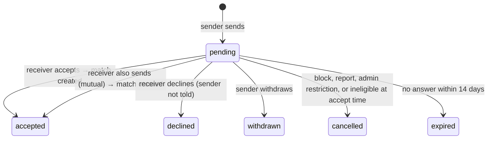

# Interests

> Related: [Matches](matches.md), [Discovery](discovery.md), [Matching logic](matching-logic.md), [Discovery privacy](privacy.md), [User flows §7](../product/user-flows.md#7-interest-and-matching-flow)

## 1. Purpose

An **interest** is a member saying "I'd like to dance with you". The model is **request → accept**: the receiver decides whether a match happens, and nobody can message anyone without both saying yes. Two members who send interests to each other are matched straight away.



## 2. Architecture

| Concern | File |
|---|---|
| Service (send, lists, accept, reject, withdraw) | `apps/api/src/modules/interests/interests.service.ts` |
| Routes (`/interests`, `/matches`) | `apps/api/src/modules/interests/interests.routes.ts` |
| Pair lock, ending connections on block/report/moderation | `apps/api/src/modules/interests/connections.ts` |
| Eligibility (shared with discovery) | `DiscoveryService.isEligible()` in `apps/api/src/modules/discovery/` |
| Model / migration | `apps/api/src/models/partner-interest.model.ts`, `migrations/20260929120000-create-partner-interests.ts` |
| Shared contract | `packages/shared/src/schemas/interest.schema.ts`, `types/dto/interest.dto.ts`, `INTEREST_STATUSES`, `LIMITS.INTEREST_*` |
| Web | `apps/web/src/features/connections/`, `apps/web/src/pages/InterestsPage.tsx`, partner profile CTA |

## 3. API

All endpoints need a member access token from an **active, onboarded** member (`requireActiveMember`). Suspended, banned and pending-deletion accounts get `403`. Responses are `Cache-Control: private, no-store`. Write actions share a 30/minute per-member limiter.

| Method | Path | Who | Result |
|---|---|---|---|
| POST | `/api/v1/interests` | Sender | `201` new interest or match, `200` already sent |
| GET | `/api/v1/interests/received` | Receiver | Pending interests you received (cursor pagination) |
| GET | `/api/v1/interests/sent` | Sender | Your pending interests |
| POST | `/api/v1/interests/:id/accept` | Receiver only | `200` `MatchDto` |
| POST | `/api/v1/interests/:id/reject` | Receiver only | `200`; status `declined` |
| DELETE | `/api/v1/interests/:id` | Sender only | `200`; status `withdrawn` |

Someone else's interest ID returns `404` (no IDOR oracle). A non-pending or expired interest returns `409 INTEREST_NOT_PENDING`.

### `POST /api/v1/interests`

```json
{ "receiverId": "4b1e…", "eventId": "7d3f…" }
```

`eventId` is optional context, accepted only if **both** members are looking for a partner at that open event (otherwise `400` on `eventId`). The sender is always the logged-in member; any other key is rejected.

```json
{
  "success": true,
  "message": "Interest sent",
  "data": { "interestId": "a91c…", "matched": false, "match": null, "alreadySent": false }
}
```

When the receiver had already sent an interest to the sender, the response is `"It's a match!"` with `matched: true` and the `MatchDto` in `match`.

**Checks, in order:**

| Check | Error |
|---|---|
| Not yourself | `400 VALIDATION_ERROR` |
| Sender not under review (auto-hidden after a report) and not admin-restricted | `403 INTERACTIONS_RESTRICTED` |
| Sender has a complete profile (photo) | `403 ONBOARDING_REQUIRED` |
| Sender has discovery on ("no reaching out while invisible") | `403 DISCOVERY_DISABLED` |
| Fewer than 25 interests in the last 24 hours (counted in the database) | `429 INTEREST_LIMIT_REACHED` (also a `safety_logs` warning) |
| Receiver passes **every** discovery eligibility rule for the sender: active, not deleted, not hidden, not restricted, discovery on, photo, no block or report either way, no recent decline, mutual gender and age preferences | `404 USER_UNAVAILABLE` (the same answer for every reason) |
| Already matched | `409 ALREADY_MATCHED` |

### Lists

`InterestDto`: `{ id, status: "pending", createdAt, expiresAt, event, member }`, where `member` is the other person's public allow-list profile. The other member must still be active, not hidden or restricted, and there must be no block or report between the two; otherwise the interest silently disappears from the list.

### Accept

Runs in one transaction under the pair lock: the interest is re-read with `FOR UPDATE`, must still be pending, and the sender must **still** be eligible for the receiver (re-checked now: blocks, reports, suspension and preferences may have changed). If not, the interest becomes `cancelled` and the response is `404 USER_UNAVAILABLE`. On success the interest becomes `accepted` and one match is created.

## 4. Rules

- **Declines are never revealed.** A declined interest just drops out of the sender's Sent list. For 30 days (`INTEREST_DECLINE_COOLDOWN_DAYS`) the receiver doesn't appear in the sender's discovery, and a new interest returns the generic `USER_UNAVAILABLE`.
- **Expiry:** pending interests expire after 14 days. Expiry is applied lazily. Expired interests are hidden from lists, refused at accept (and marked `expired`), and cleared before a new interest between the same pair.
- **Discovery:** members you have a pending interest to, or are matched with, leave your Discover list; their profile still opens with its `connection` status (`interest_sent`, `interest_received`, `matched`).
- **Blocks and reports** cancel pending interests in both directions ([matches §4](matches.md#4-how-matches-end)).

## 5. Database guarantees

`partner_interests` (migration `20260929120000`), see [schema §4.14](../database/schema.md#414-partner_interests):

| Guarantee | Enforced by |
|---|---|
| At most **one pending interest per unordered pair** (A→B and B→A can't both be pending) | Unique index `partner_interests_one_pending_per_pair_unique` on `(LEAST(sender_id, receiver_id), GREATEST(sender_id, receiver_id)) WHERE status = 'pending'` |
| No interest to yourself | `partner_interests_not_self_check` |
| `responded_at` set exactly when no longer pending | `partner_interests_responded_check` |
| Valid status | `partner_interests_status_check` |
| Concurrent sends/accepts for the same pair are serialised | Transaction-scoped advisory lock on the pair (`lockPair()`) |

Because only one pending interest can exist per pair, two members sending to each other at the same moment produce exactly one pending row, and then exactly one match (integration-tested with concurrent requests).

## 6. Web experience

| Where | What |
|---|---|
| Partner profile | **Send interest** (mentions a shared event automatically) → "Interest sent · Withdraw". If they sent first: "X is interested in dancing with you" → **Accept** / **Decline**. Matched: "You matched: view match" |
| Discover cards | "Interested in you" tag when they already sent one |
| `/interests` | Tabs **Received** (Accept / Decline) and **Sent** (waiting, open until …, Withdraw). Declined ones just disappear |
| After accepting or a mutual send | Opens the match screen with "It's a match!" |

## 7. Security considerations

- The acting member always comes from the session; bodies are strict (no `senderId`, no `status`).
- Accept/reject require being the receiver; withdraw requires being the sender; everything else is `404`.
- Eligibility is re-checked on the server at send **and** accept time, reusing the discovery rules, so the client (or a stale card) can't bypass blocks, reports, suspensions or preferences.
- Generic `USER_UNAVAILABLE` never reveals a block, report, decline or sanction.
- Rate limits: 25 interests per rolling 24 h (database), 30 actions/minute (memory).

## 8. Testing

| Test file | Covers |
|---|---|
| `apps/api/src/modules/interests/interests.int.test.ts` | Send/pending/lists, idempotent resend, mutual → one match, **concurrent mutual sends → one match**, validation and sending rules, daily limit, event context, accept/reject/withdraw, IDOR, expiry, block/report/suspension/review effects, unmatch and re-match, `connection` on partner profiles |
| `apps/api/src/modules/interests/constraints.int.test.ts` | Direct inserts: duplicate pending (both directions), self-interest, inconsistent states, duplicate active match, one match per interest, canonical order |
| `packages/shared/test/interest.test.ts` | Schemas (no sender spoofing) |

## 9. Known limitations

- No notifications yet (in-app or push): members see new interests when they open Interests.
- Expiry is lazy (no background job); expired rows stay `pending` in the table until touched, but are never shown or accepted.
