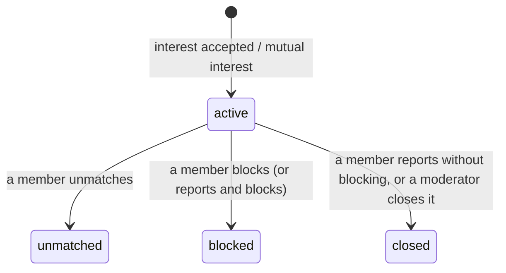

# Matches

> Related: [Interests](interests.md), [Discovery](discovery.md), [Discovery privacy](privacy.md), [User flows §7.3–7.4](../product/user-flows.md#73-accepting--match)

## 1. Purpose

A **match** exists when two members have both said yes: one accepted the other's interest, or both sent one. A match is what will open a chat (next phase). Until then the match screen shows the partner's profile, the event they matched for, and safety guidance.

## 2. Lifecycle



Ended matches are kept as history (never reused). After an unmatch the two can match again later through a **new** interest, which creates a **new** match row. There is never more than one active match per pair.

## 3. API

Member endpoints (active, onboarded members; `Cache-Control: private, no-store`):

| Method | Path | Result |
|---|---|---|
| GET | `/api/v1/matches` | Your active matches, newest first (cursor pagination) |
| GET | `/api/v1/matches/:id` | One match; `404` unless you are one of its two members |
| POST | `/api/v1/matches/:id/unmatch` | Ends it for both (`unmatched`). The other member is not told why |

```json
{
  "success": true,
  "message": "Success",
  "data": {
    "id": "5f0a…",
    "status": "active",
    "createdAt": "2026-10-02T14:05:11.000Z",
    "event": { "id": "7d3f…", "slug": "rangtaali-navratri-night-k3v9qa", "name": "Rangtaali Navratri Night", "eventDate": "2026-10-11" },
    "partner": { "id": "4b1e…", "name": "Rohan", "age": 27, "…": "public allow-list profile" }
  }
}
```

Matches are shown only while the other member's account is active. If the partner is suspended, banned or deleted, the match is hidden (not deleted, so a reactivated account's match reappears unless it was ended).

## 4. How matches end

| Trigger | Match status | Pending interests between the pair |
|---|---|---|
| A member unmatches | `unmatched` (`ended_by_user_id`) | — |
| A member blocks the other | `blocked` | Cancelled (both directions) |
| A member reports the other with "also block" | `blocked` | Cancelled |
| A member reports the other without blocking | `closed` | Cancelled |
| A moderator closes the match | `closed` (`ended_by_admin_id`) | Cancelled |

All of these run in one transaction under the pair lock (`endConnections()` in `apps/api/src/modules/interests/connections.ts`). Nobody is notified. `ended_by_user_id` is internal and never shown to the other member.

## 5. Admin moderation

Match moderation shows **counts, names, dates and statuses only**. There is no message content (chat doesn't exist yet), and no phone numbers.

| Method | Path | Permission | Purpose |
|---|---|---|---|
| GET | `/api/v1/admin/users/:userId` | `users:view` | Now includes `interactionsRestricted` and `connections` (`activeMatches`, `pendingInterestsSent`, `pendingInterestsReceived`, `interestsSentLast24h`) |
| GET | `/api/v1/admin/users/:userId/matches` | `users:view` | Last 50 matches (any status): partner id and name, event, status, created/ended dates |
| POST | `/api/v1/admin/matches/:matchId/close` | `users:sanction` | `{ reason }`: ends an active match (`closed`) and cancels pending interests between the pair. Audited as `match.close` (target type `match`) |
| POST | `/api/v1/admin/users/:userId/restrict-interactions` | `users:sanction` | `{ reason }`: the member can still log in and browse but **cannot send or accept interests**; their pending interests (sent and received) are cancelled and they leave other members' discovery. Audited |
| POST | `/api/v1/admin/users/:userId/lift-interaction-restriction` | `users:sanction` | `{ reason }`: lifts it. Audited |

Moderators and super admins have `users:view` and `users:sanction`; event managers have neither (`403`).

**Admin UI** (`/users/:id`): an "Interests & matches" panel with the counts, the match history table (status, partner link, event, dates) and, for admins who can sanction, **Close match** and **Restrict interactions / Lift restriction**, each asking for a reason that goes into the audit log.

### Which safety tool to use

| Situation | Tool |
|---|---|
| One match is a problem (e.g. off-platform harassment reported) | Close match |
| Member spams interests or pressures people, but may keep browsing | Restrict interactions |
| Member must be cut off entirely | Suspend (existing) |

## 6. Database guarantees

`matches` (migration `20260929120100`), see [schema §4.15](../database/schema.md#415-matches):

| Guarantee | Enforced by |
|---|---|
| Members stored in canonical order, so (A, B) and (B, A) are the same key | `matches_canonical_order_check` (`user_a_id < user_b_id`); `canonicalPair()` in code |
| **At most one active match per pair** | Partial unique index `matches_one_active_per_pair_unique (user_a_id, user_b_id) WHERE status = 'active'` |
| One match per interest | `matches_interest_unique (interest_id)` |
| `ended_at` set exactly when not active | `matches_ended_check` |
| Valid status | `matches_status_check` |

Every code path that creates or ends a match holds the pair's advisory lock, and the unique indexes make a duplicate impossible even if that were bypassed.

## 7. Web experience

| Route | Contents |
|---|---|
| `/matches` | Active matches with partner, event and match date |
| `/matches/:id` | "It's a match!" (right after matching) or "You and X", the partner's profile, "Chat is coming soon" with advice to keep conversations on the platform and meet at the event, safety tips, **Unmatch** (confirm), **Block**, **Report** |

## 8. Testing

See [interests §8](interests.md#8-testing), plus `apps/api/src/modules/admin/matches/admin-matches.int.test.ts`: history and counts visible with `users:view` only, closing (permission, reason required, audited, both members lose the match, no double close), restricting and lifting interactions (pending interests cancelled, can't send, excluded from discovery, audited).

## 9. Known limitations

- Chat, read receipts and match notifications come with the chat phase.
- Suspending a member hides their matches but doesn't end them; ban flows (and ending matches on ban) come with the moderation phase.
- The admin match list shows the latest 50 matches per member.
