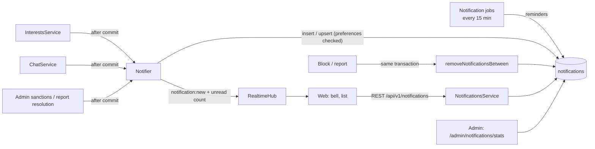

# Notifications

> Related: [Socket events](../chat/socket-events.md), [Interests](../matching/interests.md), [Chat architecture](../chat/architecture.md), [Admin actions](../safety/admin-actions.md), [Schema §4.21](../database/schema.md#421-notifications-and-notification_preferences)

## 1. Purpose

In-app notifications tell members that something needs their attention: someone is interested, a match happened, a message arrived, an event starts soon, or a moderator acted on their account. They appear behind a **bell with an unread count** in the web app and on a **Notifications** page, and arrive live over Socket.IO.

Principles:

- **Never private information.** A notification holds IDs and public display data only. It never contains message text, phone numbers, Instagram handles, locations, report details or moderator notes.
- **Never fatal.** Notifications are created **after** the action that caused them has committed. A notification failure is logged and never fails or undoes the action.
- **Respect blocks and sanctions.** Blocking or reporting someone deletes every notification between the two members. A suspended, banned or deleted member is never shown as the actor. Banned and deleted members receive nothing.
- **The member decides**, except for safety: every type except `safety` can be turned off.

## 2. Types

| Type | Recipient | Trigger | Actor | Link | Can turn off |
|---|---|---|---|---|---|
| `interest_received` | Receiver | A new interest is sent (not a repeated send) | Sender | `/interests` | ✅ |
| `interest_accepted` | Original sender | The receiver accepts | Accepter | `/matches/:matchId` | ✅ |
| `match_created` | Both members | Mutual interest (both sent one) | The other member | `/matches/:matchId` | ✅ |
| `new_message` | The other member | A chat message is stored | Sender | `/chats/:matchId` | ✅ |
| `verification_completed` | The member | A verification is decided (approved / rejected) | — | `/profile` | ✅ |
| `event_reminder` | Members going to or interested in an event | 24 h before a published event starts (job) | — | `/events/:slug` | ✅ |
| `safety` | The member | A moderator warns, restricts chat, suspends, lifts a restriction; the member's report is reviewed | — | `/guidelines` or `/safety` | ❌ always on |

`safety` kinds: `warning_issued`, `chat_restricted`, `account_suspended`, `restriction_lifted`, `report_reviewed`. Bans send nothing (the member can no longer sign in). A reporter is told **only** that the report was reviewed, never the outcome.

**Collapsing:** there is at most **one unread `new_message` notification per chat**. Further messages increase its `count` and move it to the top (`occurred_at`). Reading the chat (`message:read` / `POST /chats/:matchId/read`) marks it read; the next message starts a new one.

**Accepting doesn't notify the accepter**, and a repeated interest send notifies nobody.

`verification_completed` is ready (type, preference, wording, `notifier.notify({ type: 'verification_completed', data: { verificationType, outcome } })`), but the API does not yet have a verification review/provider flow that calls it. It will be wired in when that flow ships.

## 3. Architecture



| Concern | File |
|---|---|
| Notifier, member service, DTO builder, helpers | `apps/api/src/modules/notifications/notifications.service.ts` |
| Routes | `apps/api/src/modules/notifications/notifications.routes.ts` |
| Event reminders + retention job | `apps/api/src/modules/notifications/notification-jobs.ts` (started in `server.ts`) |
| Admin monitoring | `apps/api/src/modules/admin/notifications/` |
| Models / migration | `models/notification.model.ts`, `models/notification-preference.model.ts`, `migrations/20261001100000-create-notifications.ts` |
| Shared contract | `packages/shared/src/constants/enums.ts` (`NOTIFICATION_TYPES`, …), `schemas/notification.schema.ts`, `types/dto/notification.dto.ts`, `types/socket.ts` |
| Web | `apps/web/src/features/notifications/`, `pages/NotificationsPage.tsx`, bell in `components/AppShell.tsx`, socket handling in `features/chat/ChatRealtime.tsx` |
| Admin | `apps/admin/src/pages/NotificationsMonitorPage.tsx` |

The notifier checks the recipient's account (active or suspended) and preferences, stores the notification, and pushes `notification:new` to the member's `user:{id}` room. It runs after the triggering transaction has committed and catches its own errors.

## 4. Privacy

| Rule | How |
|---|---|
| No message text | `new_message` stores the match ID and a count only; the wording is "New message from Asha" |
| No contact details or locations | The actor is `{ id, name, thumbnailUrl }` (the public display name and photo), loaded at read time |
| Blocks | `removeNotificationsBetween()` deletes notifications in both directions **in the block/report transaction** |
| Unavailable actors | If the actor is suspended, banned or deleted, `actor` is `null` ("A member") |
| Moderation | Safety notifications carry a `kind` only: no note, report, reporter or moderator |
| Storage | References are foreign-key columns (`ON DELETE CASCADE`), so notifications disappear with the member, match, interest or event. `data` holds only a safety kind or a verification outcome |
| Retention | Deleted **90 days** after they occurred (`LIMITS.NOTIFICATION_RETENTION_DAYS`) |
| Caching | Every response is `Cache-Control: private, no-store` |
| Logs | Failures log the type and user ID only |

## 5. API

All endpoints need a member access token. Active **and suspended** members may use them (safety notices explain a suspension). Everything is scoped to the caller: another member's notification is a `404`.

| Method | Path | Description |
|---|---|---|
| GET | `/api/v1/notifications` | Newest first. Query: `cursor`, `limit` (1–50, default 20), `unread=true` |
| GET | `/api/v1/notifications/unread-count` | `{ unread }` |
| POST | `/api/v1/notifications/:id/read` | Marks one read (idempotent); returns the notification |
| POST | `/api/v1/notifications/read-all` | `{ updated }` |
| GET | `/api/v1/notifications/preferences` | `{ interest_received, interest_accepted, match_created, new_message, verification_completed, event_reminder }` (all `true` by default) |
| PUT | `/api/v1/notifications/preferences` | Any subset of those keys as booleans. `safety`, unknown keys, non-booleans or an empty body → `400` |

Mark-read, mark-all and preference changes are rate-limited to 60 per member per minute.

### Examples

```http
GET /api/v1/notifications?limit=2
Authorization: Bearer <member access token>
```

```json
{
  "success": true,
  "message": "Success",
  "data": [
    {
      "id": "0c7e…",
      "type": "new_message",
      "actor": { "id": "4b1e…", "name": "Rohan", "thumbnailUrl": "https://res.cloudinary.com/…" },
      "link": "/chats/5f0a…",
      "count": 3,
      "matchId": "5f0a…",
      "interestId": null,
      "event": null,
      "verification": null,
      "safety": null,
      "occurredAt": "2026-10-11T14:02:10.000Z",
      "readAt": null
    },
    {
      "id": "91aa…",
      "type": "event_reminder",
      "actor": null,
      "link": "/events/rangtaali-navratri-night-k3v9qa",
      "count": 1,
      "matchId": null,
      "interestId": null,
      "event": { "id": "7d3f…", "slug": "rangtaali-navratri-night-k3v9qa", "name": "Rangtaali Navratri Night", "startsAt": "2026-10-11T14:30:00.000Z" },
      "verification": null,
      "safety": null,
      "occurredAt": "2026-10-10T15:00:00.000Z",
      "readAt": null
    }
  ],
  "meta": { "nextCursor": "eyJjcmVhdGVkQXQiOi…" }
}
```

```http
PUT /api/v1/notifications/preferences
Authorization: Bearer <member access token>

{ "new_message": false }
```

```json
{
  "success": true,
  "message": "Preferences saved",
  "data": {
    "interest_received": true,
    "interest_accepted": true,
    "match_created": true,
    "new_message": false,
    "verification_completed": true,
    "event_reminder": true
  }
}
```

Errors: `401` (no or invalid member session; admin tokens are refused), `403` (banned or deleted), `404` (not your notification), `400` (validation), `429` (rate limit).

### Realtime

`notification:new` → `{ notification: NotificationDto, unreadCount: number }` to every tab of the recipient ([socket events](../chat/socket-events.md#3-server--client)). For a collapsed chat notification it carries the updated row. Suspended members have no socket, so the web app also polls the unread count every minute.

## 6. Scheduled jobs

`startNotificationJobs` runs every 15 minutes (and once at start-up):

1. **Event reminders** (`createEventReminders`): one `event_reminder` per member with an attendance (`going` or `interested`) for a **published** event starting within the next **24 hours**, if the member is active and hasn't turned reminders off. The unique index `(user_id, event_id) WHERE type = 'event_reminder'` makes it idempotent across runs and processes. New reminders are pushed live.
2. **Retention** (`purgeOldNotifications`): deletes notifications older than 90 days.

## 7. Admin monitoring

`GET /api/v1/admin/notifications/stats` (`dashboard:view`: every admin role), `Cache-Control: no-store`. Aggregates only: no member IDs, content or individual notifications.

```json
{
  "success": true,
  "message": "Success",
  "data": {
    "generatedAt": "2026-10-11T14:05:00.000Z",
    "totals": { "last24h": 412, "last7d": 2310, "unread": 380, "stored": 5120 },
    "byType": [
      { "type": "new_message", "last24h": 190, "last7d": 1020, "readRate7d": 0.874, "unread": 95, "optedOut": 12 },
      { "type": "safety", "last24h": 3, "last7d": 11, "readRate7d": 0.636, "unread": 4, "optedOut": null }
    ]
  }
}
```

Admin UI: **Notifications** (`/notifications`) shows totals and a per-type table (24 h, 7 days, read rate, unread, opted out), refreshed every minute. A sudden drop in a type's volume or a rise in opt-outs is the signal to investigate; delivery failures appear in the API logs as `Notification failed`.

## 8. Database

Migration `20261001100000-create-notifications`, see [schema §4.21](../database/schema.md#421-notifications-and-notification_preferences).

| Table | Key points |
|---|---|
| `notifications` | `user_id`, `type` (check), `actor_user_id`, `match_id`, `interest_id`, `event_id` (all FK `CASCADE`), `data` jsonb, `count ≥ 1`, `occurred_at`, `read_at`. Checks: not self, match required for match/message/accept types, event required for reminders |
| `notification_preferences` | One optional row per member (PK `user_id`), one boolean per configurable type, default `true`. No `safety` column |

Indexes: `(user_id, occurred_at DESC, id DESC)` (list), partial `(user_id) WHERE read_at IS NULL` (unread count), **unique** `(user_id, match_id) WHERE type = 'new_message' AND read_at IS NULL` (collapsing), **unique** `(user_id, event_id) WHERE type = 'event_reminder'` (one reminder), `(actor_user_id, user_id)` (block clean-up), `(occurred_at)` (retention), `(type, occurred_at)` (monitoring).

## 9. Web

- **Bell** in the header (signed-in members) with the unread count (`99+` cap), live through `notification:new`, polled every minute as a fallback.
- **Notifications page** (`/notifications`): newest first, unread highlighted, **Unread only**, **Mark all as read**, **Load more**; opening a notification marks it read and follows its link. **Settings** shows a checkbox per configurable type, with a note that safety notices are always shown.
- Opening a chat marks its message notification read (the chat read mutation refreshes the notification queries).

## 10. Edge cases

| Case | Behaviour |
|---|---|
| Interest sent twice | Second send creates nothing |
| Accept when a match already exists | No `interest_accepted` (no new match) |
| Chat message while the recipient has the chat open | Notification is created, then marked read when their client marks the chat read |
| Member blocks someone | All notifications between them are deleted in the same transaction |
| Actor suspended later | Notification stays, actor shown as "A member" |
| Recipient banned / deleted | Nothing is stored |
| Recipient suspended | Stored and visible (safety notices explain the suspension); no live push (no socket) |
| Event unpublished or archived before the reminder window | No reminder; an archived event keeps existing reminders until retention |
| Match, interest or event deleted | Its notifications cascade away |

## 11. Testing

| File | Covers |
|---|---|
| `apps/api/src/modules/notifications/notifications.int.test.ts` | Triggers (interest received/accepted, mutual match, collapsed chat messages, safety notices, report reviewed, verification via the notifier); no message text, notes or reporter IDs; mark one/all read; IDOR `404`; cursor pagination and `limit` validation; auth and `no-store`; preferences (defaults, partial update, `safety` rejected, turned-off types not created, safety still delivered); block removes notifications; suspended actor hidden; no private fields; banned recipients get nothing; event reminders (window, idempotent, preferences, drafts skipped); retention purge; admin stats (permissions, counts, opt-outs, no member IDs) |
| `apps/api/src/realtime/socket.int.test.ts` | `notification:new` pushed live with the unread total and without message text |
| `packages/shared/test/notification.test.ts` | Types, configurable set, list query and preference schemas |

Run `npm run test` with `TEST_DATABASE_URL` set ([database setup](../database/database-setup.md)).

## 12. Known limitations

- In-app only: no web push, email or SMS notifications yet.
- `verification_completed` has no trigger until the verification flow exists in the API.
- Event cancellation / change notices and new-interest reminders are not built (events can't be cancelled yet).
- One API process: live pushes rely on the in-memory Socket.IO rooms (see [chat scaling](../chat/architecture.md#8-scaling)); the stored notification and unread count are always correct.
