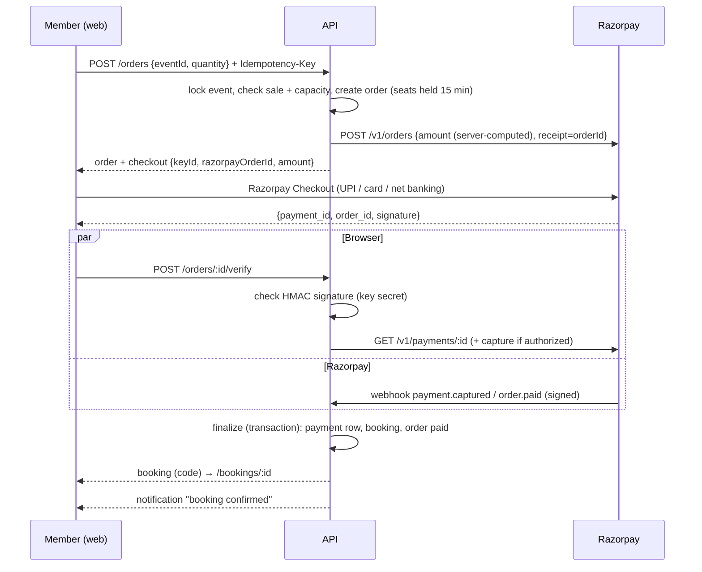

# Payment Flow

> Related: [Razorpay](razorpay.md), [Webhook](webhook.md), [Refunds](refunds.md), [Event API](../events/event-api.md)

## 1. Purpose

A member buys passes for an event on Garba Partner:

**Event → Buy pass → Razorpay order → Payment → Webhook / verification → Verify payment → Booking → Confirmation.**

The rule behind every step: **the client's view of a payment is never trusted.** A booking exists only after the server has verified a **captured** payment for the **exact order amount**.

## 2. Sequence



Both paths (browser verification and webhook) call the same **`finalize()`**, which is idempotent: whichever arrives first creates the booking, the other finds it.

## 3. Pass settings

Admins with `events:manage` set **price** (₹1–₹10,000 per pass) and optional **capacity** on a published or draft event: `PUT /api/v1/admin/events/:eventId/pass` `{ pricePaise, capacity }` (audited `event.pass_update`). `pricePaise: null` stops sales; capacity can't go below passes already sold or held. Existing orders keep the price they were created with.

Sales are open while the event is **published** and **hasn't started**. Up to **6 passes per order**.

## 4. API (member)

All need an **active** member session and are `Cache-Control: private, no-store`.

| Method | Path | Description |
|---|---|---|
| GET | `/api/v1/events/:idOrSlug` | Public. `pass: { pricePaise, currency, maxPerOrder, onSale, remaining, soldOut } \| null` |
| POST | `/api/v1/orders` | `{ eventId, quantity }` + header `Idempotency-Key: <uuid>`. `201` new, `200` same key again |
| GET | `/api/v1/orders/:orderId` | Your order (status, `lastPaymentError`, `bookingId`) |
| POST | `/api/v1/orders/:orderId/verify` | `{ razorpayOrderId, razorpayPaymentId, razorpaySignature }` from Checkout |
| GET | `/api/v1/bookings` | Your bookings, newest first (active or suspended members) |
| GET | `/api/v1/bookings/:bookingId` | One booking (`404` if not yours) |

### Create an order

```http
POST /api/v1/orders
Authorization: Bearer <member access token>
Idempotency-Key: 3f0e2a5c-7c1e-4a8b-9d7f-0e6b1c2d3a4f

{ "eventId": "7d3f…", "quantity": 2 }
```

```json
{
  "success": true,
  "message": "Order created",
  "data": {
    "order": {
      "id": "b1c2…",
      "status": "created",
      "event": { "id": "7d3f…", "slug": "rangtaali-navratri-night-k3v9qa", "name": "Rangtaali Navratri Night", "venueName": "GMDC Ground", "startsAt": "2026-10-11T14:30:00.000Z", "endsAt": "2026-10-11T19:30:00.000Z" },
      "quantity": 2,
      "unitPricePaise": 49900,
      "amountPaise": 99800,
      "currency": "INR",
      "expiresAt": "2026-10-05T12:15:00.000Z",
      "paidAt": null,
      "lastPaymentError": null,
      "bookingId": null,
      "createdAt": "2026-10-05T12:00:00.000Z"
    },
    "checkout": {
      "keyId": "rzp_test_xxxxxxxxxxxxxx",
      "razorpayOrderId": "order_NXj0fY3kQy2m1a",
      "amountPaise": 99800,
      "currency": "INR",
      "name": "Garba Partner",
      "description": "2 × pass · Rangtaali Navratri Night"
    }
  }
}
```

The body is a strict object: an `amount` (or any other field) is rejected with `400`.

### Verify

```http
POST /api/v1/orders/b1c2…/verify
Authorization: Bearer <member access token>

{ "razorpayOrderId": "order_NXj0fY3kQy2m1a", "razorpayPaymentId": "pay_NXj1Ab2cD3eF4g", "razorpaySignature": "5f1c…(64 hex)" }
```

```json
{
  "success": true,
  "message": "Payment verified",
  "data": {
    "order": { "id": "b1c2…", "status": "paid", "bookingId": "c9d8…", "…": "…" },
    "booking": {
      "id": "c9d8…",
      "code": "GP-7K3M9QX2",
      "status": "confirmed",
      "refundStatus": "none",
      "cancelReason": null,
      "event": { "…": "…" },
      "quantity": 2,
      "amountPaise": 99800,
      "currency": "INR",
      "createdAt": "2026-10-05T12:03:10.000Z",
      "cancelledAt": null
    }
  }
}
```

Verification steps: the order is yours → its Razorpay order ID matches → **HMAC-SHA256(key_secret, `order_id|payment_id`)** matches → the payment is **fetched from Razorpay** and must belong to this order → `finalize()`. If Razorpay says the payment failed, the response has `booking: null` and `order.lastPaymentError`, and the member can pay again on the same order.

Errors: `400 PAYMENT_VERIFICATION_FAILED` (bad signature or mismatched order), `404` (not your order), `409 PASSES_NOT_ON_SALE` / `SOLD_OUT` / `IDEMPOTENCY_CONFLICT` (same key, different body), `502 PAYMENT_PROVIDER_ERROR`, `503 PAYMENTS_UNAVAILABLE`, `429` rate limit.

## 5. Statuses

| Entity | Statuses |
|---|---|
| Order | `created` (awaiting payment, seats held until `expires_at`) → `paid` \| `expired` (no payment in 15 min, or replaced by a newer checkout for the same event) \| `failed` (Razorpay couldn't create the order) |
| Payment | `created`, `authorized`, `captured`, `failed`, `refunded` (as verified by the server; a captured payment never moves back to failed) |
| Booking | `confirmed` \| `cancelled` (with `cancel_reason`: `admin_refund`, `sold_out`, `event_unavailable`) |
| Refund (payment and booking) | `none`, `pending`, `processed`, `failed` ([refunds](refunds.md)) |

## 6. Idempotency and transactions

| Risk | Protection |
|---|---|
| Double-click / retry creates two orders | `Idempotency-Key` header; `UNIQUE (user_id, idempotency_key)`; a race on the same key returns the winner's order |
| Verify + webhook + retries create two bookings | `finalize()` locks the order row; `UNIQUE (order_id)` and `UNIQUE (payment_id)` on bookings; `UNIQUE (razorpay_payment_id)` on payments |
| Same webhook delivered twice | `payment_webhook_events.event_id` (the `X-Razorpay-Event-Id`) ([webhook §4](webhook.md#4-idempotency)) |
| Overselling | Order creation and finalize lock the **event row** (`SELECT … FOR UPDATE`) before counting confirmed passes + live holds |
| Partial writes | Payment row, booking and order status change in **one transaction**. Provider calls (capture, refund) happen outside transactions, and their results are written afterwards |
| Hoarding seats | A new checkout for the same event releases the member's previous hold; holds last 15 minutes |

## 7. Failure handling

| Situation | What happens |
|---|---|
| Razorpay unavailable when creating the order | `502`; the order is marked `failed` and holds no seats |
| Payment fails (declined, cancelled) | Payment recorded `failed` with Razorpay's customer-facing reason; the order stays `created`, so the member can retry until it expires |
| Member closes Checkout | Nothing is charged; the order holds seats until it expires |
| Browser closes after paying | The webhook finalizes the booking; if the webhook is also missed, the expiry job asks Razorpay for the order's payments before expiring it ([webhook §6](webhook.md#6-reconciliation)) |
| Verify request times out | The web app polls `GET /orders/:id` for up to a minute, then tells the member we'll confirm or refund |
| Payment captured after the hold expired | Booked if seats are still free; otherwise the booking is created as `cancelled` (`sold_out`) and **refunded automatically** |
| Event archived/unpublished or over when the payment is captured | Booking `cancelled` (`event_unavailable`), refunded automatically |
| Two captured payments for one order | The second is refunded automatically; one booking |
| Authorized, not captured | The API captures it for the order amount (capture errors trigger a re-read from Razorpay) |

## 8. Web flow

1. The event page shows **Passes · ₹499 each**, remaining count (when ≤ 20), a quantity picker and **Pay ₹998**. Signed-out visitors see **Log in to buy**.
2. **Pay** creates the order (one idempotency key per attempt), lazily loads `checkout.js` and opens Checkout without prefilled personal data.
3. On success the browser calls **verify** and goes to **/bookings/:id** ("You're going!", booking code to show at the venue). On failure or dismissal the member sees the reason and **Try payment again** (same order while it's held).
4. **My passes** (`/bookings`, linked from My profile) lists bookings; a booking page shows refund progress.
5. A `booking` notification (always on) confirms the booking, cancellations and refunds ([notifications](../notifications/notifications.md)).

## 9. Testing

`apps/api/src/modules/payments/payments.int.test.ts` (mocked Razorpay, real adapter):

- Pass availability on the event page; server-computed amount sent to Razorpay with Basic auth; idempotent retries (one Razorpay order); key conflict `409`; client amounts and bad quantities rejected; missing key `400`; not on sale `409`.
- Capacity holds, `SOLD_OUT`, expiry releasing seats; Razorpay outage → `502` + failed order releasing seats; a new checkout releases the previous hold; payments disabled → `503`.
- Verification books exactly once (repeat verify idempotent, one notification); forged signature, another order's ID, another member → rejected; a failed payment with a valid signature doesn't book (retry then succeeds); authorized payments captured for the order amount.
- Webhooks, late payments, reconciliation and refunds: see [webhook §8](webhook.md#8-testing) and [refunds §7](refunds.md#7-testing).
- Admin pass settings: permissions, validation, capacity not below sold passes, audit, existing orders keep their price.

## 10. Known limitations

- Full refunds only; no partial refunds or member self-cancellation (support/admin handles cancellations).
- One pass type per event (no tiers, early-bird or group pricing) and INR only.
- No QR code or venue check-in scanning yet: the booking code is shown and checked manually.
- No invoices/GST receipts yet (Razorpay sends its own payment receipt email if enabled).
- In-memory rate limits (single API process).
