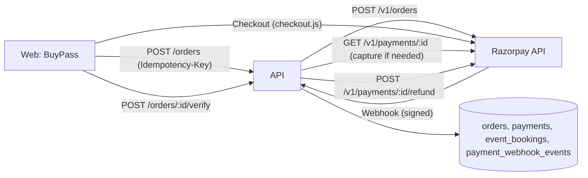

# Razorpay Integration

> Related: [Payment flow](payment-flow.md), [Webhook](webhook.md), [Refunds](refunds.md), [Environment variables](../setup/environment-variables.md)

## 1. Purpose

Garba Partner sells **event passes** (one-off purchases) through [Razorpay](https://razorpay.com). There are **no subscriptions**. Members pay with UPI, cards or net banking in Razorpay's hosted Checkout; card, UPI and bank details never reach our servers.

## 2. Architecture



| Concern | File |
|---|---|
| Razorpay REST adapter (orders, payments, capture, refunds, signatures) | `apps/api/src/providers/payments/razorpay.gateway.ts` |
| Gateway selection from env | `apps/api/src/providers/payments/index.ts` |
| Business logic (orders, finalize, webhooks, refunds, expiry) | `apps/api/src/modules/payments/payments.service.ts` |
| Member routes + webhook route | `apps/api/src/modules/payments/payments.routes.ts` |
| Capacity and pass availability | `apps/api/src/modules/payments/pass-availability.ts` |
| Expiry / reconciliation job | `apps/api/src/modules/payments/payment-jobs.ts` (started in `server.ts`) |
| Admin back office | `apps/api/src/modules/admin/payments/`, `PUT /admin/events/:id/pass` in `modules/admin/events/` |
| Raw body for webhook signatures | `apps/api/src/app.ts` (`express.json` `verify` keeps `req.rawBody` for the webhook path only) |
| Web | `apps/web/src/features/passes/` (`BuyPass`, `razorpay-checkout.ts`), `pages/BookingPages.tsx` |
| Admin | `apps/admin/src/features/payments/`, `pages/PaymentsPage.tsx` |
| Test double | `apps/api/src/test/razorpay-mock.ts` |

**No Razorpay SDK:** the adapter uses `fetch` (10 s timeout) with HTTP Basic auth (`key_id:key_secret`) and Node's `crypto` for HMAC checks. That keeps dependencies minimal and lets tests inject a mocked `fetch`.

## 3. Configuration

| Variable | Required | Notes |
|---|---|---|
| `PAYMENT_PROVIDER` | no (default `disabled`) | `disabled` \| `razorpay`. Disabled: order and webhook endpoints return `503 PAYMENTS_UNAVAILABLE`, and the web app shows no Buy button |
| `RAZORPAY_KEY_ID` | with `razorpay` | Public key ID (`rzp_test_…` / `rzp_live_…`). Sent to the browser for Checkout |
| `RAZORPAY_KEY_SECRET` | with `razorpay` | **Secret.** API auth and checkout signature verification. Server only |
| `RAZORPAY_WEBHOOK_SECRET` | with `razorpay` | **Secret.** Set when creating the webhook in the dashboard. Must differ from the key secret |

Rules enforced at start-up (`packages/config/src/server/env.ts`):

- **Test keys (`rzp_test_`) everywhere except `APP_ENV=production`**; live keys (`rzp_live_`) are refused elsewhere.
- **Production requires live keys.**
- The webhook secret must differ from the key secret.

### Never commit payment secrets

- Put real values only in your untracked `.env` (gitignored) or the server's secret store. `.env.example` has placeholders only.
- The key secret and webhook secret are used only inside the gateway adapter. They are never logged (error logs contain Razorpay's error code/description, never headers), never returned by the API, and never put in `VITE_*` variables.
- Rotate a leaked key in the Razorpay dashboard immediately, then update the environment and restart.

## 4. Local development with test credentials

1. Create a Razorpay account and switch the dashboard to **Test Mode**.
2. **Settings → API Keys → Generate Test Key.** Put the values in your local `.env`:
   ```dotenv
   PAYMENT_PROVIDER=razorpay
   RAZORPAY_KEY_ID=rzp_test_xxxxxxxxxxxxxx
   RAZORPAY_KEY_SECRET=<test key secret>
   RAZORPAY_WEBHOOK_SECRET=<a random string you also enter in step 3>
   ```
3. **Webhooks** (Test Mode): add `https://<public tunnel>/api/v1/webhooks/razorpay` (e.g. an ngrok/cloudflared tunnel to `localhost:4000`), the secret from step 2, and the events in [webhook §3](webhook.md#3-events-handled). Without a tunnel, checkout still works through `/orders/:id/verify`, and the expiry job reconciles missed payments.
4. Set a price on a published event: admin → **Events → event → Passes (online sales)**.
5. Buy a pass on the web app with Razorpay's [test cards / UPI IDs](https://razorpay.com/docs/payments/payments/test-card-details/) (e.g. UPI `success@razorpay` / `failure@razorpay`). No real money moves in Test Mode.
6. **Payment capture:** enable automatic capture in the dashboard (Settings → Payment capture). If it is off, the API captures authorized payments itself for the exact order amount.

## 5. API calls made

| Call | When |
|---|---|
| `POST /v1/orders` `{ amount, currency: 'INR', receipt: <our order id>, notes: { orderId, eventId } }` | Creating an order |
| `GET /v1/payments/:id` | Verifying a checkout result (the client's claim is never trusted) |
| `POST /v1/payments/:id/capture` `{ amount, currency }` | A payment is `authorized` but not captured |
| `GET /v1/orders/:id/payments` | Reconciling a lapsed order before expiring it |
| `POST /v1/payments/:id/refund` `{ amount, speed: 'normal', receipt, notes }` | Admin refunds and automatic refunds |

`notes` carry our IDs only: no names, phone numbers or emails. Checkout is opened without `prefill`.

## 6. Security considerations

- **Server-side amounts:** the client sends an event ID and a quantity; the price comes from the event and `amount = unit_price × quantity` is enforced by a database CHECK.
- **Two independent proofs** before a booking: an HMAC signature (checkout or webhook) **and** a captured payment for the exact order amount, read from Razorpay or from the signed webhook.
- **Constant-time** signature comparison; malformed signatures are rejected without comparison.
- **Stored payment data:** Razorpay IDs, status, amount, method (e.g. `upi`), error code and customer-facing error text. Never card numbers, VPAs, emails or phone numbers (Razorpay's payment entity includes some of these; they are dropped).
- **Rate limits:** 10 order creations and 30 verifications per member per minute.
- **CSP:** production must allow `https://checkout.razorpay.com` in `script-src` and `https://api.razorpay.com` in `frame-src` ([security architecture §8.2](../architecture/security-architecture.md#82-security-headers)).

## 7. Testing

- `apps/api/src/modules/payments/payments.int.test.ts` runs the **real gateway adapter** against `createRazorpayMock()` (an in-memory Razorpay behind an injected `fetch`), so request bodies, Basic auth, signatures and response parsing are exercised without network access or credentials.
- `apps/api/src/providers/payments/razorpay.gateway.test.ts` covers the signature algorithms and the environment rules.
- Details: [payment flow §9](payment-flow.md#9-testing).
