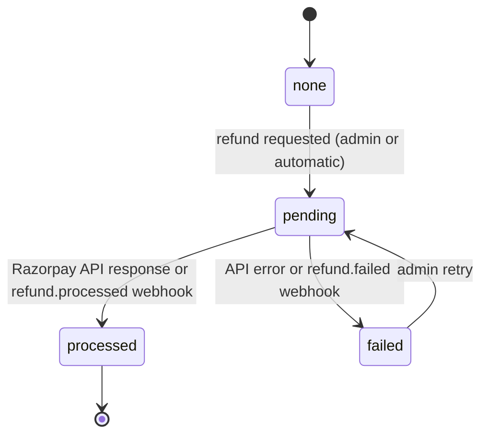

# Refunds

> Related: [Payment flow](payment-flow.md), [Webhook](webhook.md), [Razorpay](razorpay.md), [Admin actions](../safety/admin-actions.md)

## 1. Purpose

Money goes back to the member when a booking is cancelled by an admin, or automatically when a payment can't be honoured. Refunds are always **full** (the whole booking amount) and go to the original payment method through Razorpay.

## 2. When refunds happen

| Trigger | Who | Booking | Notes |
|---|---|---|---|
| Admin refund | Super admin (`payments:refund`) | `cancelled` / `admin_refund` | Requires a reason; audited `booking.refund` |
| Payment arrived after the hold lapsed and passes sold out | Automatic | `cancelled` / `sold_out` | Created and refunded in the same flow |
| Payment captured for an event that is no longer available (archived, unpublished, over) | Automatic | `cancelled` / `event_unavailable` | |
| Second captured payment for an already-paid order | Automatic | (no booking for it) | The extra payment is refunded |
| Refund failed earlier | Super admin **Retry refund** | stays `cancelled` | Audited `booking.refund_retry` |

Members can't cancel in the app; they contact support with their booking code.

## 3. Refund status

Stored on both `payments.refund_status` and `event_bookings.refund_status`:



When processed: `payments.status = 'refunded'`, `amount_refunded_paise` = the refunded amount, `refunded_at` set, `razorpay_refund_id` recorded. The member gets a `booking` notification at each step (`cancelled`, `refund_processed`, `refund_failed`), and **My passes** shows the state. Razorpay typically takes 5–7 working days to return money to the member.

## 4. How a refund runs

1. **Transaction:** lock the booking; refuse if a refund is `pending` or `processed` (`409`); the payment must be `captured`. Set the booking `cancelled` (seats freed immediately) and both refund statuses to `pending`; write the audit entry.
2. **After commit:** `POST /v1/payments/:id/refund` `{ amount: <remaining>, speed: 'normal', receipt: 'refund_<booking id>', notes: { bookingId, paymentId } }`.
3. Record the result: `processed` / `pending` / `failed`. A network or API error is recorded as `failed` and never leaves money half-tracked. The booking stays cancelled, and an admin can retry.
4. **Webhooks** (`refund.created`, `refund.processed`, `refund.failed`) update the status later, matched by Razorpay payment ID. A processed refund is final and never overwritten by a late event.

Double refunds are prevented by the booking lock plus the `pending`/`processed` check, and by `UNIQUE (razorpay_refund_id)`.

## 5. Admin API

Permission `payments:view` (super admins, event managers) for reading; `payments:refund` (super admins only) for refunds. Responses are `no-store`.

| Method | Path | Description |
|---|---|---|
| GET | `/api/v1/admin/payments/bookings` | Filters: `status`, `refundStatus`, `eventId`, `cursor`, `limit` |
| GET | `/api/v1/admin/payments/bookings/:bookingId` | Booking + payment (Razorpay IDs, method, refund state) |
| GET | `/api/v1/admin/payments/orders` | Filters: `status`, `eventId`; includes every payment attempt |
| GET | `/api/v1/admin/payments/orders/:orderId` | One order |
| POST | `/api/v1/admin/payments/bookings/:bookingId/refund` | `{ reason }` (5–500 chars). Full refund, or a retry after `failed` |

```http
POST /api/v1/admin/payments/bookings/c9d8…/refund
Authorization: Bearer <super admin access token>

{ "reason": "Customer cannot attend (support ticket #481)" }
```

```json
{
  "success": true,
  "message": "Refund requested",
  "data": {
    "id": "c9d8…",
    "code": "GP-7K3M9QX2",
    "status": "cancelled",
    "cancelReason": "admin_refund",
    "refundStatus": "processed",
    "quantity": 2,
    "amountPaise": 99800,
    "user": { "id": "4b1e…", "name": "Rohan" },
    "orderId": "b1c2…",
    "payment": {
      "razorpayPaymentId": "pay_NXj1Ab2cD3eF4g",
      "status": "refunded",
      "method": "upi",
      "refundStatus": "processed",
      "razorpayRefundId": "rfnd_NXk9Zz8yY7xX6w",
      "amountRefundedPaise": 99800,
      "…": "…"
    },
    "…": "…"
  }
}
```

Errors: `403` (no `payments:refund`), `404`, `409` (already refunded / refund in progress / payment not captured), `503` (payments disabled). A failed provider call returns `200` with `refundStatus: "failed"` so the admin sees the state and can retry.

**Admin UI:** **Payments** (`/payments`): bookings (status and refund filters) and orders with every payment attempt; a booking page with **Refund ₹…** / **Retry refund** (reason required, super admins only).

## 6. Security and privacy

- Only super admins can move money back; every refund and retry is in the append-only audit log with the reason, amount and Razorpay payment ID.
- Admin views show display names and Razorpay IDs, never phone numbers, card numbers or UPI IDs.
- Refund `notes` carry our IDs only.

## 7. Testing

In `apps/api/src/modules/payments/payments.int.test.ts`:

- Event managers can list bookings but get `403` on refunds; super admin refund → booking cancelled, Razorpay refund called for the full amount, payment `refunded`, audit entry, second refund `409`, the member sees the refund, seats freed.
- Pending refund completed by the `refund.processed` webhook.
- Refund API failure → `failed`, then a retry succeeds (audited as a retry).
- Automatic refunds: duplicate payment, sold out after a lapsed hold.

## 8. Known limitations

- No partial refunds, and no automatic refund policy tied to event cancellation (events can't be cancelled yet).
- Instant refunds (`speed: optimum`) aren't used; they cost extra.
- Refunds stuck in `pending` with no webhook aren't polled yet; admins see them via the `refundStatus=pending` filter.
