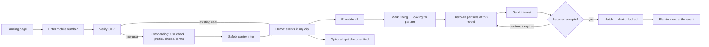
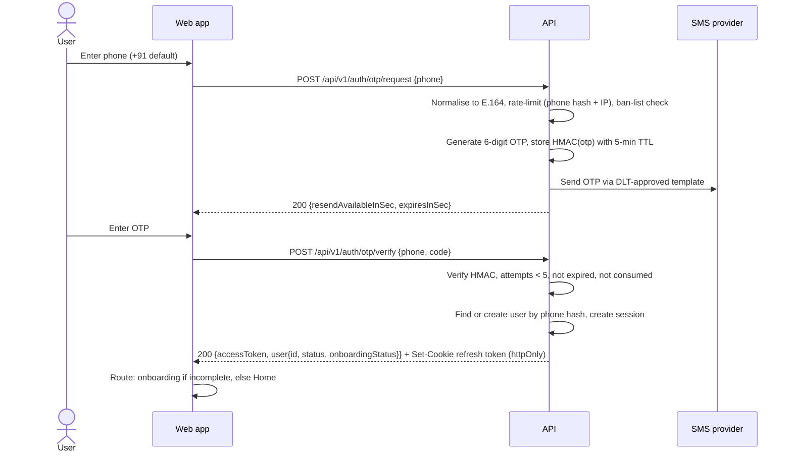
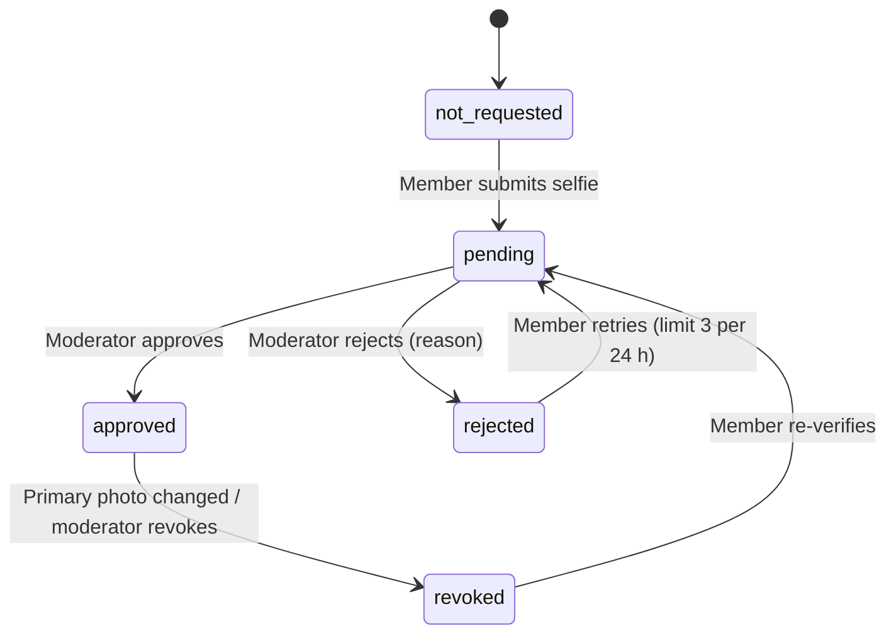
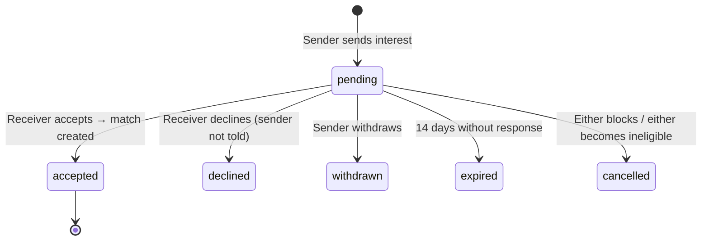
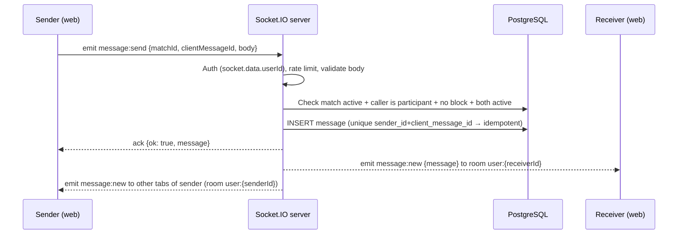

# User Flows — Garba Partner

> Related: [MVP scope](MVP-scope.md), [Application architecture](../architecture/application-architecture.md) (endpoints), [Database architecture](../architecture/database-architecture.md) (states), [Security architecture](../architecture/security-architecture.md)

This document defines each journey step by step, including states, business rules and edge cases. Numeric limits appear here as `LIMITS.*`. They are defined once in `packages/shared/src/constants/limits.ts` and listed in [application architecture §9](../architecture/application-architecture.md#9-business-rules-and-limits).

## Contents

1. [End-to-end member journey](#1-end-to-end-member-journey)
2. [Authentication flow](#2-authentication-flow)
3. [Onboarding and profile flow](#3-onboarding-and-profile-flow)
4. [Photo verification flow](#4-photo-verification-flow)
5. [Event flow](#5-event-flow)
6. [Partner discovery flow](#6-partner-discovery-flow)
7. [Interest and matching flow](#7-interest-and-matching-flow)
8. [Chat flow](#8-chat-flow)
9. [Block flow](#9-block-flow)
10. [Report flow](#10-report-flow)
11. [Account settings and deletion flow](#11-account-settings-and-deletion-flow)
12. [Admin journeys](#12-admin-journeys)
13. [Global rules for every flow](#13-global-rules-for-every-flow)

---

## 1. End-to-end member journey

**Primary navigation (web, mobile-first bottom bar):** Events · Discover · Interests · Chats · Profile.

---

## 2. Authentication flow

### 2.1 Login / sign-up (a single flow)

There is no separate "sign up". A phone number that has never been seen before creates an account after OTP verification.

**Rules**

| Rule | Value |
|---|---|
| OTP length / TTL | 6 digits / `LIMITS.OTP_TTL_SECONDS` = 300 |
| Wrong attempts per OTP | `LIMITS.OTP_MAX_ATTEMPTS` = 5, after which the OTP is invalidated and a new one must be requested |
| Resend cooldown | `LIMITS.OTP_RESEND_COOLDOWN_SECONDS` = 30 |
| Sends per phone | 5 per hour, 10 per 24 h |
| Sends per IP | 20 per hour |
| Supported numbers | Indian mobile numbers (+91) at MVP. Validate format server-side |
| Requesting a new OTP | Invalidates any previous unconsumed OTP for that phone |

**Responses and edge cases**

- **The `otp/request` response is the same** whether the number is new, existing, suspended or banned. This prevents account enumeration. Ban handling happens after verification.
- Banned phone hash: `otp/request` still returns 200 but **no SMS is sent** (saves cost and gives nothing away). `verify` then fails with the generic `OTP_INVALID`.
- Wrong code → `OTP_INVALID` with remaining attempts. Expired → `OTP_EXPIRED`. Too many attempts → `OTP_ATTEMPTS_EXCEEDED`.
- Account `status = banned` after a successful OTP: no session is created. The user sees `ACCOUNT_BANNED` with a support/grievance link.
- Account `status = suspended`: a session is created, but the app shows a suspension screen (reason category + end date). Every social API returns `ACCOUNT_SUSPENDED`.
- Account `status = pending_deletion` (inside the 30-day grace window): logging in shows "Your account is scheduled for deletion on <date>. Restore it?". Restoring sets `status = active`.
- The OTP is never logged, never returned in any API response and never stored in plain text.

### 2.2 Session lifecycle

| Token | Lifetime | Storage (web) | Notes |
|---|---|---|---|
| Access token (JWT) | 15 min | In memory only (not localStorage) | Sent as `Authorization: Bearer`. Also used for the Socket.IO handshake |
| Refresh token (opaque, random 256-bit) | 30 days absolute | `httpOnly; Secure; SameSite=Strict; Path=/api/v1/auth` cookie | Stored hashed in `user_sessions`. Rotated on every use. Reusing an old token revokes that session ([database architecture §3.1](../architecture/database-architecture.md#user_sessions)) |

- On app load, the web app calls `POST /api/v1/auth/refresh`. Success means it's logged in. A 401 sends the user to the login screen.
- On a 401 from any API call, the app tries one silent refresh and retries once. If that fails, it goes to login.
- **Logout**: `POST /api/v1/auth/logout` revokes the current session and clears the cookie.
- **Log out of all devices** (Settings): revokes all sessions for the user.
- Sanctions (suspend/ban) revoke all sessions and disconnect sockets immediately (see [§12.3](#123-user-sanction)).

---

## 3. Onboarding and profile flow

### 3.1 Onboarding steps

Onboarding is a single multi-step form. Progress is kept on the client and submitted in two API calls (profile, then photos), so no half-finished profile row is ever discoverable.

| Step | Fields | Validation |
|---|---|---|
| 1. Age gate | Date of birth, plus a checkbox confirming "I am 18 or older" | Age computed server-side in `Asia/Kolkata`. **< 18 → rejected** (see below) |
| 2. Basics | First name (display name), gender (`woman`, `man`, `non_binary`) | Name: 2–30 characters, letters/spaces/`.`/`'`/`-` only, no digits (discourages phone numbers) |
| 3. Location | City (from the active list), area (optional, from the city's list) and a "Show my area on my profile" toggle (default **off**) | Only admin-seeded cities/areas. No free text and **no GPS** |
| 4. Dance | Experience (`beginner`, `intermediate`, `advanced`), styles (multi: `garba`, `dandiya_raas`) | At least one style |
| 5. Partner preferences | Interested in partnering with (`women`, `men`, `everyone`), preferred age range | Age range 18–80, min ≤ max |
| 6. About | Bio (optional) | ≤ `LIMITS.BIO_MAX_LENGTH` = 300 characters. Phone number/URL/email patterns are rejected with a friendly message |
| 7. Photos | 1–6 photos, first one is primary | JPEG/PNG/WebP, ≤ 5 MB, ≥ 400×400 px. Server re-encodes and strips EXIF/GPS |
| 8. Visibility & terms | **Visibility:** an explicit yes/no choice: "Show my profile in partner discovery (adult members in my city, and at events where I turn on 'looking for a partner')". Nothing is pre-selected, and choosing "no" means browsing events only. **Terms:** accept Terms of Service, Privacy Policy and Community Guidelines (current versions) | Visibility choice required (`discoveryEnabled`). Terms required. Version and timestamp are stored |
| 9. Safety intro | Three-card safety introduction with a link to the safety centre | Informational |

API: `POST /api/v1/me/profile` (steps 1–6 and 8), then `POST /api/v1/me/photos` for each photo. The server sets `onboarding_completed_at` once a profile exists **and** at least one photo is stored.

### 3.2 Underage handling

- If the computed age is < 18, the API returns `UNDERAGE` and sets `users.underage_rejected_at`. **The user cannot submit another date of birth.** Later onboarding attempts return `UNDERAGE` until support clears the flag.
- The UI shows: "Garba Partner is only for adults (18+)." It doesn't hint that a different date would work.
- The account is scheduled for deletion under the standard retention policy.

### 3.3 Editing the profile

- `PATCH /api/v1/me/profile`: everything from onboarding is editable **except date of birth**. DOB changes go through support (prevents age manipulation).
- Gender is editable. Its history isn't exposed.
- Photos: add (up to 6), delete (at least 1 must remain while `discovery_enabled`), reorder.
- Changes show up in discovery straight away. There is no approval step, apart from post-moderation of photos (§12.5).
- Bio and name edits go through the same validation as onboarding.

### 3.4 What other members see (profile view)

| Shown | Never shown |
|---|---|
| First name, age (years), gender | Phone number, date of birth, surname |
| City, and area only if the member chose to show it | GPS/exact location, home address |
| Photos (approved or pending review, see §12.5) | Rejected photos, verification selfies |
| Bio, experience, styles | Other events they're attending (except the shared event in event mode) |
| "Photo verified" badge (with explanation link) | "Last seen" timestamp, online status |
| Context: "Also looking for a partner at \<event\>" (event mode only) | Their partner preferences, reports, sanctions |

Profiles are reachable only by logged-in, onboarded, active members, through discovery, interests or matches. Nothing is indexed publicly.

---

## 4. Photo verification flow

**Purpose:** give members a limited, honest signal that someone's profile photos show the person using the account.

**What it does NOT do:** confirm legal name, age, identity documents, criminal history or intentions. The badge copy must say so ([product overview §7](product-overview.md#7-safety-and-trust-positioning-mandatory-copy-rules)).

**Steps**

1. Member taps **Get photo verified** (Profile → Verification).
2. `POST /api/v1/me/verification` creates a `user_verifications` row (`type = photo`, `provider = internal_review`) with `status = initiated` and a random **gesture code** from a fixed set (e.g. "thumbs up with left hand", "touch your right ear", "three fingers up"). The response includes the gesture instruction and an example illustration.
3. The member takes a live selfie with the camera (`<input capture="user">`) and uploads it: `POST /api/v1/me/verification/:requestId/selfie`. The request moves to `pending`.
4. The selfie is stored as a **private (authenticated) Cloudinary asset**. Only admins can view it, through a short-lived signed URL.
5. A moderator compares the selfie with the gesture and the profile photos, then approves or rejects with a reason (`gesture_mismatch`, `face_not_visible`, `does_not_match_photos`, `inappropriate`, `other`).
6. On approval, `users.photo_verified_at` is set, the badge appears and the member gets an in-app notification.
7. On rejection, the member is notified with the reason and may retry. At most `LIMITS.VERIFICATION_ATTEMPTS_PER_DAY` = 3.
8. **Retention:** the selfie asset is deleted `LIMITS.VERIFICATION_SELFIE_RETENTION_DAYS` = 30 days after the decision (a scheduled job). The row keeps only status, reviewer, timestamps and reason.

**Edge cases**

- If the member changes their **primary photo** after approval, the badge is **revoked** automatically (`photo_verified_at = null`, request `revoked`) and they're asked to re-verify.
- A pending request expires after 7 days without review → `expired`. The member can resubmit. (Operationally, the SLA is < 24 h.)
- Suspended members cannot request verification.

**Future: ID/age verification (post-MVP, designed for now)**

- Done through a licensed KYC provider, e.g. a DigiLocker consent flow. The provider does the verification.
- We store **only**: `provider`, `provider_reference_id`, `result` (`passed`/`failed`), `is_over_18` (boolean), `name_matches_profile` (boolean), `verified_at`.
- We **never** receive or store an Aadhaar number, a masked Aadhaar number, an Aadhaar XML/QR payload or document images. If a provider's API returns any of these, we discard them immediately and never persist or log them. Provider choice needs legal review.

---

## 5. Event flow

### 5.1 Member side

1. **Home = Events.** Upcoming published events in the member's city, sorted by `starts_at`. There's a city switcher and a date filter (Today, This weekend, All upcoming).
2. **Event card:** cover image, title, date/time (IST), venue name, area, price info text, and counts ("120 going").
3. **Event detail:** everything above plus description, full venue address and map link (public venues only), organiser name, and a "Pass info" text/external link (MVP; Razorpay purchase comes later).
4. **Attendance actions:**
   - `Going` / `Interested` / clear (`PUT` / `DELETE /api/v1/events/:eventId/attendance`).
   - **"I'm looking for a partner for this event"** toggle, available only when status is `Going` or `Interested`. Default **off**.
5. With the partner toggle on, the event detail shows **"See who's looking for a partner here"** → event-mode discovery (§6).
6. **My events** (Profile → My events): the member's own attendances.

**Rules**

- Attendance can only be set on `published` events that haven't ended.
- **Attendee lists are never public.** Event pages show aggregate counts only (`going_count`, `interested_count`, and optionally "N looking for partners").
- A member's attendance can be seen by another member **only if both have `looking_for_partner = true` for that same event** (reciprocal visibility).
- When an event is **cancelled**, everyone with an attendance record gets an in-app notification. The event shows a "Cancelled" banner, and event-mode discovery closes.
- When an event **ends** (`ends_at` passed), attendance is read-only and event-mode discovery closes. Existing matches and chats are unaffected.

### 5.2 Visitor side

Visitors can see the public event listing and event details, with counts, but nothing about attendees. Any attendance action prompts login.

---

## 6. Partner discovery flow

Discovery shows a paginated list of profile cards. There are two modes.

| Mode | Entry point | Who appears |
|---|---|---|
| **Event mode** | Event detail → "See who's looking for a partner" | Members with attendance on this event and `looking_for_partner = true`. **The viewer must also have `looking_for_partner = true` on the event** (reciprocity) |
| **City mode** | Discover tab | Members in the viewer's selected city with `discovery_enabled = true` |

### 6.1 Eligibility filter (applied server-side to every candidate, in both modes)

A candidate appears only if **all** of the following hold:

1. `users.status = 'active'`, onboarding complete, not `hidden_from_discovery` (auto-hide after reports, §10.3).
2. `user_preferences.discovery_enabled = true`.
3. Has at least one photo not in `rejected` status.
4. Not the viewer.
5. **No block in either direction** between viewer and candidate.
6. No **active match** with the viewer.
7. No **pending interest** from the viewer to the candidate (it shows in "Sent" instead).
8. The viewer hasn't had an interest to this candidate declined within `LIMITS.INTEREST_DECLINE_COOLDOWN_DAYS` = 30. The candidate is simply left out; the decline itself is never revealed.
9. **Mutual preference match:** the candidate's gender fits the viewer's `partner_gender_preference` *and* the viewer's gender fits the candidate's preference. The candidate's age is within the viewer's age range *and* the viewer's age is within the candidate's range.

The viewer must also be eligible: active and onboarded. If `discovery_enabled = false`, the viewer can still browse, but the UI explains that they can't be found while it's off. Members with discovery off cannot **send** interests either (no browsing while invisible). This keeps things symmetric and fair.

### 6.2 Viewer filters (optional)

- Experience level (multi), dance style (multi), narrower age range (within their preference), and "Photo verified only".
- Ordering: photo-verified first, then most recently active (`last_active_at` bucketed to the day, so exact activity times can't be inferred), then `id`. Cursor pagination, page size 20.

### 6.3 Actions on a card

- **Send interest** (§7). In event mode, the interest is tagged with the event.
- **Skip**: client-side only, not persisted in the MVP. The card may come back later.
- **View profile** → full profile (§3.4) → Send interest / Block / Report.

### 6.4 Empty states

- Event mode with the viewer's toggle off: "Turn on 'Looking for a partner' to see who else is."
- No candidates: "No one matches yet. Check back closer to the event, or widen your preferences."

---

## 7. Interest and matching flow

The model is **request → accept**. The receiver decides whether a conversation happens.

### 7.1 Sending

`POST /api/v1/interests {receiverId, eventId?}`

- The server re-checks **every** eligibility rule in §6.1 (never trust that the card came from discovery). If the receiver is ineligible, it returns the generic `USER_UNAVAILABLE` (never reveals a block).
- Daily limit: `LIMITS.INTERESTS_PER_DAY` = 25 (rolling 24 h). Over the limit → `INTEREST_LIMIT_REACHED`.
- One pending interest per ordered pair (DB partial unique index).
- **Mutual interest:** if the receiver already has a *pending* interest to the sender, the new request **accepts that existing interest** and creates the match straight away. The response says `matched: true`.
- `eventId` is only accepted if both users currently have `looking_for_partner = true` for that event.
- The receiver gets an in-app notification and a realtime `interest:new` event.

### 7.2 Receiving

The **Interests** tab has two lists:

- **Received:** pending interests with a card for each sender (the same data as §3.4) and the event context, if any. Actions: **Accept**, **Decline**, View profile, Block, Report.
- **Sent:** the viewer's pending interests (status "Waiting"). Action: **Withdraw**.

Declined, expired and withdrawn interests disappear from both lists. **The sender is never told about a decline.** From their side, the interest just drops out of "Sent" (the UI copy is "No longer pending").

### 7.3 Accepting → match

`POST /api/v1/interests/:id/accept` runs in a single DB transaction:

1. Lock the interest row. Check it's still `pending` and the receiver is the caller.
2. Re-check eligibility for both users (active, no block).
3. Set interest `accepted`, and create a `matches` row with the user IDs stored in canonical order (`user_a_id < user_b_id`) and the `event_id` from the interest.
4. Notify both users (`match:new`).

Result: a chat thread opens for both users, starting with the safety reminder.

### 7.4 Unmatching

- Either member can **unmatch** from the chat screen or the match list: `POST /api/v1/matches/:matchId/unmatch`.
- The match becomes `unmatched`. The chat disappears for **both** users, and neither can send further messages.
- The other member isn't told explicitly. The thread just disappears.
- Messages are kept (hidden from users) for `LIMITS.ENDED_MATCH_MESSAGE_RETENTION_DAYS` = 90 days, so a report filed around the time of unmatching can still be investigated. They're purged after that.
- After an unmatch, either user may show up in the other's discovery again, unless a block exists. A new interest starts over from scratch.

---

## 8. Chat flow

1:1 chat is available **only for active matches**. Text only in the MVP.

### 8.1 Opening a chat

1. **Chats** tab: list of active matches, ordered by the latest message. Shows the other member's name, primary photo, last message preview and unread indicator.
2. Opening a chat loads the latest 30 messages: `GET /api/v1/matches/:matchId/messages?limit=30`. Older ones load on scroll via the `before` cursor.
3. A pinned safety card at the top of each new chat: "Meet at the event or another busy public place. Tell a friend your plans. Never send money. [Safety tips]".

### 8.2 Sending a message

- Body: 1–`LIMITS.MESSAGE_MAX_LENGTH` = 1000 characters after trimming. Plain text only, rendered as text (never as HTML).
- Rate limit: `LIMITS.MESSAGES_PER_MINUTE` = 30 per user.
- **Idempotency:** the client generates a UUID `clientMessageId`. Retries don't create duplicates.
- **REST fallback:** `POST /api/v1/matches/:matchId/messages` uses the same service method. It's used when the socket is disconnected.
- **Offline receiver:** the message is stored. The receiver sees it and the unread count next time they open the app (web push is post-MVP).
- **Contact-sharing nudge:** if the message looks like a phone number, email, UPI ID or URL, the **sender's** client shows a non-blocking prompt before sending: "Sharing contact details? Only share with people you trust. You can keep chatting here." The server doesn't block it (adults may choose to share), but it records `messages.contains_contact_info = true` for moderation context.

### 8.3 Read receipts

- When a chat is open and visible, the client emits `message:read {matchId, lastReadMessageId}` (debounced), or calls `POST /api/v1/matches/:matchId/read`.
- The server stores `matches.user_a_last_read_at / user_b_last_read_at` and emits `message:read` to the other participant.
- UI: "Seen" under the last message the other person has read. No typing indicators and no online status in the MVP (privacy + simplicity).

### 8.4 When chat becomes unavailable

| Event | Effect |
|---|---|
| Unmatch | Thread removed for both. Sends fail with `MATCH_NOT_ACTIVE` |
| Block (either side) | Match becomes `blocked`. Thread removed for both. Sends fail with `MATCH_NOT_ACTIVE` |
| Either user suspended/banned | Thread hidden from the other user while the sanction lasts, and sends fail. After a suspension ends, an active match reappears |
| Either user deletes their account | Match `closed`. Thread removed |

Before every send, the server checks the match status **and** both users' statuses **and** blocks. The client state is never trusted.

---

## 9. Block flow

Blocking is instant, silent and symmetric in effect.

**Entry points:** profile view, discovery card menu, received interest, chat header menu, match list item.

`POST /api/v1/blocks {userId}` runs in a single transaction:

1. Insert `blocks(blocker_id, blocked_id)` (idempotent).
2. Cancel pending interests in **both** directions.
3. Set any active match between them to `blocked`.
4. Emit `match:ended` to both users (the blocked user's client just removes the thread and is given no reason).

**Effects (enforced server-side in every relevant query):**

- Neither user can see the other in discovery, interests, matches, chats or profile views. The profile endpoint returns `404 NOT_FOUND` rather than "blocked".
- Neither can send interests or messages to the other.
- Blocked users are **not notified**.
- **Unblock:** Settings → Blocked members → Unblock (`DELETE /api/v1/blocks/:userId`). This only lifts future invisibility. It **does not** restore the old match or chat.
- Blocking and reporting are independent, but the report form offers "Also block this member" (checked by default).

---

## 10. Report flow

### 10.1 Member reporting

**Entry points:** profile view, discovery card, received interest, chat header (report user), long-press/menu on a message (report message).

Form:

| Field | Values |
|---|---|
| Reason (required) | `underage`, `safety_threat` (threats, stalking, violence), `harassment`, `sexual_content`, `fake_profile`, `scam_spam`, `hate_speech`, `other` |
| Details (optional) | ≤ 1000 characters |
| Also block (checkbox) | Checked by default |

`POST /api/v1/reports {reportedUserId, messageId?, reason, details?, alsoBlock}`

- If a `messageId` is given, the server checks that the reporter is a participant in that message's match and stores a **snapshot** of the message body (plus up to 10 preceding messages from the same match for context) in the report. The evidence therefore survives unmatch or deletion.
- Limit: `LIMITS.REPORTS_PER_DAY` = 10 per reporter. One open report per (reporter, reported user, message) combination (duplicates are merged).
- Confirmation screen: "Thanks. Our team will review this. If you're in immediate danger, call 112." with a safety centre link.
- The reported user is **never told** who reported them.

### 10.2 Priority

| Priority | Reasons | Target first action |
|---|---|---|
| **P0** | `underage`, `safety_threat` | < 1 h in event season, < 4 h otherwise |
| **P1** | `harassment`, `sexual_content`, `hate_speech`, `scam_spam` | < 12 h |
| **P2** | `fake_profile`, `other` | < 48 h |

### 10.3 Automatic protective actions (no moderator needed)

- **P0 report** → the reported user is immediately set to `hidden_from_discovery = true` until a moderator reviews. They can still use existing chats; moderators decide on sanctions.
- **Threshold:** `LIMITS.AUTO_HIDE_REPORT_THRESHOLD` = 3 distinct reporters within 7 days (any reason) → `hidden_from_discovery = true` pending review.
- Auto-hide never suspends or bans on its own. Only a human applies a sanction.

### 10.4 Moderator handling → see [§12.2](#122-report-handling).

---

## 11. Account settings and deletion flow

**Settings screen:**

- Discovery on/off (`discovery_enabled`).
- Show area on profile on/off.
- Blocked members list (unblock).
- Log out / log out of all devices.
- Safety centre, Community guidelines, Terms, Privacy policy, Grievance officer contact.
- **Download my data** (DPDP access right): MVP is "request via email/grievance form", handled manually within the statutory timeline. A self-service export is post-MVP.
- **Delete account.**

**Deletion:**

1. User confirms by typing `DELETE`. `DELETE /api/v1/me`.
2. Straight away: `status = pending_deletion`, all sessions revoked, sockets disconnected, the user disappears from discovery, pending interests are cancelled, active matches are `closed`, and photos are hidden.
3. Grace period `LIMITS.ACCOUNT_DELETION_GRACE_DAYS` = 30. Logging in again during this window offers **Restore**.
4. After the grace period, a scheduled job **hard-deletes or anonymises**: profile, photos (Cloudinary assets destroyed), verification data, attendances, interests, notifications and sessions. Messages the user sent are deleted. The `users` row is anonymised: phone fields nulled, `status = deleted`.
5. **Exception:** if the user has open reports against them or active sanctions, the report and sanction records (with their message snapshots) are kept for the legal retention period (see [security architecture §9](../architecture/security-architecture.md#9-data-privacy-retention-and-deletion)). The phone hash of a **banned** user goes on `banned_phone_hashes` so they cannot sign up again.

---

## 12. Admin journeys

The admin panel is a separate app (`apps/admin`) on its own subdomain. Every action requires a specific role (see [application architecture §7.3](../architecture/application-architecture.md#73-admin-role-permission-matrix)), and **every write action is audit-logged**.

### 12.1 Admin login

1. `admin.<domain>` → email + password → `POST /api/v1/admin/auth/login` → returns `challengeId` (no tokens yet).
2. TOTP code from an authenticator app → `POST /api/v1/admin/auth/totp {challengeId, code}` → access token + admin refresh cookie.
3. First login (account created by a super admin with a one-time temporary password): forced password change and TOTP enrolment (QR code) before anything else.
4. Lockout: 5 failed password or TOTP attempts → the account is locked for 15 min and the event is audit-logged.

### 12.2 Report handling

1. **Reports queue**: filter by status (`open`, `in_review`, `resolved`, `dismissed`), priority and reason. Default sort: priority, then oldest first.
2. Open a report → **Assign to me** (`in_review`).
3. The detail view shows: reporter reason and details, the message snapshot with context, the reported user's profile (photos, bio), their previous reports (count + outcomes), their sanction history, and other open reports against the same user (grouped).
4. **Resolve** with one action plus a required internal note:
   - `dismiss`: no violation.
   - `warn`: user gets an in-app warning notice citing the guideline.
   - `remove_content`: reject specific photo(s) or blank the bio.
   - `suspend`: 1, 3, 7 or 30 days.
   - `ban`: permanent. The phone hash is added to `banned_phone_hashes`.
   - Optionally **clear auto-hide** (`hidden_from_discovery = false`) when dismissing.
5. The reporter gets a generic in-app update: "We've reviewed your report and taken appropriate action." We don't disclose the specific action.

### 12.3 User sanction

Triggered from a report resolution or directly from the user detail page (with a note).

- Creates a `user_sanctions` row and updates `users.status` (`suspended` / `banned`).
- **Immediate enforcement:** revokes all user sessions, disconnects all sockets (`user:{id}` room), cancels pending interests, hides the user from discovery and from other users' interest lists and chats.
- Suspensions end on their own (scheduled job sets `status = active` when `ends_at` passes, if no other active sanction exists).
- **Revoke sanction** (moderator+): sets `revoked_at` and restores status. Audit-logged with a reason.

### 12.4 Verification review

1. **Verification queue** (`pending`, oldest first).
2. Detail view: the selfie (signed URL, expires in 5 min), the requested gesture, and all profile photos side by side.
3. **Approve** or **Reject** with a reason. The member is notified.
4. Moderators must not download or screenshot selfies (policy; the UI offers no download button).

### 12.5 Photo moderation (post-moderation)

- New and changed photos are **visible immediately** with `status = pending_review`. They join the **Photo review queue**.
- A moderator approves (`approved`) or rejects (`rejected`, with a reason: nudity, violence, not a person, contains contact info, someone else/celebrity, minor in photo, other).
- A rejected photo is hidden straight away and the member is notified. If it was the only photo, the member is hidden from discovery until they add a new one.
- Optional enhancement: enable Cloudinary's automated moderation add-on to pre-flag photos. (It's a paid add-on; decide at implementation time.)

### 12.6 Event management (event manager)

1. **Events list**: filter by status (`draft`, `published`, `cancelled`), city and date.
2. **Create event**: title, description, city, area, venue name, venue address, map URL, start/end (IST input, stored UTC), organiser name, price info text, external pass link (optional), cover image. Saved as `draft`.
3. **Preview** → **Publish** (sets `published_at`). Validation: `ends_at > starts_at` and `starts_at` in the future.
4. **Edit** a published event: allowed. Material changes (time/venue) send a notification to attendees ("Event details updated").
5. **Cancel**: requires a reason and notifies attendees. Can't be undone (create a new event instead).
6. Events are never hard-deleted once published (attendance and interests refer to them).

### 12.7 City/area management (event manager)

- Add or rename cities and areas, and activate or deactivate them. Deactivating a city hides its events, and it no longer appears in onboarding choices. Existing profiles keep the city but are shown a prompt to update it.

### 12.8 User lookup

- Search by user ID, display name, or **phone number** (the phone is hashed server-side and matched on `phone_hash`, so it never goes into the DB in plain text or into logs).
- The user detail page shows the profile, status, verification, sanctions, reports made and received, and counts (matches, interests). **Message content is visible only through report snapshots**, never by browsing a user's chats.
- **Reveal phone number** (super admin only): requires a reason (e.g. a legal request reference), shows the number once and writes an audit log entry.

### 12.9 Admin account management (super admin)

- Create an admin (email, name, role) with a temporary password; deactivate an admin; change a role; reset TOTP. All audited.

### 12.10 Dashboard

- Counts: new users (24 h / 7 d), onboarded users, active members (7 d), open reports by priority, pending verifications, pending photo reviews, upcoming events, matches created (7 d).

---

## 13. Global rules for every flow

1. **Server-side enforcement:** every endpoint and socket handler re-checks authentication, status (active/suspended/banned/pending_deletion), ownership and block relationships. See `assertCanInteract()` in [security architecture §5](../architecture/security-architecture.md#5-authorization-and-the-interaction-gate).
2. **Don't reveal blocks, declines or report outcomes** to the affected party. Use generic errors (`USER_UNAVAILABLE`, `NOT_FOUND`).
3. **No private data in responses:** API serializers for other users' profiles are allow-lists (`PublicProfileDto`) and never return a model row directly.
4. **Timezone:** store UTC and display in `Asia/Kolkata`.
5. **Rate limits** apply to all sensitive actions (OTP, interests, messages, reports, uploads, verification).
6. **Accessibility:** mobile-first, WCAG 2.1 AA colour contrast, labelled controls, keyboard-navigable admin.
