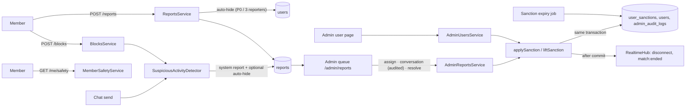

# Moderation System

> Related: [Admin actions](admin-actions.md), [Abuse prevention](abuse-prevention.md), [Incident response](incident-response.md), [Community guidelines](community-guidelines.md), [Chat moderation](../chat/moderation.md), [Authorization](../auth/authorization.md)

## 1. Purpose

Garba Partner is an 18+ platform where strangers meet to dance. The moderation system lets members **report** people and messages, lets the platform **flag** suspicious patterns, and gives moderators a **queue** and a set of **proportionate, audited actions**: dismiss, warn, restrict chat, suspend, ban.

Four rules drive the design:

1. **A person decides every sanction.** Reports and automated flags never suspend or ban anyone. The strongest automatic step is hiding a member from discovery until a moderator looks ([§5](#5-automatic-protection-and-what-is-never-automatic)).
2. **Protecting yourself is instant.** Blocking and reporting take effect immediately and end the chat for both members, whatever happens in review.
3. **Reporters are anonymous to the reported member.** Nobody is ever told who reported them, and warnings never reveal the report.
4. **Everything a moderator does is audited.** Each action writes an append-only audit entry in the same transaction as the change.

Identity or photo verification is never treated as proof that someone is safe, and moderation copy never claims it is.

## 2. Architecture



| Concern | File |
|---|---|
| Member reports (evidence, merge, auto-hide) | `apps/api/src/modules/safety/reports.service.ts` |
| Blocks | `apps/api/src/modules/safety/blocks.service.ts` |
| Sanctions: apply, lift, expire, history | `apps/api/src/modules/safety/sanctions.ts` |
| Expiry job (every minute) | `apps/api/src/modules/safety/sanction-expiry.job.ts` (started in `server.ts`) |
| Automated flags | `apps/api/src/modules/safety/suspicious-activity.service.ts` |
| Member notices (`/me/safety`) | `apps/api/src/modules/safety/member-safety.service.ts`, `safety.routes.ts` |
| Queue, assign, conversation, resolve | `apps/api/src/modules/admin/reports/` |
| Direct sanctions on a member | `apps/api/src/modules/admin/users/` |
| Safety and audit log viewers | `apps/api/src/modules/admin/log-viewer/` |
| Shared contract | `packages/shared/src/constants/{enums,guidelines,limits,admin}.ts`, `schemas/safety.schema.ts`, `types/dto/safety.dto.ts` |
| Web | `apps/web/src/features/safety/`, pages `SafetyCenterPage`, `CommunityGuidelinesPage`, `BlockedMembersPage`, `ChatPage` |
| Admin | `apps/admin/src/features/moderation/`, `features/log-viewer/`, pages `ReportsPage`, `ReportDetailPage`, `UserDetailPage`, `LogPages` |

## 3. Priorities

Each report reason maps to a priority and to the community guideline it breaks (`REPORT_PRIORITY_BY_REASON`, `COMMUNITY_GUIDELINES`):

| Reason (API value) | Member label | Priority | Guideline |
|---|---|---|---|
| `threatening_behavior` | Threatening behaviour | **P0** | No threats or violence |
| `underage` | Seems to be under 18 | **P0** | Adults only (18+) |
| `harassment` | Harassment or bullying | P1 | Be respectful |
| `asking_for_money` | Asking for money or payment details | P1 | Never ask for money |
| `inappropriate_behavior` | Inappropriate or sexual behaviour | P1 | Keep it appropriate |
| `impersonation` | Pretending to be someone else | P1 | Be yourself |
| `fake_profile` | Fake profile | P2 | Be yourself |
| `spam` | Spam or promotion | P2 | No spam or promotion |
| `other` | Something else | P2 | (none) |

`underage` is kept in addition to the product's eight reasons: on an 18+ platform an under-18 member must always be reportable, and removing the existing reason would have dropped that protection.

The queue is ordered **priority, then oldest first**. Target handling times are in [incident response §2](incident-response.md#2-severity-levels).

**Migration of existing reports** (`20260930100000-update-report-reasons`): `safety_threat → threatening_behavior`, `sexual_content → inappropriate_behavior`, `hate_speech → harassment`, `scam_spam → spam`. Stored priorities are unchanged. The down migration maps back (lossy for the new-only reasons).

## 4. Reporting (member)

`POST /api/v1/reports` (active or suspended members; rate-limited, see [abuse prevention §3](abuse-prevention.md#3-rate-limits)).

```http
POST /api/v1/reports
Authorization: Bearer <member access token>

{ "reportedUserId": "4b1e…", "reason": "asking_for_money", "details": "Asked me to pay for his pass on GPay", "messageId": "c2b7…", "alsoBlock": true }
```

```json
{
  "success": true,
  "message": "Thank you. Our team will review your report.",
  "data": { "reportId": "9a0f…", "alreadyReported": false, "blocked": true }
}
```

| Behaviour | Detail |
|---|---|
| Evidence | Profile snapshot; for a message report, the message and up to 10 earlier ones ([chat moderation §2](../chat/moderation.md#2-reporting-a-message-member)) |
| Duplicates | One open report per reporter and member: a new report merges into it (`200`, `alreadyReported: true`) |
| Separation | The pair's pending interests are cancelled and their match ends (`blocked` if `alsoBlock`, default `true`, else `closed`) |
| Anonymity | The reported member is never told |
| Errors | `400` self-report or invalid reason, `404` unknown member or message, `429` more than 10 reports in 24 h (logged as `safety.report_limit_reached`) |

## 5. Automatic protection and what is never automatic

| Trigger | Automatic effect | Never |
|---|---|---|
| A **P0** report | Reported member hidden from discovery (`hidden_reason = 'p0_report'`) | Suspension, ban, chat restriction |
| Reports from **3 different members within 7 days** | Hidden from discovery (`report_threshold`) | Same |
| Automated flag: money requests / repeated messages | System report in the queue + hidden from discovery (`suspicious_activity`) | Same |
| Automated flag: blocked by many members | System report only | Same |

Hidden members keep their account, matches and chats; they just stop appearing to new people. A moderator clears the flag by resolving with `dismiss` or `warn` and `clearAutoHide: true`.

**Bans need a reviewed report.** `resolve` with `action: "ban"` is refused (`409`) unless the report is `in_review`: a moderator must first **assign it to themselves** and look at the evidence. Direct bans from a member's page require a written reason and a browser confirmation. Both are audited. This is tested in `moderation.int.test.ts` ("never suspends or bans on reports alone", "requires a reviewed report before banning").

## 6. Moderation queue (admin)

Permission `reports:manage` (moderators, super admins). Responses are `Cache-Control: no-store`.

| Method | Path | Description |
|---|---|---|
| GET | `/api/v1/admin/reports` | Queue. Filters: `status` (default open + in review), `priority` (`0`–`2`), `reason`, `source` (`member` \| `system`), `cursor`, `limit` |
| GET | `/api/v1/admin/reports/:id` | Detail: reporter's details or the flag's `signals`, snapshots, other reports, the member's **sanction history**, `reportedUserChatRestricted`, resolution |
| POST | `/api/v1/admin/reports/:id/assign` | **Review:** status `in_review`, assigned to you (reassigns if someone else had it). Audited `report.assign` |
| GET | `/api/v1/admin/reports/:id/conversation` | Audited, bounded conversation view ([chat moderation](../chat/moderation.md#conversation-access)) |
| POST | `/api/v1/admin/reports/:id/resolve` | `{ action, note, durationDays?, clearAutoHide? }` ([admin actions §3](admin-actions.md#3-resolving-a-report)) |

List item:

```json
{
  "id": "9a0f…",
  "reason": "asking_for_money",
  "priority": 1,
  "status": "open",
  "source": "system",
  "reportedUser": { "id": "4b1e…", "name": "Rohan", "accountStatus": "active" },
  "reporter": null,
  "assignedAdminId": null,
  "openReportsAgainstUser": 2,
  "involvesChat": true,
  "trigger": "money_requests",
  "createdAt": "2026-10-11T13:05:42.118Z"
}
```

System reports (`source: "system"`) have no reporter. Their `evidence.signals` hold counts (for example `{ "moneyRequestMessages": 4, "chats": 2, "windowHours": 24 }`), and their message evidence contains **only the flagged member's own messages**. There is at most one **open** system report per member and trigger (unique index `reports_one_open_system_flag_unique`): later detections refresh its signals.

## 7. What the member sees

`GET /api/v1/me/safety` (active and suspended members, `private, no-store`):

```json
{
  "success": true,
  "message": "Success",
  "data": {
    "accountStatus": "active",
    "suspendedUntil": null,
    "chatRestricted": true,
    "chatRestrictedUntil": "2026-10-14T13:05:42.118Z",
    "warnings": [
      {
        "id": "e51c…",
        "guideline": { "id": "never_ask_for_money", "title": "Never ask for money", "summary": "Do not ask members for money…" },
        "issuedAt": "2026-10-11T13:05:42.118Z",
        "acknowledgedAt": null
      }
    ]
  }
}
```

`POST /api/v1/me/warnings/:warningId/acknowledge` marks a warning as read (`404` for anyone else's warning). The web app shows these notices above every page ([admin actions §6](admin-actions.md#6-what-the-member-sees)). Moderator notes, report IDs and reporters are never returned.

## 8. Database changes

| Migration | Change |
|---|---|
| `20260930100000-update-report-reasons` | New `reports_reason_check` (existing rows remapped), `restrict_chat` in `reports_resolution_action_check`, unique index `reports_one_open_system_flag_unique (reported_user_id, (evidence->>'trigger')) WHERE source='system' AND status IN ('open','in_review')`, index `reports_source_status_idx`, `suspicious_activity` in `users_hidden_reason_check` |
| `20260930100100-create-user-sanctions` | Table **`user_sanctions`**, `users.chat_restricted_at`, `messages.contains_money_request`, index `messages_sender_id_created_at_idx` |

Details: [schema §4.20](../database/schema.md#420-user_sanctions-and-moderation-columns).

## 9. Security considerations

- **Authorization on every endpoint:** members only act on themselves (`/me/*`, scoped queries: another member's warning is a `404`). Admin routes check permissions server-side (`reports:manage`, `users:sanction`, `users:unban`, `safety_logs:view`, `audit:view`); the admin UI hiding buttons is UX only.
- **No automatic sanctions** ([§5](#5-automatic-protection-and-what-is-never-automatic)).
- **Immediate enforcement:** suspensions and bans revoke sessions in the same transaction and disconnect sockets after commit; chat restrictions are checked on every send (REST and socket) inside the send transaction.
- **Privacy:** reporter anonymity; moderator notes never reach members; safety logs contain IDs and counts, never message text, phone numbers or OTPs; IP addresses are stored only as HMACs and never returned by the log viewers.
- **Integrity:** `admin_audit_logs` and `safety_logs` are append-only (database triggers); sanctions are never deleted (lifting sets `revoked_at`/`expired_at`).
- **Validation:** every body and query goes through the shared zod schemas (strict objects, enum reasons, whitelisted durations).

## 10. Edge cases

| Case | Behaviour |
|---|---|
| Second report about a member who is already suspended/restricted/banned | Resolving with the same action closes it without a second sanction (`sanctionAlreadyActive: true` in the audit entry) |
| Warning or restriction on a banned account | `409 This account is banned.` |
| Ban while a timed suspension runs | The suspension is revoked ("Superseded by a ban"), so its expiry can never reactivate a banned account |
| Reported member deletes messages or unmatches | Evidence snapshots survive (`SET NULL` references, copied JSON) |
| Report resolved twice | `409` |
| Many urgent reports against one person | Hidden from discovery once; status stays `active` until a moderator acts |
| Suspended member | Can still sign in, see `/me/safety`, block and report |

## 11. Testing

| File | Covers |
|---|---|
| `apps/api/src/modules/safety/moderation.int.test.ts` | Reasons and priorities; **no auto-ban** (6 urgent reports → only hidden); ban refused until assigned; warnings (guideline shown, note hidden, acknowledge, IDOR `404`, audit); chat restriction (REST send refused, reading allowed, lift, audit, timed via report, expiry); `durationDays` validation; timed suspension and expiry; ban (matches ended, interests cancelled, supersedes suspension, conflicts); unban super-admin only; reuse of an active sanction; event managers refused; money-request, repeated-message and frequently-blocked flags (one flag per trigger, auto-hide rules, no sanctions, evidence only the flagged member's messages); price talk not flagged; unblock logging; log viewers (permissions, filters, no IP hashes) |
| `apps/api/src/realtime/socket.int.test.ts` | Chat restriction refuses socket sends without disconnecting |
| `apps/api/src/modules/safety/safety.int.test.ts`, `admin/reports/admin-reports.int.test.ts`, `admin/users/admin-users.int.test.ts` | Blocking, reporting, auto-hide, queue, conversation access, resolution, suspend/reactivate |
| `packages/shared/test/safety.test.ts` | Reason list and P0s, guideline coverage, money-request detection (positives and false-positive guards), schemas, permissions |

Run: `npm run test` (API integration tests need `TEST_DATABASE_URL`, see [database setup](../database/database-setup.md)).

## 12. Known limitations

- The reporter doesn't get an in-app "we reviewed your report" update yet (needs notifications).
- Warnings, restrictions and suspensions show up on the member's next page load or within 5 minutes; there is no push notification.
- Appeals are handled outside the app (a super admin can lift a ban; moderators can lift restrictions and suspensions).
- Moderator workload metrics (time to first review, per-moderator counts) are not built yet; the audit log has the raw data.
