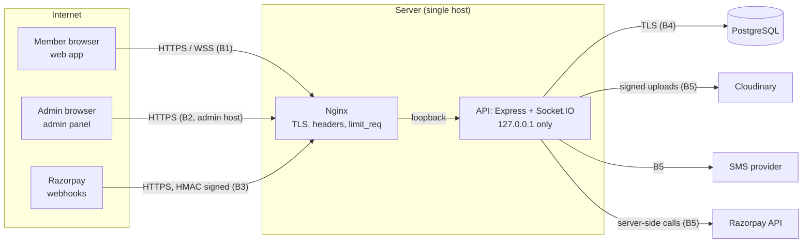

# Threat Model

> Related: [Security checklist](security-checklist.md), [Security best practices](security-best-practices.md), [Security architecture](../architecture/security-architecture.md) (design-time threat table §2), [Abuse prevention](../safety/abuse-prevention.md), [Incident response](../safety/incident-response.md)

## 1. Purpose and scope

This page describes what we protect, from whom, where the attack surface is, and which controls answer each threat. It reflects the system **as implemented** after the security hardening phase. The design-time version is in [security architecture §2](../architecture/security-architecture.md).

In scope: the web app, the admin panel, the API (REST + Socket.IO), PostgreSQL, Cloudinary, Razorpay, the SMS provider and the Nginx front. Out of scope: the hosting provider's physical and hypervisor security, members' own devices, and Razorpay's and Cloudinary's internal security.

Review this model when a feature adds a new data type, a new external provider, a new role or a new unauthenticated endpoint.

## 2. Assets

| Asset | Why it matters | Where |
|---|---|---|
| Members' phone numbers | Enables off-platform contact, harassment, stalking | `users.phone_hash` (HMAC) + `phone_encrypted` (AES-256-GCM); never in member-facing DTOs |
| Members' location | Physical safety | Only city/area names (area opt-in). No coordinates; EXIF/GPS stripped from photos |
| Identity and age signals | 18+ platform; trust signals | Verification status only; no document numbers or images |
| Profile photos and chat messages | Privacy; harassment evidence | Cloudinary (re-encoded images); `messages` |
| Blocks, reports, safety logs | Safety of reporters; must never leak to the reported member | `blocks`, `reports`, `safety_logs` |
| Sessions and tokens | Account takeover | Hashed refresh tokens; in-memory access tokens |
| Admin accounts | Full access to member data and moderation | `admin_users` (Argon2id + TOTP) |
| Payments and bookings | Money; fraud | `orders`, `payments`, `event_bookings`; card data stays at Razorpay |
| Secrets and keys | Everything above | Environment / secret store only |
| Audit log | Accountability of admins | `admin_audit_logs` (append-only) |

## 3. Actors

| Actor | Capability | Motivation |
|---|---|---|
| Anonymous internet user | Calls public endpoints, brute-forces, scrapes | Data harvesting, spam, account takeover |
| Malicious member | Valid account; knows other members' IDs | Harassment, stalking, scams, scraping, evading blocks/bans |
| Banned or suspended member | Old tokens, new accounts | Returning to harass |
| Compromised member device | Stolen refresh cookie or access token | Impersonation |
| Malicious or careless admin (insider) | Valid admin account | Snooping on members, revealing phone numbers, abusing sanctions or refunds |
| External attacker targeting admins | Phished/reused admin password | Mass data access |
| Payment fraudster | Crafted callbacks, replayed webhooks | Free passes, double refunds |
| Compromised dependency / provider | Code in our process, or a provider account | Data exfiltration |

## 4. Architecture and trust boundaries

| Boundary | What crosses it | Main controls |
|---|---|---|
| **B1** member browser → API | Untrusted requests, uploads, socket events | TLS, strict CORS, zod validation, member JWT + DB session check, CSRF on cookie routes, rate limits, upload re-encoding |
| **B2** admin browser → API | Privileged requests | Admin host only (Nginx), password + TOTP, separate secret/audience/cookie, permission checks, audit log, idle timeout |
| **B3** Razorpay → API | Payment state changes | HMAC over the raw body, event de-duplication, amounts from our DB only |
| **B4** API → PostgreSQL | All data | Parameterised queries, least-privilege role, TLS, migrations only |
| **B5** API → providers | Images, SMS, payment orders | Secrets from env, signed requests, no personal data beyond what the provider needs |

## 5. Entry points

| Entry point | Auth | Notes |
|---|---|---|
| `POST /api/v1/auth/send-otp`, `verify-otp` | None | Per-phone and per-code limits in PostgreSQL + per-IP limits; identical responses |
| `POST /api/v1/auth/refresh` | Refresh cookie + CSRF header + Origin | Rotation and reuse detection |
| `/api/v1/events`, `/api/v1/cities`, `/api/v1/health` | None | Public, non-personal data only |
| All other member routes | Member JWT + live session | Status checks, block checks, per-member limits |
| Socket.IO `/socket.io` | Member JWT at handshake + per-event session check | Payload size and event rate limits |
| `POST /api/v1/admin/auth/login`, `login/totp-setup`, `login/verify` | None → challenge → session | Per-IP limits, account lockout across both factors |
| All other `/api/v1/admin/*` routes | Admin JWT + live session + permission | Audit log on every write |
| `POST /api/v1/webhooks/razorpay` | HMAC signature | Exempt from the global per-IP limit |
| `admin:create`, `db` CLI | Server shell access | Destructive DB commands refused outside development |

## 6. Threats and mitigations (STRIDE)

Residual risk: **L** low, **M** medium, **H** high.

### 6.1 Spoofing

| # | Threat | Mitigations | Residual |
|---|---|---|---|
| S1 | OTP brute force or SMS bombing of a phone number | Hashed OTPs, 5 attempts per code, cooldown and hourly/daily caps per number stored in PostgreSQL (rotating IPs don't help), per-IP limits, global per-IP ceiling | L |
| S2 | Admin password phishing, reuse or guessing | Argon2id, **mandatory TOTP**, lockout after 5 failures across both factors, generic errors, dummy hash for unknown emails, per-IP limits, audit of sign-ins and lockouts | L |
| S3 | Stolen admin TOTP secret from the database | Secret encrypted with a dedicated key (`TOTP_ENCRYPTION_KEY`, not stored in the DB); the password is still required | L |
| S4 | Replayed TOTP code (shoulder-surfing, phishing proxy) | Last accepted step stored; a code is accepted once. A real-time phishing proxy can still relay one code → admin host restriction, short sessions, audit | M |
| S5 | Forged or tampered JWT; `alg: none`; cross-use of member/admin tokens | HS256 pinned, issuer/audience checked, separate secrets and audiences, DB session check | L |
| S6 | Stolen refresh cookie | `HttpOnly`, `Secure`, `SameSite=Strict`, path-scoped; rotation with reuse detection revokes the family | L |
| S7 | Forged payment success from the client | Client status never trusted; checkout signature verified server-side; webhook HMAC | L |

### 6.2 Tampering

| # | Threat | Mitigations | Residual |
|---|---|---|---|
| T1 | SQL injection | Replacements for every user value; only server constants interpolated; zod validation first | L |
| T2 | Mass assignment (setting `status`, `role`, verification flags) | Strict schemas reject unknown keys; server-controlled fields never read from input | L |
| T3 | Malicious uploads (polyglots, SVG scripts, decompression bombs) | Type allow-list, size and pixel limits, decode + re-encode, random public IDs, no filenames used | L |
| T4 | Tampered payment amount or replayed webhook | Amounts from our DB; unique constraints on provider IDs; webhook de-duplication; refunds guarded by state and transactions | L |
| T5 | Editing or deleting audit entries | Trigger rejects `UPDATE`/`DELETE`; API role should be DML-only (deployment) | L |
| T6 | Prototype pollution / odd JSON shapes | Strict zod parsing; tested with `__proto__` payloads | L |

### 6.3 Repudiation

| # | Threat | Mitigations | Residual |
|---|---|---|---|
| R1 | An admin denies a sanction, refund or phone reveal | Append-only audit log in the same transaction as the change, with admin ID, target, reason, IP HMAC | L |
| R2 | Unclear who signed in as an admin, or when an account was attacked | `admin.login`, `admin.totp_enrolled`, `admin.lockout`, `admin.logout`, `admin.two_factor_reset` audited | L |
| R3 | A member denies sending a reported message | Messages stored server-side; message reports keep an evidence snapshot that survives deletion | L |

### 6.4 Information disclosure

| # | Threat | Mitigations | Residual |
|---|---|---|---|
| I1 | Phone numbers exposed to members | Never in member DTOs (PII guards); reveal only via audited super-admin action | L |
| I2 | Phone numbers or OTPs in logs | Redaction of auth headers, cookies, OTPs, codes, tokens, phones, sensitive query parameters, SQL values in errors; the dev SMS provider logs nothing | L |
| I3 | Exact location | No coordinates stored; area only on opt-in; EXIF/GPS stripped | L |
| I4 | IDOR: reading other members' chats, matches, orders | Every query scoped by the caller; `404` for other people's resources; tested | L |
| I5 | Discovery leaking hidden, paused or reported members | Visibility rules applied to discovery **and** direct profile lookups (SEC-01) | L |
| I6 | Personal responses cached by browsers or proxies | `Cache-Control: no-store` on every API response by default | L |
| I7 | Stack traces or SQL in error responses | Central error handler; generic `INTERNAL_ERROR` | L |
| I8 | Reporter identity leaked to the reported member | Reports are never shown to the reported member; sanctions show neutral reasons | L |
| I9 | Scraping of profiles | Discovery is opt-in and paginated; per-member and global per-IP limits; no bulk export of members | M |
| I10 | Leaked database backup | Phones encrypted, OTPs/tokens hashed, TOTP secrets encrypted, keys outside the database | M (depends on backup handling) |

### 6.5 Denial of service

| # | Threat | Mitigations | Residual |
|---|---|---|---|
| D1 | Request floods | Nginx `limit_req` (deployment), global 300/min per-IP limit, per-endpoint limits | M (single host) |
| D2 | Expensive uploads | 1 file, size and pixel limits, memory storage bounded | L |
| D3 | Socket floods | Payload size limit, per-socket event rate limit | L |
| D4 | Locking admins out on purpose | 15-minute lock only; per-IP limits; audited. Accepted | L |
| D5 | SMS cost abuse | Per-number and per-IP send caps in PostgreSQL | L |

### 6.6 Elevation of privilege

| # | Threat | Mitigations | Residual |
|---|---|---|---|
| E1 | Member reaching admin routes | Separate identity tables, secrets, audiences, cookies; admin API only on the admin host (Nginx) | L |
| E2 | Moderator performing super-admin actions (unban, refund, audit, 2FA reset) | Permission checks on the server for every route; tested matrix | L |
| E3 | An admin with a stolen session swapping the authenticator | `totp-setup` works only on `setup` challenges; reset needs **another** super admin; reset ends all sessions | L |
| E4 | Banned/suspended member bypassing restrictions through another API or the socket | Status checked on every request and socket event; block checks in every interaction path | L |
| E5 | Compromised dependency | Minimal dependencies, lockfile, `npm audit` in the release checklist | M |

## 7. Product abuse cases

| Abuse | Controls |
|---|---|
| Stalking a member met at an event | No exact location, no attendance lists outside reciprocal mode, blocks hide both ways everywhere, report → auto-hide on P0 |
| Harassment after a block | Blocks enforced in discovery, interests, matches, chat (REST and socket), profile lookups |
| Romance/money scams | Safety copy ("never send money"), report reasons, moderation queue, message reports |
| Ban evasion with a new number | A banned number can never sign in again (accounts are matched by phone HMAC); OTP sends are rate-limited; accepted residual risk (new numbers are cheap) |
| Underage users | 18+ date-of-birth check and DOB lock; identity verification (when enabled) is a signal, never a guarantee |
| Admin snooping | Least-privilege roles, phone hidden by default, audited reveal, audit log review |

## 8. Assumptions

These must stay true; if one changes, revisit this model.

1. Nginx terminates TLS and is the only thing listening publicly; the API listens on `127.0.0.1` (`API_HOST`), so `trust proxy = loopback` is correct.
2. Nginx exposes `/api/v1/admin/` only on the admin host ([best practices §5](security-best-practices.md#5-nginx-and-deployment-assumptions)).
3. Secrets live in a secret store or protected env files readable only by the service user, and differ per environment.
4. One API process (in-memory limiters). Running several requires a shared limiter store first.
5. PostgreSQL is not reachable from the internet; the API uses a DML-only role.
6. Admins keep their authenticator on a separate device from the one they sign in with, where possible.

## 9. Top residual risks

1. **Forced password change for new admins is missing** (M): accounts from `admin:create` keep the printed password. Mitigated by mandatory TOTP.
2. **Single host and in-memory limits** (M): a restart resets limiter windows; volumetric attacks rely on Nginx and the provider.
3. **Real-time phishing of admins** (M): TOTP can be relayed within 30 seconds. Phishing-resistant factors (WebAuthn) are the long-term answer.
4. **Scraping by registered members** (M): bounded by limits and opt-in discovery, not eliminated.
